# The First Answer Is Not Enough

## An Architecture for AI-Assisted Deliberation Before Decision

**Deliberation before decision.**

**A research and technical white paper on divergent problem construction, constrained conflict, adversarial examination, refusal, qualified action, real-world observation, and durable provenance**


*Cover illustration: an editorial metaphor, not a diagram of the implemented board.*

**Paper version:** 3.0\
**Date:** August 15, 2026\
**Architecture described:** The Arachne Method\
**Software examined:** WebChess package version 2.2.0 release candidate\
**Released baseline:** tag `v2.1.0`, commit `9980328581ba3e6fed6f2c4fc99b555fec4773bc`\
**Immutable candidate baseline:** commit `7a3749cf7f2c4e4c5ebfeb9b9aa870a11843f3a2` on `feat/local-clerk-runtime`\
**Distribution boundary:** the candidate is committed locally but is not tagged, pushed, published, previewed, or deployed\
**Status:** implemented architecture, release-candidate audit, explicit limitations, and falsifiable research agenda\
**Prepared for:** The WebChess Project\
**Project lead:** Jack Reynolds

> Every question arrives wrapped in its first frame. The Arachne Method exists to keep that frame from becoming a monopoly merely because it spoke first.

---

## Abstract

This paper describes the **Arachne Method**, an eight-authority architecture for delaying premature closure in AI-assisted problem solving, and audits its current implementation in WebChess. In compact form, it is a versioned sequence that expands a question, allocates salience, attacks survivors, refuses insufficiency, qualifies an Answer, and records reversible action. A difficult question is expanded into sixty-four problem-specific facets. Those facets, sixty-four fixed I Ching-inspired change lenses, and sixty-four board locations are joined through three domain-separated deterministic permutations derived from a saved seed. The resulting pairs become pieces on a complete circular-chess variant. Captures, routes, and the terminal position create an inspectable trail of attention and a terminal ecology. They do not create evidence.

After play, WebChess assembles the exact forthcoming Answer prompt. Portia examines every terminal candidate and judges that prompt; a deterministic Gate either permits progress or invokes bounded Retry. A permitted prompt generates the substantive Answer. Charlotte then qualifies that exact stored Answer rather than silently replacing it. Wilbur records an authenticated owner's chosen action and later observation. The Web preserves the within-case genealogy. The formal eight authorities are **Anansi, Chess, Portia, Gate, Retry, Charlotte, Wilbur, and the Web**. Answer is an indispensable generated artifact between Gate and Charlotte, but it is not a ninth authority.

The implementation is substantial: a purpose-built semantically blind chess engine, canonical replay, typed lifecycle contracts, prompt and digest binding, bounded provider recovery, durable PostgreSQL repositories, quota and concurrency controls, visible research records on the OpenClaw path, owner-scoped export, and tested user interfaces. Commit `7a3749c` closes the audited persistence, deletion, Wilbur-durability, export, dependency, and loopback-runtime blockers; sections 14 and E preserve the exact repair ledger. The remaining boundaries are different in kind. No hosted Preview or Production deployment is established. Automatic research is conditional and does not fetch source-page text. Same-model Portia is not error-independent adjudication. Wilbur observations are reports, not verified causal outcomes. The repository proves neither backup operation nor causal decision benefit.

The architecture separates functions that one-pass systems often blur: imagination from selection, selection from adversarial examination, examination from sufficiency, sufficiency from prose generation, generation from qualification, recommendation from consequence, and provenance from truth. This is an implemented architecture and a falsifiable research program, not a validated decision engine. Its significance depends on controlled comparison with direct model answers, generic self-critique, debate, tree search, alternate move policies, fixed and semantic casts, human-only baselines, and the earlier capture-trail pipeline.

---

## Claim discipline

This paper makes five bounded claims.

1. Committed WebChess source at `7a3749c` implements an inspectable pipeline for semantic expansion, seeded casting, complete circular-chess play, server-authoritative replay, prompt-bound Portia, deterministic Gate, bounded Retry, digest-bound Answer, Charlotte qualification, durably admitted Wilbur records, and within-case provenance.
2. Those functions have distinct typed contracts, durable states, retry budgets, and failure modes. They are not eight costumes placed on one undifferentiated completion call.
3. Engine V2 is a tactically sophisticated but semantically blind trajectory selector. Its measured perft, search, and paired-arena results establish bounded implementation behavior, not reasoning quality, Elo strength, semantic relevance, or decision benefit.
4. The immutable 2.2.0 candidate commits both loopback execution topologies: the OpenClaw plugin and the source-checkout runtime with direct PostgreSQL, canonical migration bootstrap, and either a signed loopback machine session or a complete Clerk development-key pair. The hosted Clerk/Vercel/Neon/OpenAI architecture is also implemented in source. None of those source facts proves that commit `7a3749c` was pushed, tagged, or deployed.
5. The architecture is testable through ablation, comparative evaluation, cross-seed and cross-policy analysis, blinded human review, cost and latency measurement, and real-world follow-up. Implementation is not that evaluation.

It does **not** claim that:

- random casting discovers hidden truth;
- chess strength is equivalent to reasoning quality;
- a surviving Portia candidate is proven true;
- Charlotte's recommendation is morally correct because it is eloquent;
- Wilbur's observed outcome establishes causality without an appropriate design;
- the eight-stage system is effective before controlled evaluation;
- the repository proves that a hosted Preview or Production deployment exists;
- a loopback machine session identifies a particular human or provides Clerk-equivalent security;
- the 2.2.0 candidate is already a published release or a live service;
- Anansi, the Yijing, *Charlotte's Web*, Portia biology, Jung, Turing, or Fischer somehow anticipated or endorsed this software.

The mythology is a mnemonic architecture. The science begins where the metaphors are converted into explicit contracts, failure states, and experiments.

## How to read implementation claims

Every implementation table in this edition uses the following evidence ladder. The labels prevent an attractive diagram from laundering a proposal into a shipped feature.

| Label | Meaning | What it permits the paper to say |
|---|---|---|
| **RELEASED** | Present in tagged source, currently `v2.1.0` at `9980328` | The capability was released in source form; deployment and benefit still require separate evidence |
| **COMMITTED RC** | Present in immutable candidate commit `7a3749c`, whose package metadata is 2.2.0 | The capability is committed and reproducible from that commit; it is not thereby tagged, pushed, published, or deployed |
| **PUBLICATION** | Explanatory paper, figures, and downloads produced after the immutable code candidate | Publication can describe or critique `7a3749c`; it cannot retroactively become candidate code or deployment evidence |
| **PARTIAL** | Components exist, but a named operational or evidentiary boundary remains topology-dependent or unproven | The paper names the implemented pieces and the remaining boundary rather than collapsing both into “done” |
| **MEASURED** | Reproduced during this audit with a stated method and environment | The observation is evidence for that run, not a universal performance guarantee |
| **PROPOSED** | A design, metric, evaluation, or future contract not implemented in the audited source | The paper may motivate and formalize it, but cannot describe it as current behavior |

The same discipline applies to equations. A solid **IMPLEMENTED** label denotes executable code. A dashed **PROPOSED METRIC** label denotes a research definition. **EXPLANATORY NOTATION** names relationships without claiming that the software computes them. Every formula in this paper is followed by a definition of its symbols and a plain-language interpretation.

---

## Contents

1. [The problem WebChess is trying to solve](#1-the-problem-webchess-is-trying-to-solve)
2. [The current WebChess implementation](#2-the-current-webchess-implementation)
3. [The eight-part lifecycle](#3-the-eight-part-lifecycle)
4. [Anansi: imagination and structured plurality](#4-anansi-imagination-and-structured-plurality)
5. [Chess: constrained conflict and terminal ecology](#5-chess-constrained-conflict-and-terminal-ecology)
6. [Portia: adversarial traversal and selective consumption](#6-portia-adversarial-traversal-and-selective-consumption)
7. [Gate: interpretive sufficiency](#7-gate-interpretive-sufficiency)
8. [Retry: controlled recursion](#8-retry-controlled-recursion)
9. [Answer and Charlotte: proposal, qualification, and truthful persuasion](#9-answer-and-charlotte-proposal-qualification-and-truthful-persuasion)
10. [Wilbur: consequence in the world](#10-wilbur-consequence-in-the-world)
11. [The Web: provenance, memory, and inheritance](#11-the-web-provenance-memory-and-inheritance)
12. [Formal model and reference algorithm](#12-formal-model-and-reference-algorithm)
13. [Implemented data contracts and proposed extensions](#13-implemented-data-contracts-and-proposed-extensions)
14. [Implementation ledger: release, candidate, deployment, and proposal](#14-implementation-ledger-release-candidate-deployment-and-proposal)
15. [Theoretical foundations](#15-theoretical-foundations)
16. [Cultural and intellectual lineage](#16-cultural-and-intellectual-lineage)
17. [Failure modes, risks, and safeguards](#17-failure-modes-risks-and-safeguards)
18. [Falsifiable evaluation program](#18-falsifiable-evaluation-program)
19. [Remaining engineering and research](#19-remaining-engineering-and-research)
20. [Worked example](#20-worked-example)
21. [Conclusion](#21-conclusion)

**Appendices:** [A](#appendix-a-current-circular-chess-rules-and-engine-specification), [B](#appendix-b-portia-attack-and-gate-reference-tables), [C](#appendix-c-reference-audit), [D](#appendix-d-glossary-acronyms-and-formula-registry), [E](#appendix-e-infrastructure-persistence-security-and-recovery-audit); [References](#references).

---

# 1. The problem WebChess is trying to solve

## 1.1 Premature semantic collapse

A difficult question rarely enters an AI system naked. It arrives already dressed as a sentence.

That sentence has a subject, a boundary, a presumed cause, an implied beneficiary, and a silent theory of what kind of answer will count. A user asks whether to build, buy, hire, automate, publish, retreat, or proceed. The model recognizes a familiar shape and supplies a plausible frame. Within seconds, possibilities that never fit that frame have vanished without leaving a trace.

The answer may be articulate. It may even be factually correct within the frame it chose. The deeper failure can occur earlier: the system may answer the wrong construction of the right question. This paper calls that failure **premature semantic collapse**—the conversion of an ambiguous, contested, or under-specified situation into one dominant interpretation before alternatives, assumptions, stakeholders, evidence, and consequences have been made visible. Hallucination is one possible defect after collapse. Premature semantic collapse is more fundamental.

The first answer is therefore not rejected. It is demoted. It enters as a claimant, not a monarch.

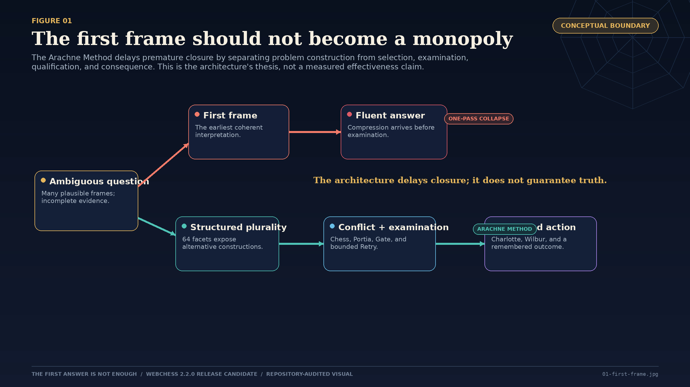

*Figure 1. The Arachne Method delays premature closure by separating problem construction from selection, examination, qualification, and consequence. This is the architecture's thesis, not a measured effectiveness claim.*

Human reasoning suffers analogous pathologies. Problem representation determines which operations seem available. Familiar examples induce fixation. Goal shielding suppresses competing concerns. Confirmation bias recruits contrary information into the preferred story. Creative idea generation and idea selection are separable capacities, and the capacity to produce many candidates does not guarantee the capacity to select well among them (Newell, Shaw, & Simon, 1958; Reiter-Palmon et al., 1997; Jansson & Smith, 1991; Rietzschel, Nijstad, & Stroebe, 2010; Nickerson, 1998).

WebChess begins from a different assumption: before asking a model for an answer, construct a field large enough to make the first answer lose its monopoly.

## 1.2 The central design thesis

The revised thesis is:

> A difficult problem may be handled more responsibly when imagination, conflict, adversarial examination, sufficiency judgment, retry, value-based synthesis, real-world consequence, and memory are implemented as distinct stages with distinct authorities.

This is not the usual generator-critic loop. A critic often inherits the generator's framing, uses the same model, and grades the same fluent artifact. The eight-part lifecycle introduces several separations:

- **Anansi** is rewarded for coverage and distinctness, not final correctness.
- **Chess** is rewarded for coherent constrained conflict, not semantic truth.
- **Portia** is rewarded for finding reasons to reject or qualify survivors, not for producing a recommendation.
- **Gate** is authorized to refuse synthesis when the remaining material is inadequate.
- **Retry** changes the sampled path or the semantic field rather than demanding prose from intellectual wreckage.
- **Charlotte** is rewarded for value fidelity, audience understanding, truthful communication, and reversible action.
- **Wilbur** gives an accountable human a place to record action and later report consequences that no language model can manufacture from rhetoric alone.
- **The Web** preserves lineage, including failure and dissent, so future cycles do not awaken with the memory of a goldfish and the confidence of an emperor.

## 1.3 Why a game at all?

A game supplies bounded rules, role asymmetry, temporal order, visible conflict, and forced termination. It makes selection inspectable. In ordinary model generation, the path from possibilities to final wording is largely hidden and ephemeral. WebChess externalizes a portion of that path as a durable sequence of moves and captures.

The game is not justified because chess is mystical, universal, or inherently wise. It is justified only if its constrained traversal produces useful diversity, attention allocation, or defixation at acceptable cost. That proposition is empirical.

## 1.4 Why spiders?

The spider figures identify functions that are otherwise easy to blur:

- Anansi represents generative cunning, multiplicity, indirection, and the construction of possible worlds.
- Portia represents active testing inside another system's information environment.
- Charlotte represents language used in service of a protected life, audience modeling, and responsibility for downstream consequences.
- Wilbur represents the vulnerable reality for whose sake the architecture exists.
- The Web represents the relational substrate and historical memory that outlasts any single intervention.

The metaphors are useful only while they discipline engineering. The instant they become immunity from measurement, they have become incense in the server room.

---

# 2. The current WebChess implementation

The package declares **WebChess 2.2.0** at immutable release-candidate commit `7a3749c`; the latest tag remains `v2.1.0`. This edition keeps tagged release, committed candidate, publication, deployment, and proposed research as separate evidence states. The formal architecture has eight authorities. The public home page also presents eight cards by combining **Gate & Retry** and including **Answer**; the in-game lifecycle rail presents seven labels—Anansi, Chess, Portia, Answer, Charlotte, Wilbur, Web—and deliberately folds Gate and Retry into the Portia-facing transition. These are three views of one control flow, not three competing architectures.

The repository is a working instrument, not a vaporware sketch. Commit `7a3749c` contains the circular-chess engine, server-authoritative replay, typed lifecycle contracts, durable PostgreSQL state, all three source runtime surfaces, and the green release-candidate gate. This paper is a later publication layer over that immutable code boundary. Shipping those stages does not establish that the method improves reasoning. Section 18 remains the evaluation program; section 14 records exactly which boundary supports each claim.

## 2.1 Question normalization

The application accepts an authenticated user's problem as normalized text between 12 and 240 characters. The original problem is retained as the governing reference. Every later transformation must remain auditable against the wording that initiated it.

## 2.2 The first model pass: sixty-four facets

The first server-side model request produces exactly sixty-four problem-specific facets. Each facet is assigned to one intersection of eight practical dimensions and eight movements of change.

| Practical dimensions | Movements of change |
|---|---|
| Purpose | Begin |
| People | Receive |
| Resources | Clarify |
| Timing | Connect |
| Risks | Challenge |
| Values | Adapt |
| Evidence | Consolidate |
| Possibilities | Release |

Each facet contains a stable ID, title, concrete focus, practical question, and compact keyword. Application checks reject missing or duplicate IDs, normalized duplicate titles and focuses, obvious numbered scaffolds, dominant substitution templates, and widespread lexical near-duplication. Those checks establish schema integrity and eliminate several cheap failure modes. They cannot prove that the facets are correct, complete, relevant, culturally appropriate, or genuinely independent.

This remains the candidate's implemented Anansi function: one compressed question becomes a structured plurality. The richer Anansi extension described in section 4.7 — assumptions, evidence status, stakeholders, disconfirming observations, tests, source spans, and user merge/reject before casting — is not in commit `7a3749c`.

## 2.3 Independent casting

The server saves a root seed and derives three domain-separated deterministic permutations:

1. a permutation of the sixty-four facets;
2. a permutation of sixty-four I Ching-inspired change lenses; and
3. a permutation of the completed facet-lens pairs onto the sixty-four board locations.

The separation matters. A facet's lens is not inferred from its meaning, and its location is not a causal map of the problem. The cast is reproducible from the saved seed but not evidentially privileged. These are deterministic software shuffles over 32-bit derived states, not claims of statistical independence, cryptographic unpredictability, or coverage of the `64!` possible permutations. They implement bounded recombination.

## 2.4 Circular chess

The board contains eight bounded concentric rings and eight angular sectors. Sectors wrap from 7 to 0; rings terminate at the inner and outer edges. Black begins in the center and advances outward, representing **inside-out intent**. White begins outside and advances inward, representing **outside-in evidence**. White moves first.

The variant intentionally differs from orthodox chess:

- Kings are captured directly; there is no check or checkmate.
- Castling and en passant are absent.
- Pawns may make an initial two-ring move when clear.
- Pawns promote to Queens at the far ring.
- A side with no legal move passes if the other side can move.
- A King capture wins.
- Mutual immobility, 100 quiet plies, or 256 total plies produces a draw.
- A King capture on ply 256 takes precedence over the move-limit draw.

The game can be played manually, one guided turn at a time, or through autoplay. Seven captures mark reflection depth in the interface. They do not stop the game and are not evidence.

## 2.5 Engine V2

The guided player is a purpose-built engine for WebChess's cylindrical, direct-capture, pass-enabled rules. It uses iterative deepening, principal-variation alpha-beta search, aspiration windows, a dual-word hashed transposition table, rules-aware quiescence, static exchange evaluation, move-ordering heuristics, promotion-race evaluation, King-danger evaluation, and a deterministic seeded root tie-break. Search runs in a worker and uses a deterministic default budget of 150,000 nodes.

The engine is strategically sophisticated and semantically blind. It does not read the facet on a square, assess external evidence, understand the user's domain, or decide that one perspective is intellectually superior. It selects moves according to the game evaluation.

That distinction is foundational:

> Better chess under WebChess rules is not the same thing as better reasoning about the user's problem.

## 2.6 Captures as salience records

When a piece captures another piece, the destination square's facet-lens pair enters the chronological capture trail. The active piece and captured piece supply role metaphors. The current attention weight is calculated from the value of the challenged piece, the value of the active piece, and a middle-ring meeting bonus.

This score is not probability, confidence, evidence quality, moral weight, or objective importance. It is a designed display measure that helps organize attention.

## 2.7 Server-authoritative replay

The browser proposes only a piece ID, destination, and expected game revision. The server loads the persisted division and append-only event stream, reconstructs the board from the canonical initial position, validates every move, derives captures and promotions, inserts forced passes, applies ending precedence, and commits the next event atomically with an idempotency key and compare-and-swap revision.

No runtime accepts client-supplied pieces, captures, passes, outcomes, attention weights, Portia dispositions, Gate results, or model answers as canonical authority. Ownership is bound at query time to the verified principal. Wilbur is deliberately different: its action and observation text is an authenticated, schema-bounded human report. The server records that report; it does not independently verify its truth.

## 2.8 Terminal ecology and the board-derived answer prompt

Only after canonical replay proves a terminal position does WebChess derive the survivor set. Each surviving piece becomes a candidate package with piece identity, polarity, role, final coordinate, facet, reconstructed route, captures made, plies on which it was attacked, promotion, and source digest. Engine-estimated threats that cannot be derived from the event log are not fabricated.

The original question and the board's weights, values, routes, captures, and survivor ecology are then assembled into one concrete answer-generation prompt package, with a digest of that exact package. That package is Portia's prey. The 0.1.0 pipeline, which sent the capture trail directly to a synthesis model, is retained only as a legacy path for games that have no lifecycle row. New games do not skip Portia and the Gate.

## 2.9 Portia

Portia runs before any answer exists. It receives the exact prompt package and attacks every survivor with a versioned thirteen-type taxonomy:

relevance to the original problem; unsupported assumption; evidence grounding; redundancy; contradiction; causal overreach; stakeholder or opponent response; seed or path sensitivity; actionability; reversibility; harm or exclusion; metaphor overreach; and narrative overfitting.

Each survivor is classified `preserved`, `wounded`, `consumed`, or `unresolved`. Survival on the board is eligibility for attack, not truth. Portia also returns a prompt decision (`permit`, `retry_game`, `retry_field`, or `deny`), required revisions, coverage tags, redundancy clusters, and cross-candidate contradictions.

Each survivor receives all thirteen attack classes exactly once in the accepted review. Candidate assessments are persisted in deterministic survivor order; a recovered attempt resumes from the saved prefix rather than restarting a decorative traversal. A technical-failure-free Portia attempt with `N` survivors makes `N` candidate calls followed by one cross-candidate summary call. Provider-started technical failures are bounded to three attempts for the run. The third incomplete validation ends at `portia_unavailable`, preserves completed checks, and authorizes neither Gate nor Answer.

Portia in the 2.2.0 candidate is prompt-bound: it adjudicates the forthcoming generation, not a later essay. It is still typically the same provider family as Anansi and Charlotte. Cross-model, retrieval-backed, and human attack channels remain proposed (section 6.8).

## 2.10 Gate and Retry

After a complete Portia review, a deterministic Gate — not a language model — decides whether synthesis may proceed. The shipped algorithm (`webchess-gate-v4`) uses hard floors rather than the weighted score sketched in section 7.2. A pass currently requires:

- Portia `permit` on the reviewed prompt;
- at least three preserved or wounded candidates;
- at least three independent redundancy clusters;
- coverage of protected outcome, evidence or reality, risk or countercase, and agency or action;
- at least one tension pair between independent usable candidates;
- no blocking severe or fatal objection;
- no field-repair reason; and
- an explicit qualification for every wounded candidate.

The Gate records missing requirements, counts, coverage, and a digest of its inputs. It does not treat survivor count as sufficiency.

A failed Gate may authorize at most two same-field replay children and at most one regenerated-field child, in the order selected by the deterministic policy. A same-field retry preserves both the division and the cast; a field retry creates a new semantic field. If regeneration occurs before the two replay allowances are spent, those remaining replays may still occur on the new field. Including the initial game, the hard ceiling is four games across at most two fields. Duplicate terminal fingerprints push Retry toward field regeneration. Exhaustion ends at `insufficient_basis` and cannot silently reach Answer or Charlotte. Failed runs remain in the provenance record.

## 2.11 Answer and Charlotte

Only Portia's permission and a persisted Gate pass authorize Answer. The model receives the exact reviewed board prompt. The generated answer is stored with that prompt, the reviewed digest, and Gate provenance. Its structured contract contains an opening, synthesis, tensions, recommendation, and exactly three actions; visible prose must contain 450–750 Unicode-tokenized words. The player-visible prompt is a separate, disclosure-oriented artifact; the transport payload used for the hosted Responses API is not that artifact. Answer has game statuses (`answering`, then `answered`) but no separate lifecycle state.

Charlotte then qualifies that exact generated answer. It cannot substitute an unrelated synthesis. It may cite only preserved or wounded candidates, must retain each cited wound's qualification exactly, and returns 100–20,000 characters of visible prose plus exactly three structured action suggestions. The 450–750-word bound belongs to Answer, not Charlotte. Charlotte has its own durable three-attempt technical budget. Exhaustion settles at `charlotte_unavailable`: the Portia-approved Answer remains visible and is labeled as not Charlotte-qualified. Wilbur is not authorized from that state.

Charlotte in the 2.2.0 candidate is therefore a qualifier of a Gate-approved board answer, not the sole post-game author. Audience-specific variants with factual-invariance checks, and a separate protected-outcome confirmation step, remain proposed (section 9).

## 2.12 Wilbur and the Web

Wilbur is a human-owned action and observation record. A current action must reproduce the Wilbur projection of one of the three suggestions in the saved Charlotte result: index, actor, smallest action, tested assumption, expected observation, threshold, and horizon all bind under `webchess-charlotte-action-binding-v1`. At most one current-bound action may occupy a Charlotte suggestion index in a lifecycle run. Upgrade-preserved legacy actions remain readable with a `NULL` binding version; they are not retroactively presented as canonical matches. A current action begins `planned` at revision zero, its canonical content then becomes immutable, and later writes may change only status, revision, and update time. Observations remain player-authored append-only reports. WebChess neither executes the action nor independently verifies the report, and model output cannot declare real-world success.

Every storage-admitted create, status update, and observation first claims a durable owner-plus-idempotency-key mutation record. A fresh request rejected by the lifetime row/text envelope creates no ledger row and takes no rate debit. For a claimed request, the same operation and request digest can recover the exact committed result or stored denial; changed data conflicts. Rate admission is recorded once using the database clock, and the user bucket is decided before capacity is taken from the shared pseudonymous-IP bucket. The artifact, Wilbur lifecycle activity, lifecycle revision, and mutation-ledger result are committed by one atomic SQL statement. After an ambiguous transport failure, HTTP 5xx response, or malformed successful response, the browser retains the same key and payload while it refreshes or retries rather than inventing a second intent.

Wilbur's lifetime admission envelope counts action rows, observation rows, Wilbur lifecycle-event rows, mutation-ledger rows, and the future rows reserved by pending claims. Its text boundary counts the exact UTF-8 bytes of the stored action or observation fields. That envelope preserves existing history and admits exact pending or committed replays even if a later configuration lowers a cap; it is not a guarantee that an owner's entire account will fit the separate synchronous export ceiling.

The Web in this candidate is within-case provenance: question, field, seed, events, survivors, Portia progress and review, Gate decision, retries, Answer, Charlotte, Wilbur actions and observations, versions, and owner-scoped export. `webchess-account-export/4` includes the Charlotte binding version, sanitized Wilbur mutation-ledger rows, all lifecycle recovery fields, and the owner's pseudonymous user-rate windows. It omits private capacity reservations, owner and IP identifiers, HMAC material, shared IP and global counters, Clerk or vendor records, and database-restore metadata. **HMAC** means hash-based message authentication code; here it pseudonymizes rate identities rather than proving the truth of an observation. Consented cross-case learning memory is not implemented.

## 2.13 Visible research

The research contracts name seven possible stages, but current orchestration invokes the broker only immediately before Portia and only when the local OpenClaw service injects it. A deterministic policy permits one bounded search with at most five results and a 150-second envelope when the saved question matches external-evidence triggers. The broker records its decision, query, model synthesis, and candidate source URLs; it does not fetch or quote the source pages. A failed, refused, or timed-out request does not currently block Gate passage even when policy marks research `required`. Neither the hosted-service target nor the committed loopback source-checkout runtime injects this broker.

## 2.14 Three runtime surfaces, three separate promises

The same rules, engine, prompts, validation, and lifecycle handlers serve multiple topologies that do not share identity, persistence, credentials, or billing.

**RELEASED in 2.1 and COMMITTED RC in 2.2 — local OpenClaw plugin.** `openclaw webchess` launches a foreground Next.js process bound to `127.0.0.1` (port 3210 by default), uses a dedicated operator-supplied loopback PostgreSQL database, and calls `openclaw infer model run --local`. There is no Clerk login, hosted Neon database, or operator-owned OpenAI key. A stable installation-scoped principal owns local records. “Local” selects the OpenClaw execution path; OpenClaw's configured model provider may itself be remote.

**COMMITTED RC — hosted-service source target.** The repository contains an account-backed Next.js design for an independent Vercel project named `webchess`: Clerk authentication, Neon Postgres, and server-only OpenAI Responses API calls with a code-fixed `gpt-5.6-sol` model, `store: false`, structured outputs, quotas, rate limits, idempotency, concurrency leases, deletion barriers, guarded migrations, and a least-privilege runtime schema contract. Visitor credentials are never accepted. The architecture is implemented in source; repository evidence establishes neither a Preview nor a Production deployment.

**COMMITTED RC — loopback source-checkout runtime.** `npm run local:dev` owns a Docker-managed PostgreSQL 17 container on `127.0.0.1:55433`, a direct `pg` adapter, canonical migration bootstrap, and a Next.js server on `127.0.0.1:3005`. It selects exactly one authentication mode: a seven-day HMAC-signed machine principal when Clerk is absent, or a complete development-class Clerk key pair whose values begin `pk_test_` and `sk_test_`. Partial or live Clerk keys fail closed; the launcher does not prove that two development keys belong to the same Clerk instance. It validates its exact port and environment boundary, verifies the managed container and persistent-volume identity, serializes setup, writes generated environment state atomically, opens the browser only after bounded readiness, and terminates the owned Next.js process group on failure or exit. Local automatic migration requires the one-purpose activation and loopback database contract normally supplied by this launcher. Bootstrap refuses unexpected relation names and a missing, reordered, unknown, or checksum-drifted migration ledger; the separate deployment verifier checks the fuller column, constraint, trigger, index, and privilege contract.

All three source surfaces exist in commit `7a3749c`. That statement is deliberately narrower than “released” or “running”: the 2.2.0 candidate is not tagged or pushed, and no live hosted service was verified.

## 2.15 What this implementation does not claim

The WebChess 2.2.0 candidate implements the lifecycle contracts. It does not claim that:

- random casting discovers hidden truth;
- engine strength equals reasoning quality;
- a preserved Portia candidate is proven true;
- Gate passage is certainty;
- Charlotte's wording is morally correct because it is constrained;
- Wilbur observations establish causality;
- same-model Portia supplies error-independent adjudication; or
- the eight-stage system has been shown effective by the evaluation program in section 18.

The mythology remains a mnemonic. The science still begins where the contracts are measured.

---


# 3. The eight-part lifecycle

The complete lifecycle has eight parts, deliberately echoing the eight-legged creature that supplies its governing imagery.

| Part | Core function | Governing question |
|---|---|---|
| **Anansi** | Create sixty-four possible perspectives | What else could this problem mean? |
| **Chess** | Force the perspectives through constrained conflict | What path emerges under stable rules? |
| **Portia** | Hunt every terminal survivor through thirteen specified attacks | What remains, with which unresolved wounds and qualifications? |
| **Gate** | Determine whether enough independent meaning remains | Is there a sufficient basis for synthesis? |
| **Retry** | Replay the game or regenerate the field | Was the failure in traversal or representation? |
| **Charlotte** | Qualify the exact stored Answer without erasing wounds | What may responsibly be said and proposed from this Answer? |
| **Wilbur** | Record human-owned action and reported consequence | What did an accountable person do, and what did they later observe? |
| **Web** | Preserve the complete genealogy | What must the next cycle remember? |

The canonical formulation is:

> **Anansi imagines. Chess creates conflict. Portia hunts. The Gate judges sufficiency. Retry renews the search. Answer states a case. Charlotte qualifies it. Wilbur encounters reality. The Web remembers.**

The sentence contains nine verbs because **Answer is an artifact**, not because the architecture secretly has nine authorities. This is the most useful place to resolve the counting conventions:

| View | Count | Labels | Why |
|---|---:|---|---|
| Formal Arachne authorities | 8 | Anansi, Chess, Portia, Gate, Retry, Charlotte, Wilbur, Web | Separates each kind of authority |
| In-game lifecycle rail | 7 | Anansi, Chess, Portia, Answer, Charlotte, Wilbur, Web | Makes the user-visible artifact explicit and folds Gate/Retry into Portia's boundary |
| Coarse product journey | 4 | Name it, Divide it, Play it, Read it | Explains the experience without exposing every internal transition |

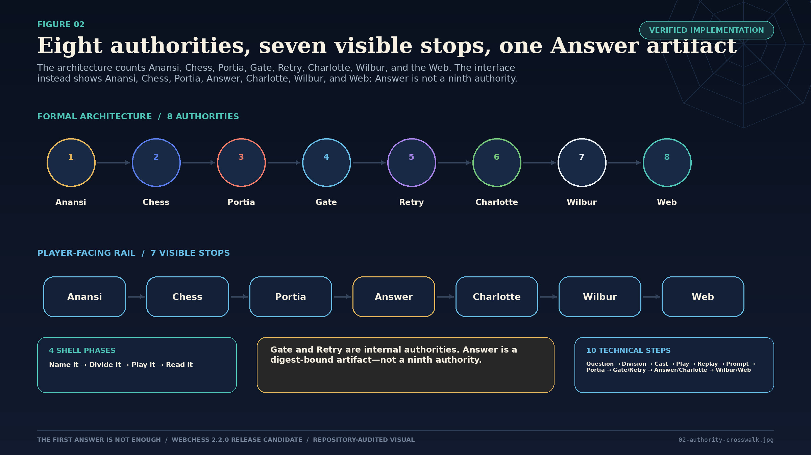

*Figure 2. The architecture counts Anansi, Chess, Portia, Gate, Retry, Charlotte, Wilbur, and the Web. The interface instead shows Anansi, Chess, Portia, Answer, Charlotte, Wilbur, and Web; Answer is not a ninth authority.*

> **Reader's map:** a Gate pass authorizes generation and storage of **Answer**; only then does **Charlotte** qualify that exact artifact. Answer is visible in the interface because it matters, but it is neither an authority nor a lifecycle state. During Answer generation the game moves from `completed` to `answering` to `answered`, while the lifecycle remains `gate_passed` until Charlotte begins.

## 3.1 Control flow

The lifecycle is not a simple one-way conveyor belt.

```text
Question
   |
   v
Anansi -> Cast -> Chess -> terminal ecology -> Portia -> Gate
             ^                                      /    \
             |                                   fail    pass
             |                                    |        |
             |                                    v        v
             +---------- Retry <------------------+      Answer
                         |                                  |
                         +---- regenerate field             v
                                                         Charlotte
                                                            |
                                                            v
                                                         Wilbur
                                                            |
                                                            v
                                                           Web
```

Retry has two levels:

1. **Game retry:** preserve the same semantic field and cast but create another game trajectory.
2. **Field retry:** regenerate the sixty-four-facet semantic field, then cast and play one regenerated-field child. This is the only field regeneration, but any unused same-field replay allowance remains available afterward. The current implementation supplies Division with one normalized, bounded repair record: the prior field-generation number, Gate missing requirements, missing-coverage tags merged from Portia and Gate, and Portia field-repair reasons. It does not pass the full Gate or Portia objects.

The process also terminates. After the versioned retry budget is exhausted, the system returns an explicit insufficiency result rather than force Answer or Charlotte to manufacture meaning from carrion.

## 3.2 Not eight chatbots in costume

The stages should not be implemented as eight free-form personalities exchanging essays. That design would generate a mythological committee meeting and then bill the user for the minutes.

Each stage requires:

- a typed input contract;
- a typed output contract;
- an explicit authority boundary;
- deterministic validation where possible;
- a defined failure state;
- versioned parameters and prompts;
- provenance linking inputs to outputs; and
- an ablation test showing whether the stage contributes measurable value.

The names are intended as mnemonic aids. Whether they improve comprehension is an empirical question; the contracts create the architecture.

---

# 4. Anansi: imagination and structured plurality

## 4.1 Cultural lineage and design responsibility

Anansi is not a generic Western mascot for cleverness. Ananse stories belong to Akan narrative traditions and traveled through the African diaspora, where they acquired new forms and political meanings. Scholarship describes Anansesem as performance, social indirection, collective memory, pedagogy, identity construction, and, in Jamaican history, a resource for cultural resistance (Arthur, 2019; Marshall, 2012).

WebChess should therefore state its borrowing explicitly. It should invite review by Akan, Ghanaian, Caribbean, folklore, and performance scholars. The system uses Anansi as a design archetype of plural generation and strategic indirection; it does not claim ownership of the tradition or reduce a living body of stories to a software logo.

## 4.2 The ANANSI mnemonic

Within WebChess, **ANANSI** stands for:

- **A - Analyze:** identify actors, tensions, constraints, evidence, unknowns, and possible objectives.
- **N - Name:** make latent concerns explicit as distinct candidate facets.
- **A - Associate:** connect each facet to a movement, role, or unfamiliar lens without claiming that the association is true.
- **N - Navigate:** place candidates into a traversable field rather than a flat list.
- **S - Synthesize:** formulate each candidate as a coherent, inspectable proposition or question.
- **I - Iterate:** repair duplicates, gaps, generic wording, and failed candidates before releasing the field.

This mnemonic belongs to the **Anansi subroutine**, not the entire eight-part lifecycle. In particular, Anansi's “Synthesize” does not mean final recommendation; it means coherent candidate construction. Anansi's “Iterate” does not replace the later Retry stage; it refers to local repair while generating the field.

The mnemonic is **INTERPRETIVE**, not an execution trace. Current Division is one structured model request followed by deterministic validation; the code does not run six ANANSI agents or six sequential passes.

## 4.3 Question intake and the implemented Division call

**IMPLEMENTED.** The governing question is whitespace-collapsed and trimmed, then restricted to 12–240 JavaScript string units. The strict JSON request contains only `problem`, uses a 16 KiB body ceiling and UUID idempotency key, and is stored with a SHA-256 digest. Intake does not extract entities, assumptions, stakeholders, protected outcomes, source spans, or a user-approved evidence set.

The hosted Division call uses `gpt-5.6-sol`, medium reasoning, `webchess-division-v2`, strict Structured Outputs, at most 20,000 output tokens, `store:false`, and no SDK retry. The player question is user-level JSON data; trusted instructions explicitly tell the model not to execute instructions embedded in it.

## 4.4 The implemented 8 × 8 field

Division requests one facet at every intersection of eight practical dimensions and eight movements.

| Dimension | Focus |
|---|---|
| Purpose | The result that truly matters |
| People | Affected people and their perspectives |
| Resources | Available time, energy, knowledge, and material |
| Timing | What is ready now and what may require patience |
| Risks | Uncertainty, tradeoffs, and unintended effects |
| Values | Principles and boundaries worth honoring |
| Evidence | What is known, assumed, missing, or contradicted |
| Possibilities | Alternatives not yet explored |

| Movement | Operation |
|---|---|
| Begin | Identify a revealing first step |
| Receive | Notice what listening or observation exposes |
| Clarify | Make a useful distinction |
| Connect | Find a consequential relationship |
| Challenge | Test a distorting assumption |
| Adapt | Identify a better-aligned change |
| Consolidate | Protect or stabilize what matters |
| Release | Loosen or remove what blocks movement |

For zero-based dimension and movement indices \(d,m\in\{0,\ldots,7\}\), identifier assignment is **IMPLEMENTED**:

$$
id=8d+m+1
$$

The inverse mapping is:

$$
slot=id-1,\qquad
d=\left\lfloor\frac{slot}{8}\right\rfloor,\qquad
m=slot\bmod8
$$

The model returns only `id`, `title`, `focus`, `question`, and `keyword`. It does not assign a dimension, movement, hexagram, piece, ring, or sector. The strict bounds are exactly 64 facets; every ID 1–64 once; title 3–100 characters; focus 12–320; question 8–320; and keyword 2–80. Titles and focuses must be normalized-unique. Questions and keywords need not be unique.

The prompt binds an ID to a requested grid slot, but code does not semantically prove that the prose at that ID fulfills its assigned dimension and movement. The 8 × 8 schema disciplines generation; it does not guarantee sixty-four distinct ideas or exhaustive coverage.

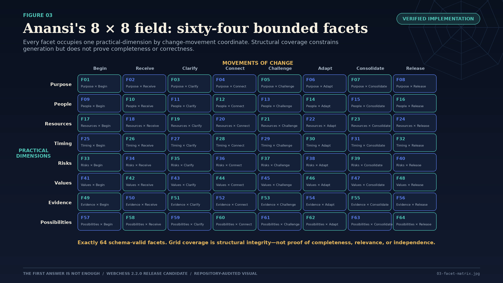

*Figure 3. The implemented 8 × 8 request matrix. It constrains coverage positions; it does not certify semantic adherence or completeness.*

## 4.5 Deterministic quality checks

**IMPLEMENTED FORMULAS.** Quality text is normalized with Unicode NFKC, lowercased, and tokenized into Unicode letters and numbers. Numeric-only tokens, tokens shorter than three characters, and a fixed stop-word set are removed for overlap analysis. Ratios use:

$$
r(c,n)=
\begin{cases}
0,&n=0\\
\operatorname{round}_{4}(c/n),&n>0
\end{cases}
$$

Here \(c\) is a count, \(n\) is the relevant total, and \(\operatorname{round}_{4}\) means rounding to four decimal places.

The field is rejected when at least 25 percent of titles begin with forms such as “Facet 12” or “Topic 4”—16 of 64—or when at least half the facets echo their own ID in any text field—32 of 64.

Numeric-only tokens are replaced by `{number}` to expose substitution templates. A text field fails when one skeleton appears at least 16 times **and** represents at least half the field; with 64 facets, the effective threshold is 32.

For meaningful-token sets \(A\) and \(B\) whose union is nonempty, Jaccard similarity is:

$$
J(A,B)=\frac{|A\cap B|}{|A\cup B|}
=\frac{|A\cap B|}{|A|+|B|-|A\cap B|}
$$

There are:

$$
\binom{64}{2}=\frac{64\times63}{2}=2{,}016
$$

unordered facet pairs. A pair is highly overlapping only when both sets have at least six tokens and \(J\ge0.82\). The whole field fails only if at least 32 facets have such a neighbor **and** at least 16 high-overlap pairs exist. Original-question overlap is diagnostic, not a rejection rule.

These checks catch scaffolding and widespread lexical duplication. They do not prove truth, relevance, completeness, cultural adequacy, semantic independence, or slot adherence. The four synthetic evaluation fixtures are regression cases, not an empirical validation study.

## 4.6 Three domain-separated deterministic permutations

**IMPLEMENTED.** A saved seed creates three seed strings:

$$
s_p=\texttt{webchess/division/}\Vert seed\Vert\texttt{/}p,
\qquad p\in\{\texttt{facets},\texttt{hexagrams},\texttt{board}\}
$$

WebChess shuffles the sorted facets, separately shuffles the sixty-four reflective lenses, zips those arrays, then shuffles the completed pairs onto the board. Array index \(i\) maps to ring \(r\) and sector \(s\) by:

$$
i=8r+s
$$

The seed string is reduced to 32 bits with FNV-1a:

$$
h_0=\texttt{0x811c9dc5}
$$

$$
h_{i+1}=\operatorname{imul}
\left(h_i\oplus c_i,\texttt{0x01000193}\right)
\pmod{2^{32}}
$$

where \(c_i\) is a JavaScript UTF-16 code unit. Mulberry32 advances its state by:

$$
a\leftarrow a+\texttt{0x6d2b79f5}\pmod{2^{32}}
$$

and applies fixed XOR, shift, and integer-multiply mixing. Fisher–Yates then uses:

$$
\text{for }i=n-1,\ldots,1:\quad
j=\lfloor u_i(i+1)\rfloor;\quad
swap(a_i,a_j)
$$

Here \(u_i\in[0,1)\) is the next PRNG value. The loop swaps each remaining position with one uniformly indexed position in its unshuffled prefix.

The version is `independent-three-shuffle-v1`, but the precise claim is **domain-separated deterministic permutations**. The cast is reproducible, not cryptographically secure or proven statistically independent. Thirty-two-bit collisions are possible, and each stream reaches only a tiny subset of \(64!\).

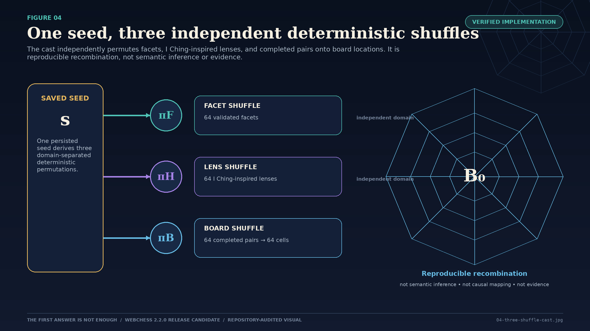

*Figure 4. The implemented cast order: shuffle facets, shuffle reflective lenses, zip them, then shuffle the completed pairs onto the board. Domain separation provides reproducibility, not evidential privilege.*

The sixty-four King Wen names and project-authored English themes are reflective prompts, not changing-line calculation, translation, prediction, or traditional Yijing divination. A juxtaposition may provoke thought; it acquires no epistemic privilege from having been cast.

## 4.7 Implemented and proposed boundaries

**IMPLEMENTED:** one Division call; fixed field coordinates; structural and lexical checks; bounded repair context after field Retry; canonical mapping and digests.

**PROPOSED:** user merge/reject before casting; explicit assumptions, stakeholders, evidence status, disconfirming observations, possible tests, and source spans; semantic slot validation; proof that sixty-four is optimal.

Anansi can still generate generic consulting language, hide semantic duplicates beneath different nouns, invent facts, neglect power, or make a complete grid look like a complete understanding. Portia can expose some failures, but upstream quality is cheaper than downstream predation. The most elegant hunter cannot extract nutrition from sixty-four papier-mache flies.

---

# 5. Chess: constrained conflict and terminal ecology

## 5.1 The function of Chess

Chess is the lifecycle's conflict engine. It does not determine truth. It forces generated possibilities into a bounded, sequential encounter governed by stable movement rules. The result is a path through the field that is neither a direct semantic ranking nor unconstrained randomness.

The game contributes:

- temporal order;
- role persistence;
- opposition between outside-in evidence and inside-out intent;
- local encounters between pieces and facets;
- path dependence;
- visible captures;
- forced termination; and
- a replayable record.

## 5.2 Implemented board and terminal rules

**IMPLEMENTED.** Black begins on rings 0 and 1 and moves outward, representing **inside-out intent**. White begins on rings 7 and 6, moves inward, and moves first, representing **outside-in evidence**. Sectors wrap from 7 to 0; rings stop at their boundaries. Neither color is a moral rank.

The variant uses direct King capture rather than checkmate; omits castling and en passant; permits an unobstructed initial two-ring pawn move; promotes a pawn to Queen at the far ring; and forces a pass when one side cannot move but the other can. It terminates on King capture, mutual immobility, 100 quiet plies, or 256 total plies. A King capture on ply 256 wins before the move-limit draw is applied. Seven captures are only an interface reflection marker.

The server reconstructs every authoritative position from the append-only event log. It validates side to move, origin, legal destination, capture identity, promotion, forced pass, terminal result, and recorded rules. A client-supplied piece snapshot has no authority.

## 5.3 Capture attention is salience, not evidence

**IMPLEMENTED FORMULA.** Piece values are:

$$
V(K)=10,\quad V(Q)=9,\quad V(R)=5,\quad
V(B)=3,\quad V(N)=3,\quad V(P)=1
$$

For captured piece \(c\), attacker \(a\), and destination ring \(r\), the display weight is:

$$
W=\operatorname{round}\left[
52+2.5V(c)+V(a)+2\max\left(0,3.5-|3.5-r|\right)
\right]
$$

The resulting range is 56–93. The captured role contributes most; the attacker adds active force; and middle-ring conflicts receive a meeting-point increment. This score is not probability, confidence, evidence quality, moral importance, or causal effect.

## 5.4 The implemented terminal ecology

A complete game yields more than a capture trail. The server requires a terminal replay and exactly sixty-four mapped parts, recomputes legal attack opportunities in every pre-event position, and creates one candidate per surviving piece.

For explanatory purposes:

$$
S_i=\{
candidateId,piece,polarity,facet,coordinate,
route,captures,attackedPlies,provenance
\}
$$

The executable candidate stores canonical piece ID; current and original kind; side and polarity; piece-role metaphor; final coordinate; the facet and change lens at that coordinate; every route step; captured IDs; every ply on which an opponent had a legal capture of that piece; move count; promotion status; game and attempt identities; and a SHA-256 source digest.

`attackedPlies` is a chess property, not proof that an idea endured criticism. The candidate ID is:

$$
candidateId=attemptId\mathbin{:}pieceId
$$

The terminal fingerprint hashes a piece-sorted semantic projection. It intentionally excludes game IDs, retry IDs, and per-record source digests, allowing Retry to detect the same terminal ecology across a genealogy rather than mistaking fresh database identities for new structure.

Survival means only that a piece remained under this field, cast, trajectory, and rule version. The associated idea is not thereby true. It has merely become eligible for Portia.

## 5.5 The captured King

King capture is a terminal bell, not an oracle. The winning polarity reached the opposing Core purpose under the rules. It did not prove that evidence should dominate intention or intention should dominate evidence.

The King capture is the bell that wakes Portia.

## 5.6 Current and legacy answer paths

**IMPLEMENTED:** New games construct the terminal ecology and an exact board-derived Answer prompt, then run Portia and deterministic Gate before Answer.

**LEGACY:** Older games without a lifecycle row can still use the capture-trail reading. Its recurrence lift is:

$$
L=1+0.08\min(3,n-1),\qquad score=W\times L
$$

Here \(n\ge1\) is the positive occurrence count for the repeated legacy signal. The lift is 1 when \(n=1\), increases by 0.08 for each of the next three occurrences, and saturates at 1.24 when \(n\ge4\). An FNV-derived two-facet fallback is used when there are no captures. That compatibility path is not the current Answer architecture.

## 5.7 Chess as selection without semantic authority

The semantically blind engine prevents the generating model from simply ranking its own favorite facets. It also may select semantically irrelevant squares: a brilliant tactical sequence can be intellectually useless.

Evaluation must therefore compare Engine V2 with random legal play, human play, shallow search, semantic policies, coverage-maximizing policies, and value-of-information policies. If a cheaper random walk performs equally well downstream, tactical grandeur becomes expensive theater. The experiment must be permitted to say so.

---
# 6. Portia: adversarial traversal and selective consumption

## 6.1 The biological source

Portia is a genus of jumping spiders specialized in preying on other spiders. Research describes Portia entering prey webs, using aggressive-mimicry signals, exploiting the resident spider's perceptual system, deriving effective signals through trial-and-error or generate-and-test behavior, and making route decisions that can involve detours (Jackson, 1995; Jackson & Nelson, 2011; Jackson & Cross, 2013; Cross & Jackson, 2019).

The prey web is not merely a trap. It is part of the resident spider's sensory apparatus. Portia succeeds by operating inside another organism's information environment.

The engineering analogy is exact enough to be useful and limited enough to require discipline:

- the terminal WebChess state is an information network;
- surviving candidates are adaptive intellectual prey;
- Portia probes how each candidate responds under pressure;
- the attack changes according to feedback;
- Portia may preserve, wound, consume, or leave unresolved what it encounters.

WebChess does not claim that Portia possesses human-style theory of mind, moral judgment, or abstract logic. Animal-cognition findings motivate a design metaphor; they do not authorize anthropomorphic mythology as evidence.

## 6.2 Portia hidden at the center

During Anansi and Chess, Portia remains hidden at the center of the Web. This separation is architecturally important. If Portia influences facet generation or move choice too early, the system may prune unconventional material before it has had a chance to interact.

When the game becomes terminal, Portia wakes and traverses the surviving ecology. The pieces are “living food” only in the metaphorical sense that each carries a still-active interpretation. Portia does not grade a polished Charlotte essay. It examines the exact forthcoming Answer prompt before Answer exists.

## 6.3 Implemented input and scrutiny order

**IMPLEMENTED.** Portia receives:

- the normalized original question;
- 1–32 exact survivor candidates;
- the complete provider-neutral board Answer prompt package;
- the terminal fingerprint and candidate source digests;
- the SHA-256 digest of that exact prompt; and
- an optional durable research packet.

Candidates are visited deterministically by attacked plies descending, captures descending, piece value descending, route length descending, then candidate ID ascending. Greater board pressure determines scrutiny order, not truth.

## 6.4 Thirteen implemented attack classes

Every candidate must receive every attack exactly once. “Not applicable” is an outcome, not permission to omit an attack.

| # | Contract identifier | Question applied to every survivor |
|---:|---|---|
| 1 | `relevance_to_original_problem` | Does this still illuminate the saved question, or has metaphor carried it elsewhere? |
| 2 | `unsupported_assumption` | Which load-bearing premise lacks support? |
| 3 | `evidence_grounding` | What is user fact, research synthesis, model inference, symbolic association, or unknown? |
| 4 | `redundancy` | Does another candidate depend on the same premise, evidence, mechanism, and consequence? |
| 5 | `contradiction` | Does it conflict with another candidate or the available basis? |
| 6 | `causal_overreach` | Has correlation, sequence, salience, or metaphor been promoted into cause? |
| 7 | `stakeholder_or_opponent_response` | How could an affected or opposing actor respond? |
| 8 | `seed_or_path_sensitivity` | Is importance brittle under this cast or trajectory? |
| 9 | `actionability` | What observation, conversation, prototype, or choice follows? |
| 10 | `reversibility` | Can use of the idea be stopped, repaired, or rolled back? |
| 11 | `harm_or_exclusion` | Who bears downside, loses agency, or disappears from view? |
| 12 | `metaphor_overreach` | Has chess or a change lens been mistaken for evidence? |
| 13 | `narrative_overfitting` | Is the story more coherent than its factual basis? |

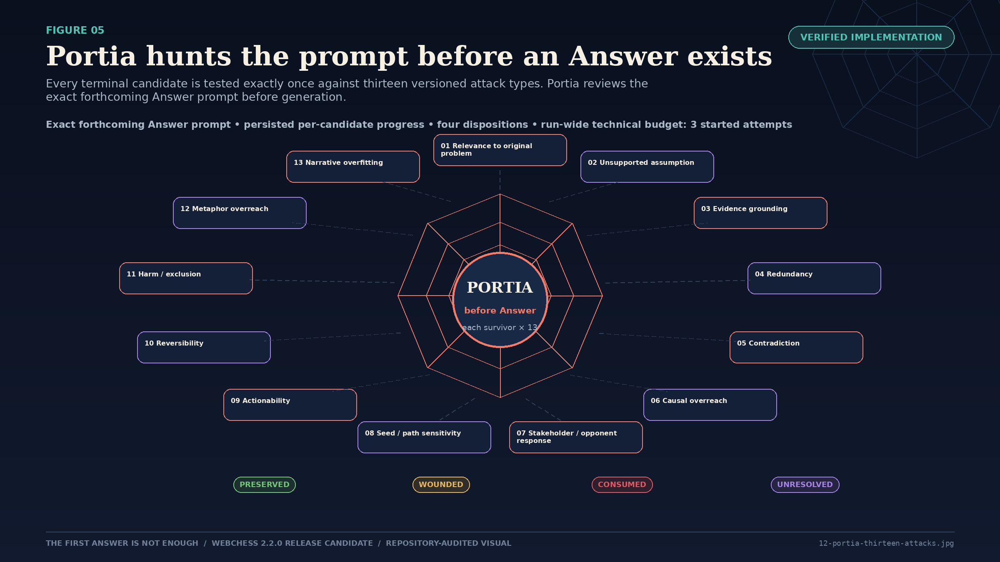

*Figure 5. Every terminal survivor receives all thirteen implemented attack classes exactly once before the separate cross-candidate summary.*

An attack finding stores type, outcome, severity, finding, consequence, and optional required revision. Outcomes are `passed`, `qualified`, `failed`, `unresolved`, or `not_applicable`; severities are `low`, `moderate`, `severe`, or `fatal`. A not-applicable or passed attack cannot demand revision. Severe and fatal findings require a concrete consequence.

## 6.5 Four dispositions

**IMPLEMENTED.** Portia classifies each survivor into one of four dispositions.

| Disposition | Enforced contract | Later use |
|---|---|---|
| **Preserved** | Has a surviving interpretation; all attacks passed or did not apply; no fatal finding | May support later work without a material wound |
| **Wounded** | Has a surviving interpretation and exact qualification; at least one qualified attack; no failed, unresolved, or fatal attack | May support later work only with the scar copied exactly |
| **Consumed** | Has no surviving interpretation | Cannot support Charlotte |
| **Unresolved** | Contains at least one unresolved attack | Remains a question, not support |

Each assessment also stores coverage tags, missing evidence, countercase, reversal condition, and optional redundancy-cluster ID. The ten coverage tags are protected outcome, stakeholder, evidence or reality, risk or countercase, agency or action, value, resource, timing, alternative, and tension.

## 6.6 Model-call topology and resumability

For \(N\) survivors in one uninterrupted, technical-failure-free Portia attempt, Portia performs \(N\) candidate calls plus one summary:

$$
C_{Portia}=N+1,\qquad1\le N\le32
$$

Candidate calls use low reasoning and at most 8,000 output tokens; the summary uses low reasoning and 6,000. Hosted calls use `gpt-5.6-sol`, prompt `webchess-portia-v4`, strict output, and `store:false`. The summary assigns reciprocal redundancy clusters, cross-candidate contradictions, missing coverage, unresolved questions, valid tension pairs, field-repair reasons, and one prompt decision: `permit`, `retry_game`, `retry_field`, or `deny`.

Completed candidate drafts persist as an ordered prefix. A resumed run validates the exact request fence and continues at the next unfinished candidate. A failed current-candidate call or failed summary call is not added to that prefix and is repeated on the later run-level attempt, so eventual success after a technical failure can exceed \(N+1\) provider calls. The first or second failed provider attempt returns to `portia_pending`; the third reaches `portia_unavailable`.

Portia's review binds `reviewedAnswerPromptDigest` to the exact forthcoming Answer package. A review of one prompt cannot authorize another.

## 6.7 Survival is not truth

Portia performs structured attempted falsification, not metaphysical certification.

> A preserved candidate means that the implemented attacks failed to destroy it under the available evidence, model, prompt, and budget.

A weak suite, missing evidence, or correlated error can preserve nonsense. In the hosted topology, Division, Portia, Answer, and Charlotte use the same fixed model family. Deterministic validators add contract-level independence, but same-model review is not error-independent adjudication.

## 6.8 Proposed safeguards against evaluator monoculture

Research on model self-refinement shows that iterative feedback can improve outputs in some settings, while other work finds that intrinsic self-correction without external feedback can fail or degrade reasoning (Madaan et al., 2023; Shinn et al., 2023; Huang et al., 2024). Portia should therefore be designed against evaluator monoculture.

Possible safeguards include:

- a model different from Anansi's generator;
- deterministic validators;
- tool-backed factual checks;
- retrieval from user-approved sources;
- multiple adversarial roles with independent prompts;
- cross-model or cross-provider adjudication where justified;
- blind human review for high-impact cases;
- disagreement preservation rather than forced consensus; and
- periodic attack-suite red teaming.

The requirement is not maximal model diversity for its own sake. The requirement is **error independence**. Four copies of the same mistake do not become a jury.

## 6.9 Portia's own failure modes

Portia can fail through:

- over-pruning unconventional but valuable ideas;
- mistaking lack of evidence for evidence of absence;
- privileging easily measurable concerns over morally important ones;
- rewarding conformity to the evaluator's worldview;
- consuming minority or culturally unfamiliar perspectives;
- inventing counterevidence;
- treating cross-seed recurrence as truth;
- attacking rhetoric instead of the underlying proposition; or
- optimizing for rejection because “critical” systems are often praised for sounding severe.

Portia must therefore be evaluated on false consumption as well as false preservation.

---

# 7. Gate: interpretive sufficiency

## 7.1 Why a separate Gate exists

After Portia hunts, the system may be left with three strong candidates, twelve wounded candidates, one unresolved existential risk, or nothing but bones. A language model will happily synthesize any of these states. That is precisely why it must not control the decision to proceed.

The Gate is a distinct sufficiency authority. It asks whether Portia's prompt-bound review contains enough independent and relevant material to authorize Answer.

## 7.2 The exact implemented conjunction

**IMPLEMENTED FORMULA — `webchess-gate-v4`.** Let:

- \(P\): Portia's prompt decision is `permit`;
- \(U\): preserved plus wounded candidates;
- \(I\): independent usable clusters;
- \(C_{req}\): required coverage;
- \(C_{obs}\): coverage supplied by usable candidates;
- \(T\): at least one tension pair joins usable candidates in different clusters;
- \(B\): an unaddressed severe or fatal cross-candidate contradiction exists;
- \(O\): a severe or fatal failed or unresolved finding remains on a usable candidate;
- \(F\): Portia supplied a field-repair reason; and
- \(Q\): every wounded candidate carries its exact qualification.

Then:

$$
\boxed{
Pass=
P
\land(U\ge3)
\land(I\ge3)
\land(C_{req}\subseteq C_{obs})
\land T
\land\neg B
\land\neg O
\land\neg F
\land Q
}
$$

The required set is:

$$
C_{req}=\{
\texttt{protected\_outcome},
\texttt{evidence\_or\_reality},
\texttt{risk\_or\_countercase},
\texttt{agency\_or\_action}
\}
$$

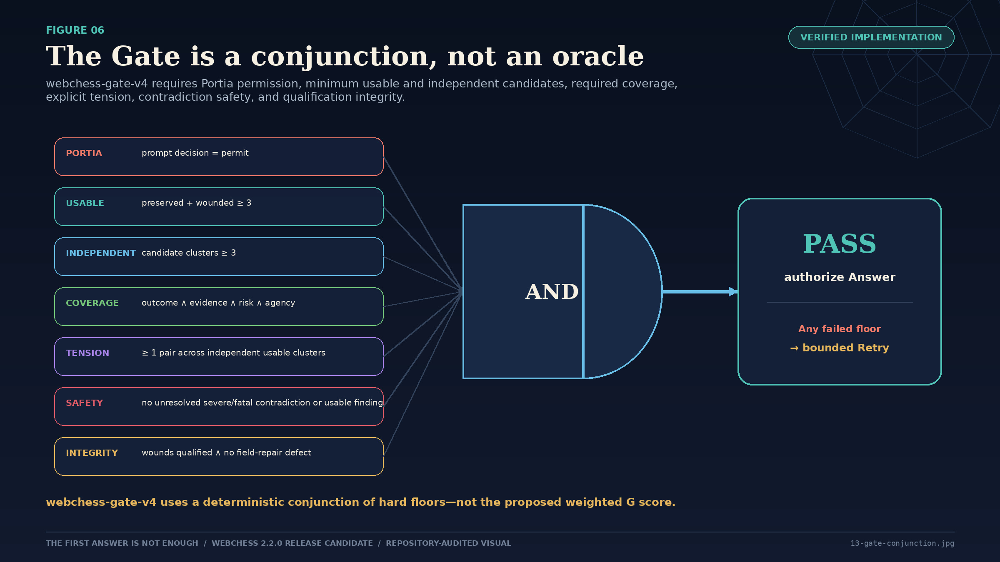

*Figure 6. Gate V4 is a deterministic conjunction of hard floors. It is not a weighted model score and does not certify truth.*

An unclustered usable candidate receives its own implicit cluster. A tension counts only across distinct usable clusters. Required revisions can be appended as exact Answer-prompt amendments only when Portia has permitted the prompt; they cannot repair a non-permit decision by stealth.

The old weighted expression \(G=w_pP+\cdots-w_uU\) is a **PROPOSED METRIC**, not current code. Gate V4 uses a hard conjunction, not a weighted threshold.

## 7.3 Duplicate ecology and next transition

A terminal ecology is duplicate-heavy when:

$$
U>0\land\frac{I}{U}<0.6
$$

That ratio influences Retry routing; it does not replace the three-cluster pass floor. A pass recommends `answer`. A failure recommends `retry_game`, `retry_field`, or `insufficient_basis` according to Portia's decision, missing coverage, field-repair reasons, duplicate density, and remaining retry allowances.

Five pawns repeating one proposition are not five independent perspectives. The Gate counts clusters, coverage, wounds, contradictions, and tensions—not merely surviving tokens in different hats.

## 7.4 Gate provenance

**IMPLEMENTED.** The result stores counts for all four dispositions, usable and independent counts, every coverage result and candidate ID, severe objection count, fatal contradiction IDs, valid tension pairs, all missing requirements, recommendation, explanation, algorithm version, and a SHA-256 digest over the review, retry context, and thresholds.

The public field `fatalUnaddressedIds` lists fatal contradictions, but the actual fail condition blocks both severe and fatal unaddressed contradictions.

Gate passage means only that Portia's structured review satisfies the versioned continuation contract. It does not certify the candidates as true. The Gate is auditable and deliberately boring. Judgment gates that perform like oracles eventually acquire priests.

---

# 8. Retry: controlled recursion

## 8.1 Retry is a lifecycle stage

Retry is not a parenthetical arrow. It consumes compute, changes provenance, introduces multiple-comparison risks, and determines whether the system learns from failure or merely rerolls until a desired answer appears. It therefore deserves explicit status.

Semantic Retry starts only after a complete Portia review and deterministic Gate failure. It is not the same as a technical provider retry.

## 8.2 Exact policy and budgets

**IMPLEMENTED — `webchess-retry-v2`.** Productive modes are `replay_game`, which preserves the field and creates another trajectory, and `regenerate_field`, which sends a bounded Portia/Gate autopsy back to Division. The terminal mode is `insufficient_basis`.

The limits are:

$$
L_{game}=2,\qquad L_{field}=1
$$

For saved counters \(g\) and \(f\):

$$
R_{game}=\max(0,2-g),\qquad
R_{field}=\max(0,1-f)
$$

One root genealogy therefore contains at most the initial game, two same-field replay children, and one regenerated-field child: **four games across no more than two fields**. The deterministic policy may spend the regeneration before both replay allowances; any unused replay allowance can then be spent on the new field. Quota, Gate routing, or unrepairable failure may stop it earlier.

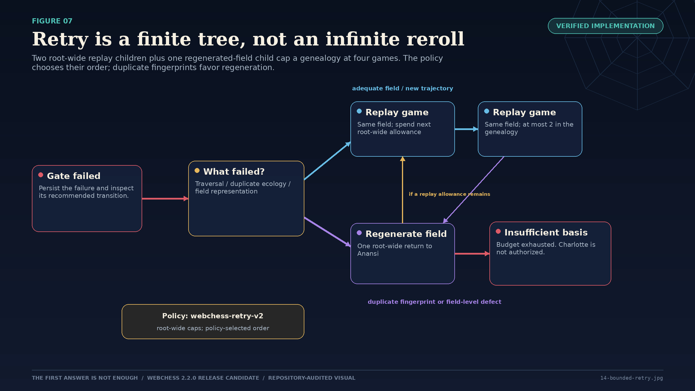

*Figure 7. Retry V2 preserves ancestry and stops after at most four games across two fields. Regeneration may occur before unused replay allowances; a duplicate terminal ecology cannot trigger an endless same-field reroll.*

## 8.3 Duplicate-terminal protection

Before Retry, the service compares the current terminal fingerprint with earlier attempts under the same root. A duplicate forces field regeneration when that allowance remains; otherwise the result is `insufficient_basis`. New record IDs cannot masquerade as new intellectual structure.

## 8.4 Repair rather than amnesia

Field regeneration retains the original question and passes one normalized repair record to a new Division call: the prior field-generation number, Gate missing requirements, missing-coverage tags merged from Portia and Gate, and Portia field-repair reasons. It does not pass the full Gate or Portia objects. Each list is normalized, deduplicated, and bounded. A same-field replay retains the canonical field and creates a new child game and trajectory seed.

Every child stores root, parent, field generation, game attempt, counters, trajectory seed, and reason. Failed Gates remain in the genealogy. Retry is therefore an autopsy-driven branch, not a “spin again” button that erases inconvenient outcomes.

A narrow compatibility rule can reopen an old `insufficient_basis` result only when a prompt-bound Portia record exists and the one field-regeneration allowance remains unused.

## 8.5 Implemented and proposed boundaries

**IMPLEMENTED:** two same-field retries, one field regeneration, duplicate-fingerprint detection, bounded repair context, ancestry, and explicit insufficiency.

**PROPOSED:** cross-game semantic recurrence, alternate move policies, expected-information-gain stopping, preregistered research budgets, and claims that recurrence increases truth. A popular error can win every election held inside the same flawed constitution.

Infinite recursion is not perseverance; it is a denial-of-service attack wearing the mask of introspection.

---

# 9. Answer and Charlotte: proposal, qualification, and truthful persuasion

## 9.1 Answer is a separate generated artifact

**IMPLEMENTED.** Answer occurs only after Portia permits the exact reviewed prompt and the deterministic Gate passes. It is a model operation and durable artifact between Gate and Charlotte, not a ninth named authority and not a lifecycle state. Progress is tracked on the game as `completed -> answering -> answer_failed | answered`.

The provider-neutral package binds the original question, replayed outcome, weighted capture trail, raw terminal survivors, terminal fingerprint, prompt version, optional research packet, exact Portia review, and Gate provenance. Portia-required revisions become visible prompt amendments only under `permit`. The player-visible prompt is stored separately from provider instructions and credentials.

Answer validates at most 256 plies and 32 captures, capture order and acting side, winner and King-capture invariants, no-progress after at least 100 plies since the last capture, and move-limit on ply 256. The strict output contains:

1. a direct answer beginning with two or three sentences;
2. what the conflicts emphasized;
3. the tension to hold;
4. exactly three reversible next moves; and
5. what could change the answer.

The rendered Answer contains 450–750 words. Hosted generation uses `gpt-5.6-sol`, medium reasoning, `webchess-answer-v3`, at most 12,000 output tokens, and `store:false`.

Unlike Portia and Charlotte, Answer has no fixed three-failure lifecycle counter. A new player attempt may be authorized subject to status, ownership, quota, and idempotency.

## 9.2 Why Charlotte

In E. B. White's *Charlotte's Web*, Charlotte does not save Wilbur by overpowering the humans. She changes the symbolic environment through language. The humans' model of Wilbur changes, and their behavior changes with it. Literary scholarship has examined the web's role in community, narrativity, ethics, edibility, friendship, and the transformation of Wilbur's social status (White, 1952; Rushdy, 1991; Ratelle, 2014).

This is the modern AI connection: language can reorganize attention, classification, status, and action without directly changing the underlying object. Search summaries, diagnostic labels, recommendations, rankings, political slogans, and model-generated explanations all operate at this symbolic layer.

Charlotte therefore represents **aligned communicative intelligence**:

- a protected outcome;
- responsibility to affected beings;
- audience modeling;
- semantic compression;
- truthful persuasion;
- practical action; and
- accountability for downstream consequences.

## 9.3 Charlotte comes after Answer

The order matters:

> Anansi -> Chess -> Portia -> Gate -> Answer -> Charlotte

Reality-testing precedes substantive Answer, and qualification follows it. Otherwise Charlotte could produce morally polished nonsense and Portia would be asked to inspect a story already compressed around a preferred conclusion.

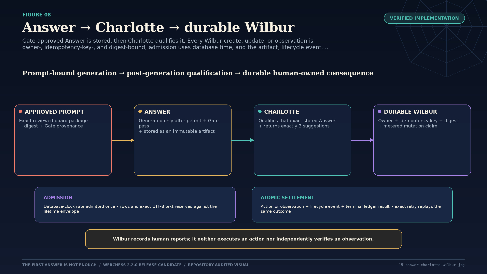

*Figure 8. Correct authority boundary: Answer generates the substantive artifact, Charlotte qualifies that exact stored artifact, and Wilbur records human-authored action and observation rather than executing them automatically.*

Answer supplies the substantive analysis. Charlotte reviews that exact stored artifact for audience, values, affected people, uncertainty, and reversible action. She may narrow it; she may not silently substitute a different answer.

## 9.4 Bound input and support

**IMPLEMENTED.** Charlotte input binds:

- the original question;
- the exact persisted Answer and canonical SHA-256 digest;
- the reviewed prompt digest;
- permitted Portia review;
- passed Gate and provenance digest;
- provider, model, and prompt identity; and
- the same optional research packet reviewed before Answer.

New generations cite at most four supporting candidates, each preserved or wounded. Every cited wound must carry Portia's `requiredQualification` byte-for-byte. Consumed and unresolved candidates cannot support the qualification.

## 9.5 Implemented Charlotte output

The `webchess-charlotte-result-v1` contract contains protected outcome; audience-ready direct answer; supporting IDs and exact qualifications; central tension; value constraints; stakeholder consequences; recommendation; communication strategy; uncertainties; what could change the answer; and exactly three action records.

Each action names its actor, tested assumption, smallest action, expected observation, decision threshold, review horizon, reversibility, risks or affected parties, and one decision rule: `stop`, `continue`, or `revise`.

The current renderer validates 100–20,000 characters, and Charlotte's word count is informational. The 450–750-word requirement belongs to Answer.

Hosted Charlotte uses `gpt-5.6-sol`, medium reasoning, `webchess-charlotte-v4`, strict output, at most 16,000 output tokens, and `store:false`. Failures one and two return to `charlotte_pending`; the third reaches `charlotte_unavailable`. In that state the Portia-approved Answer remains visible as unqualified, but Wilbur is not authorized.

## 9.6 Persuasion is not neutral

Charlotte's mechanism is ethically attractive because she saves Wilbur. The same mechanism can manufacture prestige, obscure uncertainty, manipulate institutions, or convert weak evidence into social fact. The difference is not linguistic capability. It is purpose, truthfulness, consent, and accountability.

Charlotte should therefore be constrained by principles such as:

- do not state a symbolic association as evidence;
- do not conceal material uncertainty for rhetorical force;
- do not exploit a stakeholder's cognitive vulnerability;
- distinguish explanation from influence strategy;
- disclose conflicts of interest;
- preserve dissent where it is decision-relevant;
- prefer reversible actions under uncertainty; and
- never claim that Portia survival or Gate passage establishes truth.

## 9.7 Audience-specific communication

One recommendation may require different explanations for operators, executives, regulators, affected communities, technical reviewers, and payers. Charlotte should adapt vocabulary and emphasis without changing the factual core.

This is not permission to tell each audience what it wants to hear. Audience modeling without semantic invariance is merely lying with better typography.

Charlotte is constrained, not sanctified. Schema compliance makes support and wounds traceable. It does not prove moral correctness, audience benefit, or freedom from manipulation.

---

# 10. Wilbur: consequence in the world

## 10.1 The missing object of concern

A reasoning architecture can become intoxicated by its own internal structure. Anansi generates, Chess dramatizes, Portia criticizes, Charlotte writes, and the system congratulates itself for intellectual depth. Wilbur is the reminder that somebody, somewhere, may have to live beneath the web.

Wilbur represents:

- the person whose life is affected;
- the project being protected;
- the organization that must act;
- the community bearing the downside;
- the concrete objective at stake; or
- the vulnerable reality beneath the language.

Without Wilbur, the system is a magnificent web suspended over an empty barn. With Wilbur, the architecture at least has a named place to record what a human intended to try and what that human later reported. That is reality contact, not reality certification.

## 10.2 Wilbur is not necessarily autonomous execution

WebChess does not execute Wilbur actions. The implemented stage is a human-controlled action and observation record. The system makes an intended intervention and reported consequence legible; it does not seize agency.

For high-impact decisions, Wilbur must remain under accountable human and institutional authority. Durable storage, an idempotency key, or a green user interface cannot confer consent, legal authority, domain competence, or permission to affect another person.

## 10.3 Implemented action and observation records

**IMPLEMENTED — `webchess-wilbur-v1`.** The interface offers the three action suggestions in the saved Charlotte result. For a newly created action, the service accepts only an exact match to one suggestion's index and six content fields: actor, smallest action, tested assumption, expected observation, decision threshold, and review horizon. The database stamps the binding as `webchess-charlotte-action-binding-v1`, permits at most one current-bound action per suggestion index in a lifecycle run, and requires the action to begin `planned` at revision zero. Its canonical identity and content are thereafter immutable; an update may change only status, increment revision by exactly one, and move the update timestamp forward or leave it equal.

Migration `0012` is deliberately upgrade-safe. Rows written before canonical binding receive no invented pedigree: their `charlotteBindingVersion` remains `null`, and duplicate legacy suggestion indexes may remain. The partial uniqueness rule applies only to current, version-bound rows. This distinction prevents an old resemblance from being rewritten as a new guarantee.

The action status vocabulary is:

```text
planned | in_progress | completed | abandoned | inconclusive
```

An observation stores its own identifier, action identifier, observation time and text, player-authored evidence classification, expected and unexpected effects, stakeholder response, next decision, and one assumption result:

```text
supported | rejected | unresolved
```

Evidence classification is free text. The three assumption-result labels are the player's classification; they are not a causal estimate or independent verification.

**Durable mutation boundary.** Migration `0013` adds one mutation-ledger row for each storage-admitted `create_action`, `update_action`, or `append_observation` intent, uniquely identified by owner and a UUID idempotency key. **UUID** means universally unique identifier. A fresh intent that fails the lifetime row/text envelope is rejected before ledger insertion and rate admission. A claimed row binds the operation, canonical request digest, target game, optional target action, and rate kind. A new row must begin `pending` and unadmitted. A committed or denied row is terminal and immutable; when the owner next enters the claim path, a pending row older than 24 hours becomes a durable denial.

The first exact retry does not mean “do it again.” It means “show me what happened to this intent.” If the stored identity matches, a committed create or update returns the recorded result revision, status, and update time—even if that action was changed later—and a committed observation returns the same immutable observation. A stored denial is replayed through the rate boundary. Reusing the key with another operation, target, or digest conflicts.

Rate admission occurs at most once. The service locks the pending ledger row, evaluates the owner's hourly bucket before the shared HMAC-pseudonymous IP bucket, and records `rateAdmittedAt` with PostgreSQL's own `now()` clock before a mutation may commit. A retry that finds a committed or already admitted request does not debit either bucket again. **HMAC** means hash-based message authentication code; the rate table stores a derived pseudonym, not the raw IP address.

The browser mirrors that boundary. While an intent remains ambiguous after a network failure, an HTTP 5xx response, or malformed JSON in an otherwise successful response, it keeps the same payload and idempotency key and refreshes lifecycle state. If the player retries because no recovered result appeared, the browser sends only that same intent. A definitive client error clears it. This is ambiguity recovery for WebChess's own records, not exactly-once execution in the outside world.

**Atomic settlement.** Creation, status update, and observation each use a single SQL statement built from CTEs—**common table expressions**, named subqueries within that statement. The statement writes the action or observation, advances the lifecycle revision and state, appends `action_recorded`, `action_status_updated`, or `observation_recorded`, and settles the mutation ledger together. If any required row cannot be written, none of those effects becomes the committed result.

**Lifetime admission envelope.** The row limit counts all owned Wilbur actions, observations, Wilbur lifecycle events, terminal and pending mutation-ledger rows, and future rows reserved by pending requests. A new claim contributes its ledger row and reserves two future rows for a create or observation—artifact plus lifecycle event—or one future row for a status update—lifecycle event. The text limit uses exact UTF-8 byte counts for the six stored action fields or all seven stored observation fields, including `assumptionResult`. **UTF-8** is the eight-bit Unicode transformation format used to encode the text. Updates reserve no new artifact text because canonical action content cannot change. Existing history is preserved, and an exact pending or committed replay remains available if an operator later lowers a cap; a new status update still needs capacity for its ledger row and event.

The state path is `charlotte_complete -> wilbur_planning -> wilbur_in_progress -> wilbur_observed`; `wilbur_observed -> wilbur_in_progress` permits another iteration.

## 10.4 Reality contact is not causal proof

Suppose Charlotte recommends a small pricing experiment and revenue rises. That does not prove the recommendation caused the increase. Seasonality, selection, concurrent changes, measurement error, and luck remain possible.

Wilbur adds reality contact through an authenticated player-authored report, not automated verification or causal identification. WebChess does not execute the action, fetch evidence, connect to sensors, or attest that the observation occurred. Exact replay proves only that WebChess can recover the same database intent; it says nothing about whether the outside action occurred once, occurred at all, or caused the reported outcome. Where causality matters, the human process should use an appropriate experimental or quasi-experimental design.

## 10.5 Protecting Wilbur

The system should ask before action:

- Who can be harmed?
- Who consented?
- Who has authority?
- Is the action reversible?
- What information is private?
- What would constitute unacceptable downside?
- Who can stop the experiment?
- How will dissent be recorded?

Charlotte may speak for a protected outcome; she must not appropriate the voice of the affected person.

Independent observation verification, automated execution, causal estimation, external approval workflows, consent records, and enforceable actor-authority fields are **PROPOSED**, not hidden features of the current record. The current exact Charlotte binding constrains what recommendation enters Wilbur; it does not authorize that recommendation.

---

# 11. The Web: provenance, memory, and inheritance

## 11.1 The Web is more than storage

**IMPLEMENTED.** The Web is the within-case genealogy. It has no model call and no lifecycle state. The provenance endpoint returns activities; the interface renders those activities, visible research, and version identities.

The durable case can contain normalized question and digest; field, facets, seed, mapping and cast version; canonical events and outcome; terminal ecology and fingerprint; Portia progress, assessments and summary; Gate decision and digest; Retry parentage and counters; Answer prompt and output; Charlotte structure and exact wounds; Wilbur actions and player reports; research records; activity sequence; and owner-scoped export.

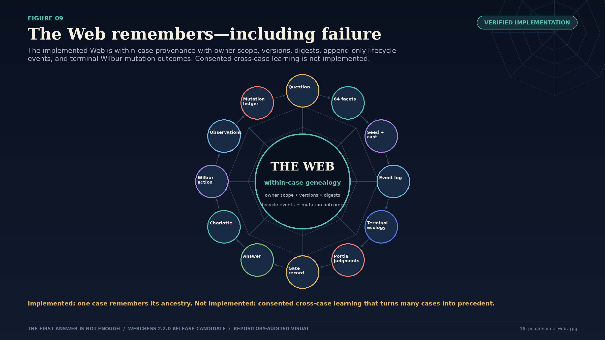

*Figure 9. The implemented Web is within-case provenance. Cross-case learning and automatic evidence verification are not implied by the links.*

This is strong provenance, but it remains a case record. The final Answer is one durable artifact among many; the genealogy makes its derivation inspectable without turning the artifact into an authority.

## 11.2 Memory layers

It is useful to distinguish four memory layers without claiming they all ship.

1. **Case memory — IMPLEMENTED:** private lifecycle artifacts for one problem.
2. **Operational memory — IMPLEMENTED:** quotas, idempotency, integrity, request leases, and system events.
3. **Learning memory — PROPOSED:** patterns across cases, requiring consent and privacy controls.
4. **Research memory — PROPOSED:** de-identified evaluation datasets with documented inclusion criteria.

Current Web does not retrieve lessons from other users, train later stages from Wilbur records, infer causal rules, or provide institution-wide memory.

## 11.3 Controlled forgetting

Perfect memory is not automatically virtuous. It can become surveillance, liability, inherited error, and permanent stigma. The Web needs:

- retention periods;
- user-controlled deletion subject to integrity and legal constraints;
- separation of identity from de-identified research data;
- access controls;
- data minimization;
- redaction and export;
- tombstones that prevent quota abuse without retaining content; and
- a documented policy for what cannot be learned from deleted cases.

Account deletion, owner-scoped export, usage accounting, and keyed tombstones exist. Cross-case retention and learning policies remain proposals.

## 11.4 Visible research broker

**TOPOLOGY-LIMITED IMPLEMENTATION.** The research contract names seven visible stages, but current orchestration calls the broker only once, immediately before Portia, and only in the local OpenClaw topology. Hosted dependencies do not inject it. Answer and Charlotte reuse the same persisted packet; they do not search again. Chess and Web are deterministically excluded.

Policy `webchess-visible-research-v3` permits one durable invocation, at most five results and five links, 150 seconds, a 12,000-character synthesis, 512 KiB process output, and 24 search activities. Deterministic patterns classify current, regulated, medical, financial, legal, geopolitical, technical, comparative, and recommendation questions as requiring or benefiting from research.

The broker accepts only public HTTPS links; rejects credentials, custom ports, localhost, private or special addresses, and local/internal hostnames; strips trackers and several injection-like lines; requires at least one acceptable public source; caps the source set; and hashes the packet.

Its boundary is explicit:

```text
contentKind = model_generated_search_synthesis
untrusted = true
directPageTextFetched = false
retrievedFacts = []
```

The packet contains a model-generated Codex Search synthesis and discovered citation candidates. It does not contain directly fetched page passages. A required research failure instructs Portia to retry or deny when material; Gate has no separate automatic research-failure clause.

Hosted research, direct page retrieval, passage-level verification, user-approved source sets, and research at every visible stage are **PROPOSED**.

## 11.5 Learning across cycles

A future Web may inform later Anansi cycles by retrieving:

- recurring failure patterns;
- Portia attacks that repeatedly expose weak facets;
- Gate dimensions that predict later success;
- Charlotte actions that generated useful evidence;
- Wilbur outcomes under similar conditions; and
- known domains where the entire method performs poorly.

This learning must not turn prior cases into unquestioned precedent. Retrieval should expose provenance, similarity limits, and contradictory outcomes.

## 11.6 The Web remembers death

Within one case, WebChess preserves Portia dispositions, Gate failures, and Retry ancestry. A future cross-case Web could ask:

- Was this idea never generated, killed by Chess, consumed by Portia, blocked by the Gate, rejected by Charlotte, or contradicted by a later player report or appropriately designed external test?
- Did a later cycle resurrect it because new evidence arrived?
- Did Portia repeatedly consume a culturally unfamiliar perspective that later proved valuable?

A system that remembers only winners trains itself to confuse survival with wisdom.

---
# 12. Formal model and reference algorithm

## 12.1 The twenty-three persisted states

**IMPLEMENTED — `webchess-lifecycle-v2.4`.**

| # | State | Meaning |
|---:|---|---|
| 1 | `anansi_pending` | A field has not begun |
| 2 | `anansi_running` | Division is in progress |
| 3 | `field_ready` | The validated field exists |
| 4 | `chess_ready` | A canonical cast is ready |
| 5 | `chess_playing` | The event log is active |
| 6 | `chess_terminal` | Replay establishes a terminal result |
| 7 | `portia_pending` | Portia can start or resume |
| 8 | `portia_running` | A fenced Portia attempt is active |
| 9 | `portia_unavailable` | Portia's three-attempt technical budget is exhausted |
| 10 | `portia_complete` | A complete prompt-bound review exists |
| 11 | `gate_passed` | Deterministic Gate authorized Answer |
| 12 | `gate_failed` | Gate refused and exposed reasons |
| 13 | `retry_ready` | Semantic Retry is available |
| 14 | `retry_running` | Retry is creating a child |
| 15 | `charlotte_pending` | Stored Answer awaits qualification |
| 16 | `charlotte_running` | A fenced Charlotte attempt is active |
| 17 | `charlotte_unavailable` | Charlotte's technical budget is exhausted |
| 18 | `charlotte_complete` | Validated qualification exists |
| 19 | `wilbur_planning` | The player may choose an action |
| 20 | `wilbur_in_progress` | An action is active |
| 21 | `wilbur_observed` | A player observation exists; iteration remains possible |
| 22 | `insufficient_basis` | Semantic repair allowances are exhausted or unusable |
| 23 | `abandoned` | The run is closed |

```text
anansi_pending -> anansi_running -> field_ready
  -> chess_ready -> chess_playing -> chess_terminal
  -> portia_pending -> portia_running
       -> portia_pending          [technical retry]
       -> portia_unavailable      [third technical failure]
       -> portia_complete -> gate_passed | gate_failed

gate_failed -> retry_ready -> retry_running
  -> chess_ready                  [same field]
  -> anansi_pending               [regenerated field]
  -> insufficient_basis
gate_failed -> insufficient_basis [no usable repair]
retry_ready -> insufficient_basis [budget exhausted]

gate_passed -> charlotte_pending -> charlotte_running
  -> charlotte_pending            [technical retry]
  -> charlotte_unavailable        [third technical failure]
  -> charlotte_complete -> wilbur_planning
     -> wilbur_in_progress <-> wilbur_observed
     -> wilbur_observed            [direct observation record]
```

Every nonterminal state can be abandoned, and a same-state transition is idempotent. A bounded Gate correction may reopen `insufficient_basis -> retry_ready` only when the unused repair allowance exists.

Three boundaries matter. The lifecycle row is normally bootstrapped only after a mapped game exists, so early Anansi/cast activities may be synthesized genealogy rather than live lifecycle-state observations. **Answer has no lifecycle state**; game statuses track it. **Web has no state**; it is a provenance view.

## 12.2 Formal implemented chain

Let \(q\) be the normalized player question. No separate user-approved evidence set is currently extracted at intake.

Division returns the validated field:

$$
F=Division(q)=\{f_1,\ldots,f_{64}\}
$$

For lens set \(H\) and domain-separated deterministic permutations:

$$
F'=\pi_F(F),\qquad H'=\pi_H(H)
$$

$$
P=pair(F',H'),\qquad B_0=\pi_B(P)
$$

A game under rules \(r\), move policy \(m\), and trajectory seed \(s\) yields:

$$
Game(B_0,r,m,s)\rightarrow(B_T,L,C,O)
$$

where \(B_T\) is the terminal board, \(L\) the canonical event log, \(C\) the capture trail, and \(O\) the outcome. Survivors and the exact prompt package are deterministic derivations:

$$
S=Survivors(B_T,L,C,O)
$$

$$
X=PromptPackage(q,S,L,C,O,R_e)
$$

where \(R_e\) is the optional persisted research packet. Portia attacks each survivor and then summarizes:

$$
J=Portia(S,X,digest(X))
$$

The deterministic Gate applies the conjunction in section 7:

$$
D=Gate(J,counters)
$$

If \(D=pass\), the distinct Answer model produces substantive artifact \(A^*\):

$$
A^*=Answer(X,J,D)
$$

Charlotte qualifies that exact stored artifact:

$$
K=Charlotte(A^*,digest(A^*),J,D)
$$

Wilbur stores player-authored action \(a\) and optional observation \(o\):

$$
(a,o)=WilburRecord(K,player)
$$

The Web presents within-case provenance:

$$
W=Record(q,F,B_0,L,S,X,J,D,A^*,K,a,o)
$$

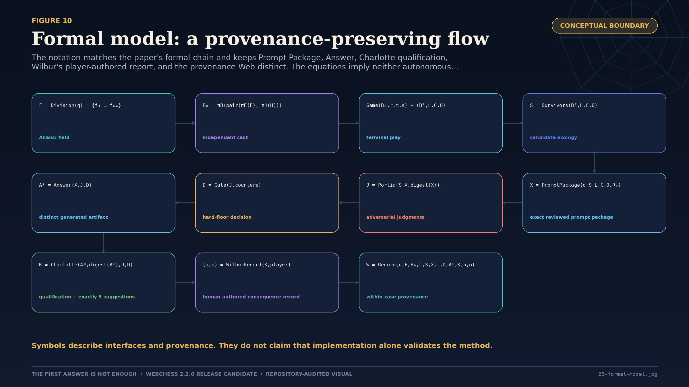

*Figure 10. Formal implemented chain. Model stages, deterministic authorities, the human-authored Wilbur record, and the provenance Web remain distinct.*

Cross-case retrieval from \(W\), an explicit intake evidence set, autonomous world transition \(world_{t_0}\rightarrow world_{t_1}\), and causal inference from Wilbur are **PROPOSED**, not present in these equations.

## 12.3 Reference algorithm

```text
function WEBCHESS(question):
    field = Division.generate_and_validate(question)
    game = Chess.create(field)

    loop:
        terminal = Chess.play_and_replay_to_terminal(game)
        survivors = derive_survivors(terminal)
        prompt = build_board_answer_prompt(question, terminal, survivors,
                                           optional_visible_research)

        review = Portia.review_each_survivor_then_summarize(prompt)
        gate = deterministic_gate(review, retry_counters)

        if gate.passed:
            answer = Answer.generate(prompt, review, gate)
            qualification = Charlotte.qualify_exact(answer, review, gate)
            return case_ready_for_player_authored_Wilbur(qualification)

        retry = deterministic_retry(gate, terminal_fingerprint, genealogy)
        if retry.mode == replay_game:
            game = create_same_field_child(game)
            continue
        if retry.mode == regenerate_field:
            repair = bounded_repair_context(
                priorFieldGeneration=field.generation,
                gate.missingRequirements,
                review.missingCoverage,
                review.recommendedGateInputs.fieldRepairReasons
            )
            field = Division.repair(question, repair)
            game = Chess.create(field)
            continue
        return explicit_insufficient_basis(gate, genealogy)
```

The regeneration call receives this normalized, bounded repair record—not the full Gate or Portia objects. This algorithm omits technical leases and retries for readability; section 12.6 supplies those boundaries.

## 12.4 Determinism and variation

Reproducibility requires separating variables that should remain fixed from variables intentionally changed.

A replay of the same game should preserve:

- question;
- facet field;
- cast seed;
- board assignment;
- rules version;
- engine version;
- move policy;
- root tie-break seed;
- model and prompt versions; and
- Gate and Portia configurations.

A retry should record exactly which of those variables changed. Otherwise, differences between runs cannot be interpreted.

## 12.5 Provider call accounting

For a normal successful game with \(N\) survivors and no technical provider failure:

$$
C_{normal}
=1_{Division}+(N+1)_{Portia}+1_{Answer}+1_{Charlotte}
=N+4
$$

Because \(1\le N\le32\), that clean-path range is 5–36 model calls. Gate, same-field Retry, Wilbur, and Web make none. Field regeneration adds one Division call. A semantic retry reaching Portia adds a clean-path \(N_j+1\) calls for its survivor count. Technical provider failures can repeat the unfinished Division, current Portia candidate, Portia summary, Answer, or Charlotte call under their operation-specific recovery, idempotency, quota, and lease rules; only Portia and Charlotte have fixed three-attempt stage budgets. Those started calls must be counted from the durable request records rather than folded into \(N+4\). Optional local research is a separate Codex Search invocation.

| Operation | Calls | Hosted request | Local OpenClaw |
|---|---:|---|---|
| Division | 1 per field | `gpt-5.6-sol`, medium, at most 20,000 output tokens | Configured provider/model |
| Portia candidates | \(N\) | `gpt-5.6-sol`, low, at most 8,000 output tokens each | Same semantic contract |
| Portia summary | 1 | `gpt-5.6-sol`, low, at most 6,000 output tokens | Same semantic contract |
| Answer | 1 after pass | `gpt-5.6-sol`, medium, at most 12,000 output tokens | Same semantic contract |
| Charlotte | 1 after Answer | `gpt-5.6-sol`, medium, at most 16,000 output tokens | Same semantic contract |
| Gate / Retry / Wilbur / Web | 0 | Deterministic code or human record | Same |
| Research | 0 in hosted graph | No broker injected | At most one policy-triggered Codex Search before Portia |

All hosted model calls use strict output, `store:false`, and no SDK retry. The default provider timeout is 120 seconds and may be configured up to one hour.

OpenClaw renders the same semantic instructions and data through its command transport, appends the JSON schema, accepts bare JSON or one complete JSON fence, and runs the same application validators. When its transport reports no token usage, usage remains explicitly unreported; private reasoning is not returned. “Local” describes the control path: the configured provider may be remote and is not necessarily Qwen. Codex Search is a distinct broker invocation rather than a normal generation-ledger stage.

## 12.6 Recovery, idempotency, and ambiguous outcomes

WebChess has two different durable ledgers because model calls and human-authored Wilbur mutations have different ambiguity boundaries.

The provider ledger uses `reserved`, `in_progress`, `succeeded`, `failed`, `rejected`, and `indeterminate`. Owner, operation, and UUID idempotency identity are unique. **UUID** means universally unique identifier. Provider idempotency and safety identifiers are opaque HMAC-SHA-256 values: hash-based message authentication codes built with the 256-bit Secure Hash Algorithm. Raw user identifiers are not sent as those provider keys.

A lease expiring before provider start settles as `failed / lease_expired_before_provider`. Expiry after provider start becomes `indeterminate / provider_outcome_unknown`; WebChess does not blindly retry an operation the provider may already have performed. Browser cancellation does not cancel detached provider work.

Division and Answer recovery validate a successful ledger payload and exact lineage before finalization. Portia and Charlotte require matching active request fences, digests, and statuses. Portia persists an ordered prefix of candidate drafts and resumes from the next candidate. Moves and Wilbur status changes use expected-revision CAS—**compare-and-swap**, a write that succeeds only if the stored revision still equals the caller's expected revision.

The separate `wilbur_mutation_requests` ledger uses `pending`, `committed`, and `denied`. Its primary identity is owner plus idempotency key; operation, request digest, game, target action, and rate kind must also agree. A new request begins pending with no admission timestamp. The service then:

1. claims exact row and UTF-8 text capacity under an owner-scoped transaction lock;
2. decides the user's hourly rate bucket before the shared HMAC-pseudonymous IP bucket;
3. records admission once with the PostgreSQL database clock;
4. writes the artifact, lifecycle revision, Wilbur activity, and committed ledger result through one CTE-based SQL statement; and
5. returns the result saved for that exact intent on any later exact retry.

**CTE** means common table expression. In this use, the linked CTEs make the artifact, activity, state advance, and ledger settlement dependent parts of one atomic statement. They do not make a real-world intervention transactional.

A create or observation claim adds its own ledger row and reserves two future rows, one artifact and one Wilbur lifecycle event. A status-update claim adds its ledger row and reserves one future event row. The admission total also counts existing action, observation, Wilbur-event, and terminal ledger rows, plus every live pending reservation. The text total is the exact UTF-8 byte sum of the fields that will be stored: six for an action and seven for an observation, including `assumptionResult`; a status update adds no artifact text. Pending claims older than 24 hours are converted to durable `WILBUR_MUTATION_EXPIRED` denials when the owner next enters the claim path, releasing their reservations without deleting the ledger row.

A committed action replay returns the result snapshot recorded by the ledger—its committed revision, status, and update time—even if the same immutable action later received another status update. A committed observation replay returns the original append-only row. A denied exact retry returns the stored denial; a reused key with different intent data conflicts. Thus lowering a storage cap does not strand a prior exact pending or committed replay, while a fresh mutation still has to fit.

The browser treats transport failure, HTTP 5xx, and a malformed HTTP 2xx body as ambiguous. It retains the same Wilbur payload and key and refreshes the lifecycle. If the player retries because no recovered result appeared, the browser reuses that intent. A definitive HTTP 4xx response clears it. This browser memory lasts only in the running client; the database ledger is the durable authority.

Canonical JSON hashing sorts object keys, preserves array order, and rejects unsupported or non-finite values. Persisted result payloads reject API keys, raw provider responses, and private chain-of-thought; cap size and nesting; and redact prompts, outputs, reasoning, and nested causes from error envelopes.

These controls protect operation identity and provenance. They do not prove provider correctness, model truth, observation truth, or exactly-once effects outside the database ledger's authority.

Budget exhaustion is a valid result. The system does not silently skip Portia or Gate and then present a full-confidence Charlotte qualification.

---

# 13. Implemented data contracts and proposed extensions

The following compact examples follow the current typed contracts. They omit some repeated nested values for readability and add no fields that the current contracts do not carry. Proposed extensions are named after each implemented boundary.

## 13.1 Anansi facet

```json
{
  "id": 1,
  "title": "Specific facet title",
  "focus": "Concrete aspect of the user's problem",
  "question": "A practical question that can reduce uncertainty",
  "keyword": "compact handle"
}
```

Dimension and movement are restored from ID after generation. Assumptions, evidence status, stakeholders, tests, and source spans are **PROPOSED**, not current facet fields.

## 13.2 Survivor package

```json
{
  "candidateId": "attempt-id:white-bishop-1",
  "pieceId": "white-bishop-1",
  "side": "white",
  "pieceKind": "bishop",
  "originalPieceKind": "bishop",
  "pieceRole": "Perspective",
  "sidePolarity": "outside-in evidence",
  "finalCoordinate": { "ring": 3, "sector": 6 },
  "facet": {
    "id": 17,
    "title": "...",
    "focus": "...",
    "hexagram": 42,
    "hexagramName": "Increase",
    "theme": "...",
    "dimension": "Resources",
    "movement": "Begin",
    "prompt": "...",
    "keyword": "..."
  },
  "route": [
    {
      "ply": 1,
      "from": { "ring": 7, "sector": 2 },
      "to": { "ring": 6, "sector": 3 },
      "capturedPieceId": null,
      "promotedTo": null
    }
  ],
  "capturesMade": [],
  "attackedPlies": [12, 19],
  "moveCount": 1,
  "promoted": false,
  "terminalGameId": "...",
  "attemptId": "...",
  "sourceDigest": "64 lowercase hexadecimal characters"
}
```

## 13.3 Portia judgment

```json
{
  "candidateId": "...",
  "disposition": "preserved|wounded|consumed|unresolved",
  "survivingInterpretation": "... or null",
  "requiredQualification": "... or null",
  "redundancyClusterId": "... or null",
  "coverageTags": ["protected_outcome", "tension"],
  "missingEvidence": ["..."],
  "countercase": "...",
  "reversalCondition": "...",
  "attackFindings": [
    {
      "attackType": "relevance_to_original_problem",
      "outcome": "passed|qualified|failed|unresolved|not_applicable",
      "severity": "low|moderate|severe|fatal",
      "finding": "...",
      "consequence": "...",
      "requiredRevision": null
    }
  ]
}
```

A complete review wraps every candidate assessment with `contractVersion`, `reviewedAnswerPromptDigest`, prompt decision and rationale, run summary, contradictions, redundancy clusters, missing coverage, unresolved questions, and Gate inputs. The validator requires all thirteen attack types exactly once and every terminal survivor exactly once.

## 13.4 Gate record

```json
{
  "algorithmVersion": "webchess-gate-v4",
  "passed": false,
  "usableCandidateCount": 2,
  "preservedCount": 1,
  "woundedCount": 1,
  "consumedCount": 4,
  "unresolvedCount": 1,
  "independentClusterCount": 2,
  "coverageResults": [
    {
      "tag": "protected_outcome",
      "satisfied": true,
      "candidateIds": ["..."]
    }
  ],
  "severeUnresolvedObjectionCount": 0,
  "contradictionResults": {
    "fatalUnaddressedIds": [],
    "tensionCandidatePairs": []
  },
  "missingRequirements": ["At least 3 usable candidates are required."],
  "recommendedNextTransition": "retry_game",
  "explanation": "...",
  "inputDigest": "64 lowercase hexadecimal characters"
}
```

There is no current `score`, weight vector, or floating-point coverage dimension.

## 13.5 Answer and Charlotte

```json
{
  "answer": {
    "answer": "...",
    "what_the_conflicts_emphasized": "...",
    "the_tension_to_hold": "...",
    "three_next_moves": ["...", "...", "..."],
    "what_could_change_the_answer": "..."
  },
  "charlotte": {
    "contractVersion": "webchess-charlotte-result-v1",
    "protectedOutcome": "...",
    "directAnswer": "...",
    "supportingCandidateIds": ["..."],
    "qualificationsByCandidateId": {},
    "centralTension": "...",
    "valueConstraints": ["..."],
    "stakeholderConsequences": ["..."],
    "recommendation": "...",
    "communicationStrategy": "...",
    "uncertainties": ["..."],
    "whatCouldChangeTheAnswer": ["..."],
    "exactlyThreeNextActions": [
      {
        "title": "...",
        "actor": "...",
        "assumptionBeingTested": "...",
        "smallestAction": "...",
        "expectedObservation": "...",
        "decisionThreshold": "...",
        "reviewHorizon": "...",
        "reversibility": "...",
        "risksOrAffectedParties": "...",
        "decisionRule": "stop|continue|revise"
      }
    ]
  }
}
```

The array is shown with one action for compactness; the executable contract requires exactly three.

## 13.6 Wilbur intervention

```json
{
  "action": {
    "id": "...",
    "lifecycleRunId": "...",
    "charlotteActionIndex": 0,
    "charlotteBindingVersion": "webchess-charlotte-action-binding-v1",
    "actor": "...",
    "action": "...",
    "testedAssumption": "...",
    "expectedObservation": "...",
    "decisionThreshold": "...",
    "reviewHorizon": "...",
    "status": "planned|in_progress|completed|abandoned|inconclusive",
    "revision": 0,
    "version": "webchess-wilbur-v1",
    "createdAt": "...",
    "updatedAt": "..."
  },
  "observation": {
    "id": "...",
    "actionId": "...",
    "observedAt": "...",
    "observation": "...",
    "evidenceClassification": "...",
    "expectedEffect": "...",
    "unexpectedEffect": "...",
    "stakeholderResponse": "...",
    "assumptionResult": "supported|rejected|unresolved",
    "nextDecision": "...",
    "version": "webchess-wilbur-v1",
    "createdAt": "..."
  }
}
```

Revision zero is the required initial state for a current action. After insertion, actor, action, tested assumption, expected observation, decision threshold, review horizon, Charlotte index, binding version, owner, run, and record identity cannot change. A status write must supply the current revision and advances it by exactly one. Upgrade-preserved actions instead expose `charlotteBindingVersion: null`; the null is an honest statement that migration `0012` did not retroactively prove a canonical Charlotte match.

The HTTP action body still repeats the six Wilbur-bound Charlotte fields, but the service compares every one with the saved suggestion and rejects any mismatch. The stored content is therefore copied from that exact saved projection rather than accepted as an editable derivative. Charlotte's title, reversibility note, affected-party risks, and decision rule remain in the Charlotte result; they are not duplicated into the Wilbur action row. Observation text and evidence classification remain authored assertions, not verified evidence.

The public action and observation objects above omit the internal recovery ledger. Its implemented shape is summarized here:

| Ledger field group | Meaning |
|---|---|
| owner + UUID idempotency key | unique durable mutation identity |
| operation + request digest | `create_action`, `update_action`, or `append_observation`, bound to exact intent data |
| target game + optional action | owner-scoped mutation target |
| rate kind + database admission time | once-only action or observation rate admission |
| `pending | committed | denied` | durable mutation state |
| denial code + retry time | exact denial recovery |
| result identifier, revision, status, update time | exact committed-result recovery |
| future-row and text-byte reservations | private admission accounting while pending |

The reservations are deliberately not part of `webchess-account-export/4`. That export includes sanitized ledger identity, admission, denial, and result fields; it omits reservation values, owner and IP identifiers, and HMAC material. The export is bounded and synchronous, so this Wilbur contract does not imply that every whole account is always exportable.

## 13.7 Lifecycle activity

```text
id
sequence
stage
activityType
stateFrom
stateTo
inputEntityIds
outputEntityIds
responsibleAgentIds
configurationDigest
status
eventVersion
createdAt
```

Provider chronology, token usage, prompt/result payload, leases, and provider response identity live in the separate model-request ledger. Private reasoning traces are neither required nor persisted. The Web preserves inspectable inputs, outputs, transformations, and decisions—not hidden chain-of-thought.

Wilbur appends three implemented activity types: `action_recorded`, `action_status_updated`, and `observation_recorded`. For each mutation, the artifact write, lifecycle revision and state change, activity append, and mutation-ledger settlement are linked in one atomic CTE statement. **CTE** means common table expression. Failure to produce any required component prevents that statement from returning a committed Wilbur result. This atomicity describes the database genealogy; it does not execute or verify the outside action represented by the record.

## 13.8 Explicit proposal boundary

The richer Anansi facets in the previous paper, weighted Gate records, autonomous Wilbur execution, causal world-state transition, cross-case learning memory, and direct evidence retrieval remain useful design candidates. None belongs in an implemented JSON example until a versioned validator and persistence path exist.

---

# 14. Implementation ledger: release, candidate, deployment, and proposal

WebChess has four distinct truth states at this audit boundary. Collapsing them into “WebChess 2.2” would be as misleading as collapsing proposal into proof.

- **RELEASED — tag `v2.1.0`, commit `9980328581ba3e6fed6f2c4fc99b555fec4773bc`.** This is the latest immutable tagged source established by the audit. It contains the Local OpenClaw visual application, the durable lifecycle through the Web, and the hosted-service source architecture as it existed in 2.1. A tag is not evidence that the hosted architecture was deployed.
- **COMMITTED RC — package 2.2.0, commit `7a3749cf7f2c4e4c5ebfeb9b9aa870a11843f3a2` on `feat/local-clerk-runtime`.** This immutable local commit contains the repaired and reconciled release candidate: both loopback runtimes; the hosted source target; migrations `0001`–`0013`; the 20-table physical schema contract; foreign-key-safe account deletion; durable, metered, capacity-bounded Wilbur mutations; export format 4; hardened authentication, migration, container, and readiness boundaries; and the dependency remediation. It is not on a remote branch found by the audit and has no tag pointing to it.
- **DEPLOYMENT — not established.** No live Vercel Preview or Production release, Clerk instance, Neon database, OpenAI project, domain, firewall policy, backup, restore drill, or promoted runtime identity was verified. The implemented hosted architecture remains a source target until those operational facts are measured against an exact published commit.
- **PROPOSED.** Section 18's evaluation program, error-independent Portia channels, calibrated Gate claims, consented cross-case memory, verified causal learning, and evidence that the method improves decisions remain proposals regardless of how complete the supporting software becomes.

**MEASURED candidate gate.** Against the code baseline that became `7a3749c`, coverage executed 91 files and 1,238 tests—84.66% statements, 80.76% branches, 88.51% functions, and 85.78% lines. A separate PostgreSQL 17 integration run passed 61 tests in nine files; a clean-commit unit run passed 1,177 tests in 82 files. Playwright passed 145 checks and skipped six tests whose contract explicitly requires a real Clerk test instance; the separate accessibility gate passed 32 of 32. Lint, type checking, production build, link checks, generated OpenClaw plugin consistency, clean package inspection, and both production-only and complete dependency audits passed; both audits reported zero vulnerabilities. A clean fresh install was not claimed: the isolated environment blocked remote package acquisition, so verification reused the already validated dependency tree after confirming the lockfile and dry-run package resolution. These are release-candidate software results, not a live-service smoke or a confirmatory study. This paper and its figures form a separately gated publication layer; they explain the candidate but do not enlarge its code evidence.

## 14.1 Three surfaces, three different promises

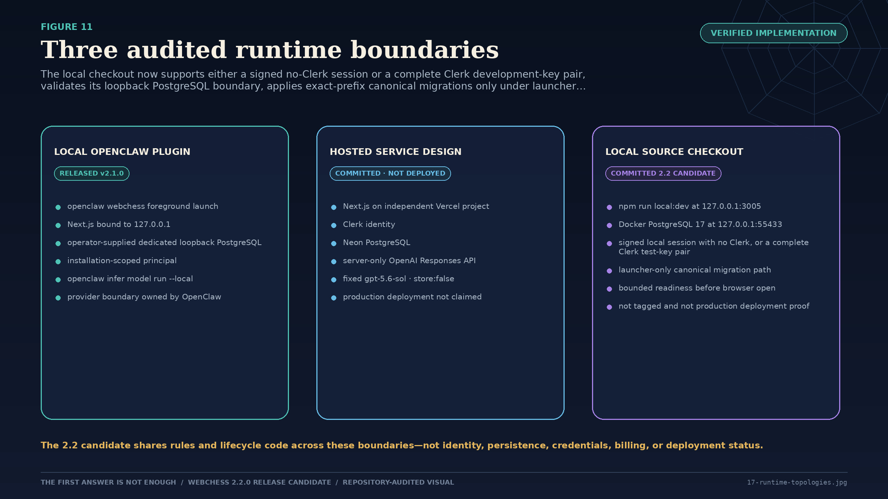

*Figure 11. The three source-level runtime boundaries. Local OpenClaw and the Docker PostgreSQL source-checkout runtime are both committed in the 2.2.0 candidate. The hosted Clerk–Vercel–Neon–OpenAI path is implemented architecture without deployment proof. Arrows show code, data, and credential ownership, not evidence that an external service is currently running.*

**Local OpenClaw is the released local product surface.** `openclaw webchess` starts a foreground Next.js development server on IPv4 loopback, normally `127.0.0.1:3210/openclaw`, and uses a dedicated loopback PostgreSQL database. It invokes the user's OpenClaw default through `openclaw infer model run --local`; the configured provider may itself be remote. There is no Clerk account, WebChess cloud database, operator-owned model proxy, telemetry, synchronization, account API, or application-managed backup. Its installation-scoped owner and fixed browser header are same-operating-system discriminators, not multi-user Web authentication.

**The hosted service is a committed source target, not a demonstrated deployment.** Its intended path is Clerk-authenticated browser → Next.js on Vercel → least-privileged Neon PostgreSQL plus server-only OpenAI Responses API with fixed `gpt-5.6-sol` and `store: false`. Visitors supply neither a model credential nor a provider choice. The repository contains careful preflight, migration-owner, privilege, origin, quota, lease, and deletion-barrier designs. It does not prove that a Vercel Production deployment, Clerk instance, Neon database, domain, firewall, backup, or restore process exists.

**The loopback source-checkout surface is a committed release-candidate runtime.** Its path is `127.0.0.1:3005` → Docker PostgreSQL 17 at `127.0.0.1:55433` → server-side OpenAI. It accepts either a seven-day Hash-based Message Authentication Code (HMAC)-signed loopback machine principal with no Clerk keys or one complete pair of Clerk development credentials; partial pairs and live credentials fail closed. The launcher validates its exact environment, managed container and volume, canonical migration boundary, readiness, and process cleanup. Automatic research is not wired. This is implemented source, not a tagged product or hosted deployment.

## 14.2 Capability ledger

| Capability | RELEASED `v2.1.0` (`9980328`) | COMMITTED RC 2.2.0 (`7a3749c`) | Operational or research boundary |
|---|---|---|---|
| Question, 64-facet Division, independent cast, circular Chess, Engine V2 | Implemented | Preserved and regression-tested | Field-quality, source-span, user-edit, and policy ablations remain research |
| Canonical replay and terminal ecology | Implemented with revision fences and survivor packages | Preserved across the hosted, OpenClaw, and direct-PostgreSQL adapters | Deep fixtures are strong regression evidence, not exhaustive rules proof |
| Portia | Prompt-bound review, per-signal persistence, three-attempt budget, `portia_unavailable` | Portia prompt 4 and lifecycle 2.4 resilience | Independent retrieval, cross-model, deterministic, or human attack channels remain proposed |
| Gate and Retry | Gate hard floors, two same-field games, one regeneration | Gate 4 repair path and eligible older-terminal reopening | Human calibration, false-pass cost, and answer-shopping effects remain unmeasured |
| Answer and Charlotte | Exact reviewed prompt, Answer after Gate, bounded Charlotte qualification | Preserved; current Wilbur actions are version-bound to one exact Charlotte suggestion | Audience variants require factual-invariance and persuasion-safety evidence |
| Wilbur | Revisioned actions and append-only observations | Durable mutation claims; exact replay/conflict/denial; once-only rates; row/text envelope; atomic artifact, event, lifecycle revision, and ledger result | Authority, consent, preregistration, causal identification, and outcome verification remain outside the record |
| Web and export | Within-case genealogy; earlier export shape | `webchess-account-export/4` adds all ten run-recovery fields, Charlotte binding, sanitized Wilbur mutation rows, and owner rate windows | It remains a bounded owner export, not a vendor subject-access package, import path, or database backup |
| Visible research | OpenClaw-only invocation; no page fetch | Policy 3, 150-second ceiling, same OpenClaw-only wiring | Hosted first-party retrieval and a deterministic required-research Gate stop remain absent |
| PostgreSQL schema | Earlier migration prefix | 13 migrations; 19 application tables plus ledger; eight contract indexes; two exact trigger/function pairs; 18 critical constraints; five defaults | A live Neon schema and role contract remain unverified |
| Hosted runtime | Architecture in source | Hardened source contract preserved | Preview, disposable Clerk smoke, Production, backup, restore, firewall, and domain evidence remain absent |
| Local OpenClaw | Released complete visual surface | Current plugin and loopback boundaries committed | Same-machine trust; no application-managed cloud backup/sync; configured provider may be remote |
| Loopback source checkout | Absent | Coherent no-Clerk or Clerk-development auth, managed PostgreSQL, exact launcher-authorized migrations, bounded readiness and cleanup | Machine identity is not human identity; automatic research is not wired |
| Deletion | Two-phase barrier design | Lifecycle artifacts/games delete before remaining model requests; self-service and forced artifact-bearing cases are regression-tested | Shared IP history and provider backups remain governed by separate retention |
| Evaluation | Extensive automated regression tests | Green release-candidate software gate | No confirmatory study shows that the Arachne Method improves human decisions |

A roadmap becomes implementation evidence only when its contracts exist in immutable source and pass their named gate. The same discipline applies to runtime surfaces: “implemented” does not mean “deployed”; “deployed” would not mean “validated”; and a durable provenance record would still not make its contents true.

Where the current implementation diverges from the original specification, three choices remain intentional:

- Portia hunts the **exact forthcoming Answer prompt**, not a later Charlotte essay.
- The Gate uses **versioned hard floors**, not the weighted score in section 7.2, because section 17.7 already names metric gaming as a failure mode.
- The player-facing sequence is Anansi → Chess → Portia → Answer → Charlotte → Wilbur → Web. Gate and Retry remain inspectable internal authorities.

---


# 15. Theoretical foundations

The Arachne Method draws on several research traditions, but none validates the architecture as a whole. This section uses a four-part discipline throughout: **source result** states what a cited work actually found or proposed; **design inference** identifies the bounded idea borrowed by WebChess; **analogy break** names what does not transfer; and **experiment required** states what must be measured before the design inference becomes a performance claim.

## 15.1 Problem construction and co-evolution

**Source result.** Human problem solving depends on representation: how a problem is encoded affects which operations and candidate solutions become available (Newell, Shaw, & Simon, 1958). Reiter-Palmon et al. (1997) experimentally examined problem construction as a contributor to creative performance rather than treating the supplied wording as a neutral container. In design studies, Dorst and Cross (2001) described problem and solution spaces as co-evolving during creative work rather than advancing through one clean, irreversible funnel.

**Design inference.** Anansi turns problem construction into a first-class artifact. Before the system is allowed to recommend, the original question becomes a field of named facets that can be inspected for repeated frames, omitted actors, unsupported premises, evidence needs, risks, values, mechanisms, and possible actions. Later Retry can distinguish a poor traversal of a useful field from a field whose problem construction was inadequate.

**Analogy break.** These studies do not identify sixty-four as a cognitively optimal field size, validate WebChess's eight-by-eight taxonomy, or show that model-generated facets are independent. More facets can mean more coverage; they can also mean more paraphrase, more cost, and more places for an invented premise to hide.

**Experiment required.** Compare sixty-four facets with smaller, larger, adaptive, expert-curated, and user-edited fields. Measure hidden-structure recall, stakeholder and risk coverage, semantic independence, generic-template rate, omission severity, and downstream decision quality under matched budgets.

## 15.2 Geneplore, variation, selection, and retention

**Source result.** Campbell (1960) proposed blind variation and selective retention as an account of creative thought. Finke, Ward, and Smith's **Geneplore** model—its name contracts *generate* and *explore*—separates a generative phase that produces provisional or “preinventive” structures from an exploratory phase that interprets and tests their possible uses; the cycle may repeat under product constraints (Finke, Ward, & Smith, 1992). Idea-generation research further shows that generating candidates and choosing among them are distinguishable capacities: people do not automatically select their most creative ideas (Rietzschel, Nijstad, & Stroebe, 2010).

**Design inference.** The eight authorities extend, but do not duplicate, that separation:

```text
Anansi      -> construct variation
Chess       -> impose constrained interaction and a path
Portia      -> attack and qualify candidates
Gate        -> judge whether the remaining basis is sufficient
Retry       -> renew the path or repair the field
Charlotte   -> make a value-governed communicative commitment
Wilbur      -> encounter consequence and record observation
Web         -> retain genealogy and enforce forgetting rules
```

**Analogy break.** Anansi's variation is not blind: it carries the user's first frame, the model's training distribution, the prompt, and provider policy. Chess survival is not biological fitness. Portia's selection is designed judgment, not nature. Evolution supplies no protected outcome, consent rule, or duty of truthfulness. The evolutionary analogy breaks decisively at Charlotte and Wilbur, where explicit valuation, authority, and possible harm enter.

**Experiment required.** Ablate each transition and compare the full system with direct response, unconstrained brainstorming, field-only review, random and semantic selection, generic critique, forced Answer, and no-follow-up conditions. A stage earns credit only for an improvement that diminishes when that stage is removed.

## 15.3 External representation, distributed cognition, and epistemic action

**Source result.** An external representation can change the work required to solve a problem when its structure makes relevant operations easier to perform (Larkin & Simon, 1987; Zhang & Norman, 1994). Hutchins (1995) analyzed cognition distributed across people and artifacts, while Risko and Gilbert (2016) reviewed cognitive offloading to external resources. Kirsh and Maglio (1994) distinguished **pragmatic actions**, which primarily change the world, from **epistemic actions**, which primarily make cognition easier.

**Design inference.** WebChess externalizes part of an otherwise transient model process as a board, legal move history, capture trail, terminal ecology, Portia record, Gate decision, Answer digest, Charlotte qualification, and Wilbur observation. An authorized reviewer can reconstruct which artifact was used and which authority changed its status.

**Analogy break.** External does not mean comprehensible, and stored does not mean correct. Engine V2 cannot read the facets; its moves should not be called epistemic actions merely because they are visible. A complex board can increase cognitive load or hide authority behind spectacle. The relevant unit is the coupled socio-technical system—user, models, engine, interfaces, database, evidence, policies, and accountable actors—not a model wearing eight names.

**Experiment required.** Test whether users and independent reviewers can identify why a candidate exists, what challenged it, which Gate condition admitted it, what uncertainty remains, and what later observation means. Compare the full visual trace with simpler textual and tabular representations; measure accuracy, time, cognitive load, and overconfidence.

## 15.4 Analogy and metaphor

**Source result.** Structure-mapping theory treats useful analogy as correspondence among relations rather than mere surface resemblance (Gentner, 1983). Gick and Holyoak (1983) showed that analogical transfer depends on recognizing a shared relational structure. Metaphorical framing can also influence how people reason about a problem and what solutions they prefer (Thibodeau & Boroditsky, 2011).

**Design inference.** Each WebChess metaphor is assigned a bounded relation: piece roles are modes of attention; White and Black are directional polarities; I Ching-inspired lenses are change prompts; Chess is constrained conflict; Portia is adversarial probing; Charlotte is accountable communication; Wilbur is protected consequence; and the Web is genealogy.

**Analogy break.** Vivid language can smuggle conclusions. “Capture” can sound like refutation, “survival” like fitness, “Portia” like infallible predation, “Charlotte” like benevolence, and “Web” like organic consent. None of those inferences is licensed. Every visible metaphor therefore needs a visible break statement, not a disclaimer hidden fifty pages later.

**Experiment required.** Compare mythic and neutral labels for comprehension, recall, confidence, perceived authority, cultural response, and actual decision quality. A metaphor should remain only if it improves understanding without laundering warrant.

## 15.5 Randomization and bounded association

**Source result.** Turing's 1950 discussion of learning machines notes that a random element can be useful in search because a systematic ordering may encounter a large region with no solutions before reaching a satisfactory one. That is a general search observation, not a recommendation for arbitrary semantic prompts. The most directly relevant controlled study is cautionary: in a preregistered experiment with 592 British participants, Malthouse et al. (2022) exposed participants to random Wikipedia pages across one convergent forecasting task and two divergent-fluency tasks. The treatment produced no improvement and often significant impairment; a Bayesian meta-analysis strongly supported the null. The authors concluded that useful random stimulation is non-trivial and may require task-related or “optimally random” material.

**Design inference.** WebChess uses pseudorandomness narrowly. Three domain-separated permutations vary facet order, lens assignment, and board location, while a saved seed permits exact reproduction. Variation can expose path sensitivity and can create distance from the first frame.

**Analogy break.** Randomness is not insight. A fluent model can retrofit significance to almost any pairing. Reproducibility proves only that a cast can be repeated, not that it deserved to happen or that its associations are evidence. Malthouse et al. weigh against claiming that arbitrary cues generally improve creativity.

**Experiment required.** Compare seeded random casts with fixed, semantically selected, stratified, adaptive, and human-curated casts, plus a no-lens condition and neutral random prompts. Report novelty, relevance, confidence inflation, narrative overfitting, downstream quality, cost, and distributions across seeds rather than one attractive run.

## 15.6 Search, self-refinement, and external feedback in AI

**Source result.** A **large language model (LLM)** can participate in several distinct test-time procedures, but their evidence should not be blended. Tree of Thoughts explores explicit reasoning branches with evaluation and search (Yao et al., 2023). Self-Refine uses one LLM as generator, feedback provider, and refiner; across the seven tasks studied, its authors reported improvements over one-step generation (Madaan et al., 2023). Reflexion stores verbal reflections in episodic memory and uses task feedback in later attempts; it is not simply an unprompted model rereading its own answer (Shinn et al., 2023). Perez et al. (2022) used language models to generate red-team test cases. In the opposite direction, Huang et al. (2024) found that **intrinsic** self-correction—without reliable external feedback—often failed to improve reasoning and could make it worse; oracle feedback changed that result.

**Design inference.** The Arachne Method separates field construction, semantically blind game traversal, prompt-bound attack, deterministic sufficiency, bounded Retry, stored Answer, Charlotte qualification, human-owned consequence, and provenance. This separation creates places where external evidence, a different model, deterministic checks, domain experts, or affected parties can eventually enter.

**Analogy break.** Different prompts are not independent authorities. In current WebChess, the same provider family may generate, attack, and qualify, so correlated errors can circulate through a longer ceremony. Self-Refine's task-bounded gains do not prove that self-critique is generally reliable; Huang et al.'s negative results do not prove that every feedback loop fails. More calls and more tokens are not deliberation by definition.

**Experiment required.** Compare direct answering, structured direct prompting, Self-Refine-style iteration, Tree-of-Thoughts-style search, same-model Portia, cross-model Portia, deterministic checks, retrieval-backed review, and human panels at equal or explicitly reported cost. Measure quality, error correlation, calibration, latency, and failure under missing or misleading feedback.

## 15.7 Attention is not importance

**Source result.** The preceding traditions justify studying representation, search, variation, and review. None establishes that procedural attention is a probability, a source, or objective importance.

**Design inference.** WebChess records its attention allocations so they can be inspected rather than silently absorbed into prose.

**Analogy break.** The boundaries are categorical:

- cast assignment is not evidence;
- chess contact is not relevance;
- capture is not refutation;
- survival is not truth;
- Portia preservation is not proof;
- Gate passage is not certainty;
- Charlotte eloquence is not correctness;
- a Wilbur observation is not causality; and
- provenance is not validation.

The architecture is a sequence of fallible filters, not a sacrament.

**Experiment required.** Test whether users can correctly classify source evidence, user report, model inference, game-derived salience, symbolic association, and unresolved uncertainty after using the interface. Confidence that outpaces classification accuracy is a failure even when users enjoy the experience.

## 15.8 Reversible experimentation and accountable consequence

**Source result.** Thomke (1998) analyzed experimentation in product development, including the organization of learning through tests. Camuffo et al. (2024) report a large-scale replication and extension of a scientific-approach intervention in entrepreneurial decision making. Both bodies of work are context-bound; neither makes experimentation universally beneficial.

**Design inference.** Where stakes and authority permit, Charlotte should translate a recommendation into a bounded, reversible action with a prediction, observable measure, time window, threshold, and stopping rule. Wilbur should record execution and observation rather than let the model announce success.

**Analogy break.** “Run an experiment” is not an ethical solvent. Many actions cannot be randomized, reversibility for an operator may still mean irreversible harm for someone else, and before-after change does not identify a cause.

**Experiment required.** Measure adoption, implementation fidelity, time to informative evidence, stop-rule compliance, unexpected harm, action reversibility, and causal confidence appropriate to the study design. High-impact decisions remain outside autonomous execution.

## 15.9 Provenance as genealogy, not truth

**Source result.** The World Wide Web Consortium's **PROV Data Model (PROV-DM)** defines a general representation of provenance using entities, activities, agents, and relations such as use, generation, derivation, attribution, and responsibility (W3C, 2013). It is a vocabulary for describing how an artifact came to be.

**Design inference.** The Web should make a case reconstructible: which question, field, seed, events, survivor package, Portia finding, Gate record, retry, Answer, Charlotte qualification, human action, and observation produced the current state. A future export can map these records to PROV concepts without requiring the operational database to use the **Resource Description Framework (RDF)**.

**Analogy break.** Current WebChess provides within-case genealogy; it does not yet claim a complete, conformant PROV export or consented cross-case memory. Provenance can preserve a falsehood perfectly. Traceability does not establish truth, responsibility does not imply consent, and durable memory can become durable surveillance.

**Experiment required.** Test reconstruction completeness, replay and digest integrity, export usability, access control, deletion, retention-policy compliance, stale-memory transfer, and privacy leakage. The Web must be evaluated on what it can responsibly forget as well as what it remembers.

---

# 16. Cultural and intellectual lineage

The figures in this section supply design concepts and warnings. None evaluated or endorsed WebChess. **The Arachne Method** is the project's umbrella name for the way eight distinct authorities are woven together; Arachne is not a ninth authority, an ancient prediction of artificial intelligence, or a claim to inherit a tradition's moral status. The name belongs to the paper's internal method vocabulary, not to its title and not to a claim of inherited authority.

Every lineage below follows the same rule: source result, design inference, analogy break, experiment required. Cultural resonance can motivate design. It cannot validate software.

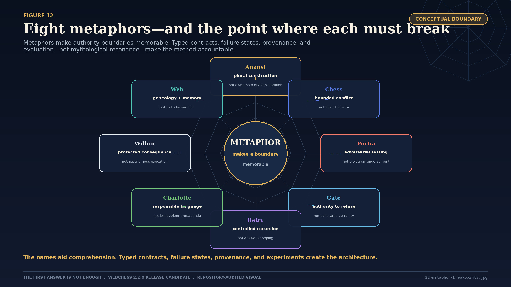

*Figure 12. The metaphor ledger. Each name is intended to make an authority boundary memorable; the lighter “not …” line marks the point where the analogy must stop. This is a conceptual map, not evidence that myth, biology, literature, or game design validates the architecture. It neither adds Arachne as a ninth authority nor turns Answer into one.*

## 16.1 Anansi: story, indirection, and Jamaican resistance

**Source result.** Arthur (2019) examines Ananse stories in a Ghanaian pedagogical context. Marshall's *Anansi's Journey* is more specific than the broad label “Caribbean”: it traces Anansi from Ghana through enslavement and cultural transformation to Jamaica, and analyzes the figure's contested roles in Jamaican cultural resistance, individualism, and national folklore (Marshall, 2012). The names also mark transmission: **Ananse** is common in Akan contexts; **Anansi** is the project name and a prominent diasporic form. These sources do not reduce a diverse performance tradition to creativity technique, and the trickster is not morally simple.

**Design inference.** WebChess borrows a bounded pattern: intelligence can work through indirection; a small actor can reorganize a field dominated by stronger actors; and a story can hold multiple perspectives without collapsing them into a single proposition. Anansi therefore names the authority that makes the first frame lose its monopoly.

**Analogy break.** A language model is not Anansi. Statistical generation is not communal oral performance or cultural resistance. The English mnemonic **ANANSI**—Analyze, Name, Associate, Navigate, Synthesize, Iterate—is a project-authored backronym, not Akan etymology. Cleverness does not imply truth, justice, or consent, and naming a software stage conveys no ownership of Ananse or Anansi traditions.

**Experiment required.** Test Anansi's field against direct response, unconstrained brainstorming, expert and user-authored reframing, and adaptive field sizes. Measure independent coverage rather than volume alone. Cultural review by Akan, Ghanaian, Jamaican, and relevant diasporic scholars or practitioners must be able to change the name, imagery, and claims; it cannot be ceremonial approval after publication.

## 16.2 Portia: experiment-specific biology, bounded adversarial design

**Source result.** *Portia* is a genus of jumping spiders whose species are known for araneophagy—preying on other spiders—and web invasion. The cited findings are specific. Jackson (1995) experimentally separated cues involved in web entry and signaling: seeing a web could elicit entry; seeing a resident spider increased that inclination; web vibrations and visual prey cues affected signaling and persistence; volatile chemical cues were not important in those tests. Jackson and Nelson (2011) reported that *P. africana* used trial-and-error, or generate-and-test, behavior to derive aggressive-mimicry signals in predator-prey encounters. Cross and Jackson (2019) tested *P. africana* with prey or leaf lures, water barriers, detour paths, and sometimes a direct causeway: after seeing prey, spiders more often used a present causeway and more often took the detour when the causeway was absent; after seeing leaf pieces, they did not take the detour. Jackson and Cross (2013) synthesize this work from a cognitive perspective, including the prey web as part of the web-building spider's sensory environment.

**Design inference.** Portia motivates an evaluator that actively probes the information environment rather than assigning one holistic score. The software can test assumptions, evidence grounding, redundancy, contradiction, causal reach, stakeholder response, path sensitivity, actionability, reversibility, and harm; it can preserve, wound, consume, or leave unresolved what it encounters.

**Analogy break.** The biological spider seeks prey, not epistemic robustness. Species- and task-specific animal results do not establish human-like theory of mind, formal logic, scientific falsification, or moral judgment. A model-generated attack can hallucinate. Same-provider Portia is not error-independent review. “Consumed” means barred from supporting the current Answer under a versioned policy; it does not mean false for all purposes.

**Experiment required.** Compare Portia with generic self-critique, deterministic checks, retrieval-backed attacks, cross-model review, domain experts, and mixed panels. Measure false preservation, false consumption, wound accuracy, source precision, novelty retention, calibration, and correlated error. Because the biological analogy concerns deceptive signaling, Portia's software permissions must exclude automated social engineering.

## 16.3 Charlotte: language as a consequential intervention

**Source result.** In E. B. White's novel, Charlotte writes words that contribute to changed human attention and valuation around Wilbur; within the narrative, those changes are followed by changed treatment of him (White, 1952). Literary scholarship interprets the web through community, narrativity, ethics, edibility, friendship, humility, and spirituality (Rushdy, 1991; Ratelle, 2014; Boonpromkul, 2022; Thomas, 2016). A novel is not a controlled causal study, and these readings do not isolate language as an empirical treatment effect.

**Design inference.** Charlotte names a separate communication authority because wording can alter classification, salience, resource allocation, and action. She comes after Portia and Gate so that communicative force is constrained by the reviewed Answer, preserved candidates, visible wounds, explicit values, affected parties, and reversibility.

**Analogy break.** Fictional Charlotte acts from friendship in an authored moral world. Software has no friendship, conscience, or standing to choose who deserves protection. Persuasion can manufacture prestige, hide uncertainty, or turn weak warrant into social fact. Audience adaptation is not automatically service; it can be manipulation.

**Experiment required.** Compare Charlotte qualification with the unqualified Answer and generic rewriting. Measure claim-to-source traceability, uncertainty retention, consumed-candidate resurrection, factual invariance across audiences, action specificity, stakeholder coverage, and persuasive force relative to evidential warrant. Include cases in which eloquence and truth pull in different directions.

## 16.4 Wilbur: the protected life and the causality boundary

**Source result.** Wilbur is the life around which Charlotte's intervention is organized in the novel. That narrative relation gives the architecture an object of concern; it does not supply an outcome metric or a causal estimator.

**Design inference.** Wilbur represents the person, project, organization, community, ecosystem, or protected outcome that can be helped or harmed. The stage requires an accountable human actor, a bounded action, and later observation. It prevents the system from treating a polished answer as its own evidence of success.

**Analogy break.** Real stakeholders are not passive “Wilburs” and should not be infantilized. A protected outcome does not speak for every affected party. A recorded observation is a human report, not independent verification. If a metric improves after action, sequence alone does not show that Charlotte caused the improvement; context, selection, concurrent changes, execution, measurement error, and chance remain alternatives.

**Experiment required.** In consenting low- or moderate-stakes work, predeclare the actor, prediction, measure, time window, threshold, stop rule, implementation-fidelity check, and affected-party safeguards. Use experimental or quasi-experimental designs when causal claims matter; otherwise preserve an explicitly limited causal-confidence label.

## 16.5 The Yijing, Wilhelm, Baynes, and the sixty-four lenses

**Source result.** The **Yijing**, often rendered in English as the *I Ching* or *Book of Changes*, is a composite Chinese classic with long histories of divination, philosophy, commentary, canonization, and reinterpretation. Hon (2023) describes a layered intellectual tradition concerned with change, contingency, symbolic interpretation, and human finitude. The familiar English edition cited here has its own transmission chain: Richard Wilhelm translated and interpreted the Chinese text in German; Cary F. Baynes rendered the Wilhelm translation into English; C. G. Jung supplied a foreword. That edition is influential in Anglophone reception, but it is neither a direct Baynes translation from Chinese nor the sole authority on the Yijing (Wilhelm, 1967).

**Design inference.** WebChess uses sixty-four project-authored **I Ching-inspired lenses** as a fixed vocabulary of change. The code follows the King Wen sequence for names and provides short reflective themes. A domain-separated seeded permutation assigns a lens to a facet, allowing the exact cast to be reproduced.

**Analogy break.** The software does not perform or authenticate a traditional divination practice, predict events, reveal hidden causation, or provide exhaustive translations of the hexagrams. The English themes are project text. A lens can provoke a personally useful interpretation without having been selected by a cosmic or evidential process.

**Experiment required.** Compare the current lens layer with no lenses, neutral labels, fixed pairings, random words, semantic selection, human selection, and culturally reviewed alternatives. Measure novelty, relevance, confidence inflation, apophenia, narrative overfitting, user classification of metaphor versus evidence, and downstream quality.

## 16.6 Jung and synchronicity: historical context, not mechanism

**Source result.** Jung presented synchronicity as an “acausal connecting principle” for meaningful coincidence; the concept belongs to his psychological and metaphysical project and to a particular twentieth-century reception of the *I Ching* (Jung, 1952/2010).

**Design inference.** Jung is relevant to the user experience of a cast: people may experience an unplanned conjunction as meaningful, and that experience is worth studying.

**Analogy break.** WebChess does not adopt synchronicity as a scientific mechanism. Humans and language models are strong relation-makers. Their ability to construct a compelling story from a random pairing does not show that the pairing was acausally or cosmically selected.

**Experiment required.** Compare I Ching-inspired pairings with neutral random and semantically selected cues. Ask participants to distinguish source evidence, user report, model inference, symbolic association, and personal meaning; measure both useful reframing and confidence inflation.

## 16.7 Fischer and Chess960: constrained variation, with the arithmetic shown

**Source result.** Official FIDE Chess960 rules constrain the starting back rank: the bishops occupy opposite-colored squares, the King starts between the two Rooks, and all eight pawns begin on the usual pawn rank. The number 960 is not mystical. It follows from the legal choices:

\[
N_{960}
= 4 \times 4 \times 6 \times \binom{5}{2} \times 1
= 16 \times 6 \times 10
= 960.
\]

Here the first `4` chooses a square for one Bishop on one color; the second `4` chooses the other Bishop on the opposite color; `6` chooses the Queen's square after the Bishops are placed; `C(5,2) = 10` chooses two of the five remaining squares for the Knights; and the final factor `1` is the only allowed Rook–King–Rook ordering of the last three squares. Ordinary piece identities and most movement rules remain stable, while setup and castling have Chess960-specific rules (FIDE Rules Commission, n.d.).

**Design inference.** Chess960 supplies a clean game-design precedent: vary an initial state under explicit constraints while preserving a stable grammar. WebChess similarly varies facet, lens, and location assignments while retaining its movement and lifecycle contracts.

**Analogy break.** WebChess does not implement Chess960. Chess960's 960 legal setups do not validate WebChess's three permutations, and a chess rule does not show that randomization improves real-world reasoning. The paper therefore relies on the official rules and not on an unofficial Fischer quotation.

**Experiment required.** Compare fixed, random, semantic, stratified, and user-curated WebChess starts. Measure useful diversity, cross-seed stability, downstream quality, and cost. A varied opening is not a better decision until evidence says so.

## 16.8 Polarity without moral coloring

**Source result.** No religious or cosmological lineage is required to explain the board colors. Historical accounts of Iranian dualism do not establish a genealogy to chess colors or WebChess (Gnoli, 1996). This paper does not claim Zoroastrianism—or any other tradition—as the source of WebChess's polarity.

**Design inference.** White is **outside-in evidence** moving from conditions toward purpose. Black is **inside-out intent** moving from purpose toward conditions. The opposition creates a readable directional tension.

**Analogy break.** White is not good and Black is not evil. Evidence can be incomplete, weaponized, irrelevant, or wrong. Intent can be wise, delusional, humane, or harmful. The colors do not encode race, culture, objectivity, or moral rank.

**Experiment required.** Test whether users can explain both polarities without moral or racial inference. Compare color, label, icon, and high-contrast accessible variants; change the visual language if the metaphor repeatedly teaches the wrong lesson.

## 16.9 Turing: an engineering contrast to Jung

**Source result.** Turing (1950) discusses a random element as useful in some searches because a systematic ordering may encounter a very large block without solutions before reaching a satisfactory one. The passage is about a practical search possibility in learning machines, not meaningful coincidence and not the Yijing.

**Design inference.** A saved pseudorandom seed can produce variation while keeping the complete assignment reproducible. Turing supplies an engineering rationale for testing variation; Jung supplies historical language for one experience of meaning. They are a contrast, not a synthesis.

**Analogy break.** Turing did not propose WebChess, its lens layer, or its chess selector. His observation does not override Malthouse et al.'s negative result for extraneous random cues and does not establish that a WebChess cast is useful.

**Experiment required.** Treat each case as a distribution across seeds and policies. Report survivor overlap, Portia stability, Gate stability, recommendation direction, cost, and outliers rather than blessing one cast after the fact.

---
# 17. Failure modes, risks, and safeguards

The eight-part lifecycle does not eliminate error. It redistributes error across more inspectable boundaries. That is useful only if every boundary has an explicit failure model. Otherwise the new stages merely give one hallucination eight ceremonial offices.

This chapter is the architecture's self-attack. A threat is not answered merely because a schema, test, or safeguard exists. Each subsection identifies the failure, observable indicators, current protection, residual exposure, and the experiment or incident that should force redesign. The Web must remember the components it retires as carefully as the ones it celebrates.

## 17.1 Apophenia and narrative overfitting

**Failure:** A random facet-lens-location conjunction feels meaningful because the final explanation is coherent. Humans detect patterns in noise, especially under uncertainty or reduced control; language models can intensify the effect by converting weak associations into fluent causal stories (Whitson & Galinsky, 2008).

**Indicators:**

- symbolic language is presented as observation;
- a recommendation depends on the hexagram label rather than the literal facet;
- rival mappings are not considered;
- the same cast supports opposite conclusions when prompted differently; or
- users rate explanations as profound while failing to identify any testable implication.

**Safeguards:**

- display seed, cast, and randomization status beside every symbolic mapping;
- require Portia to state the analogy, its break point, and a rival interpretation;
- forbid symbolic assignments from appearing in `supporting_evidence`;
- compare the interpretation with a symbol-stripped version; and
- evaluate whether independent reviewers can recover the same literal claim without seeing the metaphor.

## 17.2 Garbage multiplication in Anansi

**Failure:** The first model produces sixty-four polished variants of a shallow frame. Chess, Portia, and Charlotte then operate on semantic mulch. The system looks comprehensive because every square is occupied.

**Indicators:**

- high embedding similarity among facets;
- repeated actors, mechanisms, or assumptions under different titles;
- absent affected parties or missing decision criteria;
- facets that cannot be distinguished by blinded reviewers;
- low user recognition of the actual problem; or
- repeated Retry-field decisions for the same structural omissions.

**Safeguards:**

- expand current lexical checks into semantic cluster and coverage checks;
- require a compact ontology of actors, mechanisms, evidence, values, and uncertainties;
- let the user merge, reject, or add facets before casting;
- preserve an explicit “missing or unknown” register outside the sixty-four slots;
- score field quality separately from downstream answer quality; and
- treat Portia autopsies as structured regeneration constraints.

## 17.3 Randomness without useful distance

**Failure:** Random casting produces irrelevant associations that consume attention without creating useful novelty. Experimental work on randomness and ideation shows that arbitrary cues can help in some conditions and harm in others; semantic distance must be treated as a variable, not a sacrament (Malthouse et al., 2022).

**Indicators:**

- Portia consumes most candidates for irrelevance;
- high retry rates are driven by cast noise rather than field quality;
- users spend more time decoding symbols than examining the problem;
- random and semantically selected lenses produce indistinguishable novelty but different usability; or
- the full system underperforms a direct structured-analysis baseline.

**Safeguards:**

- compare random, semantically matched, distance-controlled, and no-lens conditions;
- estimate a useful range of semantic distance by task type;
- allow Portia to discard a lens while preserving the literal facet;
- report how much of Charlotte's recommendation derives from symbolic versus literal material; and
- preserve the possibility that the lens layer should be reduced or removed.

## 17.4 Chess theater

**Failure:** Engine V2 produces impressive tactical play that contributes no measurable reasoning value. Search depth, animated movement, and technical vocabulary generate an aura of cognition while a cheaper selection procedure would work as well.

**Indicators:**

- downstream quality does not improve with engine strength;
- random legal play performs equally or better;
- terminal survivors are insensitive to the original problem;
- users mistake engine evaluation for semantic evaluation; or
- latency and cost increase without information gain.

**Safeguards:**

- maintain random, shallow, semantic, human, and coverage policies as permanent baselines;
- report chess metrics and reasoning metrics separately;
- hide engine depth from evaluators during comparative studies;
- measure marginal value per second, node, token, and dollar; and
- retire tactical complexity that fails ablation.

## 17.5 Survivor worship

**Failure:** A surviving piece is treated as superior because it remained on the board. This converts a path-dependent game result into evolutionary mythology.

**Indicators:**

- Portia attack intensity is lower for survivors than for captured facets;
- users describe survival as proof;
- the terminal board is interpreted without comparison to uncaptured or captured counterpoints; or
- recurring survivors are promoted without checking whether recurrence arises from positional advantage.

**Safeguards:**

- state in the interface that survival is eligibility for attack, not evidence;
- include a sampled audit of captured and never-occupied facets;
- compare survivor relevance against blinded human importance ratings;
- normalize for piece type, starting position, and policy advantages; and
- allow Portia to resurrect a captured facet as a counterexample without treating it as preserved prey.

## 17.6 Portia monoculture and over-pruning

**Failure:** The adversarial evaluator shares the generator's blind spots, rewards conventionality, or consumes unfamiliar but valuable candidates. Iterative self-feedback can improve outputs, but intrinsic self-correction without independent feedback can fail or degrade reasoning (Madaan et al., 2023; Shinn et al., 2023; Huang et al., 2024).

**Indicators:**

- evaluator agreement is high despite shared model and prompt lineage;
- minority or culturally unfamiliar perspectives are consumed disproportionately;
- Portia labels lack supporting attack traces;
- human experts frequently reverse consumed judgments;
- false-evidence attacks cite nonexistent sources; or
- Portia rejects novelty because it cannot immediately operationalize it.

**Safeguards:**

- separate deterministic, retrieval-backed, model, and human attack channels;
- measure false-consumption and false-preservation rates;
- preserve disagreement and unresolved states;
- blind Portia to Charlotte's preferred answer;
- include novelty-protection rules that distinguish “unsupported” from “impossible”;
- audit outcomes across demographic, cultural, and domain groups; and
- require source identifiers for every factual attack.

## 17.7 Gate numerology and metric gaming

**Failure:** A sufficiency rule becomes an ersatz oracle. Teams tune thresholds until preferred cases pass, or candidates are rewritten to satisfy checklist language without increasing substance. The shipped Gate v4 is not the weighted score proposed earlier in the paper; it is a deterministic conjunction of hard floors. That makes its decision reproducible, not calibrated.

**Indicators:**

- thresholds change after seeing outcomes;
- small wording changes flip decisions without changing evidence;
- high aggregate scores conceal missing safety floors;
- evaluators cannot explain score differences; or
- systems optimize for Gate passage rather than downstream quality.

**Safeguards:**

- preregister Gate configurations in experiments;
- version and publish every floor, threshold, and decision rule;
- calibrate against blinded human sufficiency judgments and real outcomes;
- run sensitivity analysis around every threshold;
- do not publish a Gate probability unless a separately frozen probability model exists; and
- preserve an `insufficient_basis` state that cannot be overridden by rhetoric.

## 17.8 Retry as answer shopping

**Failure:** The system reruns games or fields until it produces the desired recommendation. Multiple attempts increase the chance of finding an apparently compelling but accidental pattern.

**Indicators:**

- manual retries cluster after disfavored answers;
- only the final run is shown;
- cross-run variance is suppressed;
- retry reasons are empty or post hoc; or
- the chosen run is an outlier relative to the full case history.

**Safeguards:**

- preserve and display all runs;
- require a machine-readable retry reason;
- cap Retry at the implemented two same-field replays and one field regeneration;
- treat an exact repeated terminal fingerprint as uninformative rather than spending another same-field attempt;
- report stability and outlier status;
- use preregistered selection rules in research; and
- prohibit deletion of inconvenient runs from an active provenance bundle.

## 17.9 Charlotte as benevolent propaganda

**Failure:** Charlotte converts weak survivors into language that is emotionally persuasive beyond the warranted evidence. Metaphorical framing can change proposed solutions and information search without readers recognizing the influence (Thibodeau & Boroditsky, 2011).

**Indicators:**

- emotionally charged wording exceeds the evidence grade;
- stakeholder-specific messages contain inconsistent factual claims;
- uncertainty disappears between Portia and Charlotte;
- consumed candidates return in paraphrase;
- calls to action exploit fear, shame, identity, or dependency; or
- users remember the recommendation but not its reversal conditions.

**Safeguards:**

- require claim-to-survivor and claim-to-evidence links;
- preserve wounds and uncertainty in the rendered recommendation;
- compare persuasive and neutral versions in safety testing;
- enforce audience consistency on factual content;
- prohibit dark-pattern objectives such as engagement or compliance maximization;
- require explicit consent for personalized persuasive framing; and
- make the strongest contrary case visible beside the recommendation.

## 17.10 Wilbur without authority, consent, or protection

**Failure:** A recommendation is executed on people who did not authorize it, or the system treats a vulnerable party as experimental material. “Reversible” for the decision maker may be irreversible for the person bearing the consequence.

The current Wilbur rail narrows one technical ambiguity: a new action must be the exact six-field Wilbur projection of the saved Charlotte suggestion named by its versioned index, and a player must explicitly create its record. That proves neither that the named actor accepted the role nor that affected parties consented. An immutable suggestion can be unauthorized with perfect fidelity.

**Indicators:**

- the actor lacks authority;
- affected parties are absent from the stakeholder model;
- no stopping rule protects them;
- harms are described only in aggregate;
- the intervention changes rights, employment, access, health, or safety without independent review; or
- outcome capture privileges organizational metrics over lived effects.

**Safeguards:**

- keep WebChess non-executing; no model output or ledger state may trigger an outside action;
- preserve the exact six-field Charlotte-to-Wilbur binding so a later record cannot disguise an edited intervention as Charlotte's original action projection;
- require explicit actor authority and affected-party analysis;
- distinguish decision reversibility from harm reversibility;
- prohibit autonomous execution in consequential domains;
- use independent legal, ethical, safety, or domain review where required;
- record consent, objections, and exclusion criteria;
- define immediate stop conditions; and
- allow Wilbur to be a community or ecosystem rather than only the paying user.

Only the first two safeguards are represented by the current implementation. Actor-authority, consent, objection, exclusion, and external-approval fields remain proposed. The durable mutation ledger prevents a database retry from multiplying an intent; it does not grant authority to carry the intent out.

## 17.11 Causal overclaim from outcome feedback

**Failure:** A favorable outcome after Charlotte's action is attributed to the recommendation even when other causes changed. A failed outcome is likewise blamed on the idea without checking execution, context, or measurement.

Current Wilbur observations are authenticated player-authored reports. `evidenceClassification` is free text, and `supported | rejected | unresolved` is an assumption label chosen by the player. WebChess does not fetch the evidence, attest that the action occurred, verify the observation, or calculate a causal effect. Exact idempotent recovery proves the identity of the stored report, not the truth of its contents.

**Indicators:**

- no pre-intervention baseline;
- no counterfactual or comparison condition;
- outcome metrics were chosen after results appeared;
- implementation fidelity is unknown;
- multiple simultaneous interventions occurred; or
- users convert narrative sequence into causal certainty.

**Safeguards:**

- record predictions and metrics before action;
- use comparison groups, staggered rollouts, interrupted time series, or randomized trials where feasible;
- distinguish mechanism failure from implementation failure;
- retain contextual events and confounders;
- label causal confidence explicitly; and
- let inconclusive outcomes remain inconclusive.

The implemented action already preserves a tested assumption, expected observation, decision threshold, and review horizon, and the implemented observation separates expected effect, unexpected effect, stakeholder response, and next decision. Those fields can support disciplined human inquiry. Baselines, registered metric definitions, comparison assignment, implementation-fidelity measurement, confounder capture, and causal-confidence estimation remain proposed.

## 17.12 The Web as surveillance infrastructure

**Failure:** Durable memory becomes a permanent dossier of private problems, dissent, vulnerabilities, and failed decisions. Provenance can improve accountability while simultaneously improving institutional capacity to monitor people. The audited product implements within-case genealogy and owner-scoped export; consented cross-case memory is not implemented and must not be smuggled into the product under the word “Web.”

**Indicators:**

- memory is retained without a purpose or deletion horizon;
- cross-case learning occurs without consent;
- raw personal data are copied into model traces;
- access expands beyond the original case participants;
- “what died and why” becomes a disciplinary record; or
- users cannot export, correct, or delete their data.

**Safeguards:**

- separate case memory from research and learning memory;
- minimize raw personal and third-party data;
- use purpose-specific access controls and encryption;
- support export, correction, deletion, and retention schedules;
- retain derived research data only under explicit consent and de-identification;
- avoid training on private cases by default; and
- make forgetting a first-class provenance event rather than a silent deletion.

## 17.13 Model error, hallucination, and source laundering

**Failure:** Anansi invents facts, Portia invents counterevidence, or Charlotte cites a model-generated claim as if it came from a user or source. The visible research broker may return a model-authored synthesis of retrieved material; that synthesis is not the fetched page itself. Hallucination is a documented failure mode of natural-language generation, and schema validity does not establish factual validity (Ji et al., 2023).

**Safeguards:**

- assign every statement an epistemic type: user observation, retrieved source, model inference, value, prediction, or symbol;
- store source identifiers and retrieval timestamps;
- prevent model inference from being promoted automatically to evidence;
- use domain-appropriate retrieval and verification;
- refuse factual adjudication when evidence access is absent; and
- include fabricated-source tests in continuous evaluation.

## 17.14 Cultural extraction

**Failure:** Anansi, the Yijing, Charlotte, and Portia are stripped of context and converted into proprietary decorative labels. The architecture gains charisma by borrowing cultural authority while returning nothing to the traditions it mines.

**Safeguards:**

- maintain accurate cultural and scholarly notes;
- use “I Ching-inspired” rather than claiming traditional practice;
- commission review from Akan, African-diasporic, Chinese, literary, and relevant religious-studies scholars;
- compensate contributors;
- document which meanings are WebChess inventions;
- support alternative translations and naming schemes; and
- remain willing to rename or remove elements that cannot be used responsibly.

## 17.15 High-stakes misuse

The WebChess 2.2.0 candidate should not be deployed as an autonomous system for diagnosis, treatment, legal rights, credit, insurance, benefits, hiring, firing, sentencing, military action, emergency response, or surveillance. In those domains, the architecture may be useful as a research or deliberation scaffold only under qualified human authority, domain-specific controls, and independent review.

The eight stages do not alchemize a reflective instrument into a licensed profession.

## 17.16 Error-independence theater

**Failure:** Functional roles are mistaken for independent witnesses. Division, Portia, Answer, and Charlotte may use the same provider family, so several beautifully separated artifacts can share one training bias, one retrieval gap, or one fabricated premise.

**Indicators:**

- stages agree almost perfectly but repeat the same factual error;
- Portia's attack language mirrors Anansi's framing;
- a provider or prompt perturbation flips several authorities together;
- disagreement disappears when the same model sees its earlier outputs; or
- “multi-agent” is claimed even though no error-independent channel exists.

**Safeguards:**

- call the stages functional authorities, not independent agents;
- measure correlated errors, not merely agreement;
- compare same-model, cross-model, retrieval-backed, human, and deterministic channels;
- hide downstream preferences from upstream adjudicators;
- retain unresolved disagreement; and
- require an external evidence path before calling any stage verification.

## 17.17 Prompt, retrieval, and provenance injection

**Failure:** Player text, a retrieved page, a prior artifact, or a model-generated repair reason crosses a trust boundary as instruction. A malicious or merely malformed source can redirect research, Portia, or regeneration while every payload remains valid JSON.

**Indicators:**

- player text changes developer-level rules;
- retrieved instructions appear in tool or model-control fields;
- a repair context quotes executable directions rather than bounded defects;
- source URLs and synthesis cannot be distinguished; or
- prompts, secrets, or raw identifiers enter operational logs.

**Safeguards:**

- preserve developer instructions and player data as separate request roles;
- normalize and bound repair findings as untrusted data;
- prohibit research from changing legal moves, seeds, or board weights;
- record source identity, retrieval time, query, and model synthesis separately;
- use purpose-separated digests and HMAC identifiers; and
- test indirect prompt injection, source laundering, and configuration-token rejection.

## 17.18 Recovery, fencing, and split-authority failure

**Failure:** A remote model call outlives its lease, a serverless instance dies after settlement, two instances believe they own the same lifecycle transition, or a Wilbur response disappears after its database commit. Without fencing and durable recovery, Portia or Charlotte can duplicate cost, attach an answer to the wrong prompt, or advance from partial work; Wilbur can double-debit a rate window, create a second record, or leave an artifact without its lifecycle activity.

**Indicators:**

- repeated provider calls under one idempotency intent;
- an expired request is silently called again;
- candidate assessments disappear after refresh;
- a late settlement resurrects deleted content;
- Answer prompt digest differs from Portia's reviewed digest; or
- local and hosted adapters apply different lifecycle rules;
- the same Wilbur idempotency key accepts a changed payload;
- an admitted Wilbur retry consumes a second user or shared-IP rate unit;
- an action, lifecycle event, and ledger result disagree about one mutation; or
- concurrent pending claims cross the configured lifetime row or UTF-8 text boundary.

**Safeguards:**

- reserve and settle model work through durable request ledgers;
- use compare-and-swap revisions, idempotency keys, leases, and active-request fences;
- mark provider-started expired work indeterminate instead of replaying it invisibly;
- resume Portia from its persisted assessment prefix;
- bind Answer to the exact approved UTF-8 prompt digest;
- bound Portia and Charlotte technical attempts separately;
- durably claim every Wilbur mutation by owner, UUID key, operation, digest, and target;
- record Wilbur admission once with the database clock, deciding the user bucket before the shared pseudonymous-IP bucket;
- reserve ledger, future-row, and exact UTF-8 text capacity under an owner-scoped transaction lock;
- atomically commit the Wilbur artifact, lifecycle revision/activity, and ledger result through one CTE statement;
- replay the stored Wilbur result or denial for an exact intent, while conflicting changed data;
- retain the browser's key and payload across transport failure, HTTP 5xx, or malformed HTTP 2xx recovery; and
- test every interruption point across the shared service boundary.

The Wilbur safeguards in this list are implemented database and client recovery boundaries. They do not make an external action exactly once, and they do not independently verify any observation. Pending claims older than 24 hours become durable denials when the owner next claims, freeing reservations but retaining the terminal ledger row in the lifetime count.

## 17.19 Conformance theater

**Failure:** Broad automated testing is summarized as scientific validation—or a green engineering ledger is summarized as proof that the method improves decisions. The release-candidate audit is deliberately specific: the immutable software snapshot passes its configured unit, PostgreSQL integration, coverage, accessibility, browser, build, link, dependency, plugin, and package checks. That is strong conformance evidence. It is not efficacy evidence, a live-hosted test, or a provider-independence result.

**Indicators:**

- “all tests pass” appears while any configured gate is red;
- browser fixtures with intercepted API routes are called browser-to-real-database E2E;
- four lexical division fixtures are called semantic evaluation;
- a six-game internal arena is reported as Elo or general superiority;
- observed deeper perft counts are called pinned regression fixtures; or
- a dirty working tree is cited as though it were an immutable commit.

**Safeguards:**

- publish the complete measured ledger in section 18.11 and the bounded engine, evaluation, and infrastructure evidence in Appendices A, D, and E;
- separate conformance, synthetic evaluation, expert cases, naturalistic use, and field outcomes;
- disclose skipped, failed, intercepted, stubbed, and separately tested boundaries;
- freeze a clean commit before a confirmatory study;
- retain negative security and dependency findings; and
- prohibit a cognitive claim whose only evidence is code coverage.

## 17.20 Cost, latency, and abandonment

**Failure:** The lifecycle improves a rubric slightly while multiplying provider calls, waiting time, human labor, energy, and user abandonment. Portia's candidate-level review is especially variable because a clean run makes one model call per survivor and then a summary call.

**Indicators:**

- quality is reported without total call count or survivor count;
- mean latency hides a severe tail;
- technical retries disappear from cost;
- local compute is treated as free;
- evaluator labor and user attention are omitted; or
- only completed sessions enter the quality analysis.

**Safeguards:**

- report matched-resource and native-product comparisons;
- record operation-level token classes, provider status, latency, retries, and human minutes;
- show median, tail latency, timeout, terminal-state, and abandonment distributions;
- plot quality–cost and quality–latency frontiers;
- count technical failure and refusal without conflating them; and
- simplify or retire any component that a cheaper alternative Pareto-dominates.

## 17.21 Metaphor authority and accessibility

**Failure:** The spiders, circular board, chess vocabulary, animation, or cultural references create undue authority, exclude people unfamiliar with the metaphors, or make the process inaccessible even when the underlying text is sound.

**Indicators:**

- mythic labels raise confidence without raising comprehension;
- animation changes quality ratings when content is identical;
- users cannot explain “salience is not evidence” after completing a game;
- chess familiarity predicts trust more strongly than task expertise;
- reduced-motion or keyboard users receive less information; or
- culturally affected readers experience the names as extraction rather than lineage.

**Safeguards:**

- compare neutral-label and mythic-label presentations;
- compare static and animated presentations;
- preserve text equivalents, keyboard operation, reduced motion, and readable exports;
- measure comprehension and false confidence separately from engagement;
- commission cultural and accessibility review; and
- keep every metaphor removable without breaking the method's literal account.

---
# 18. Falsifiable evaluation program

WebChess should be evaluated as a system of separable hypotheses. User fascination, narrative coherence, time spent, and willingness to share are product signals; they are not evidence that the method improves reasoning. The research question is whether the lifecycle produces better-defined outcomes than credible alternatives, for which users and tasks, through which components, at what cost, and with what new risks.

The evidence ladder matters. This repository contains substantial conformance evidence, a small deterministic Division fixture set, and an unexecuted research program. It does not yet contain a confirmatory result showing that WebChess improves reasoning or decisions.

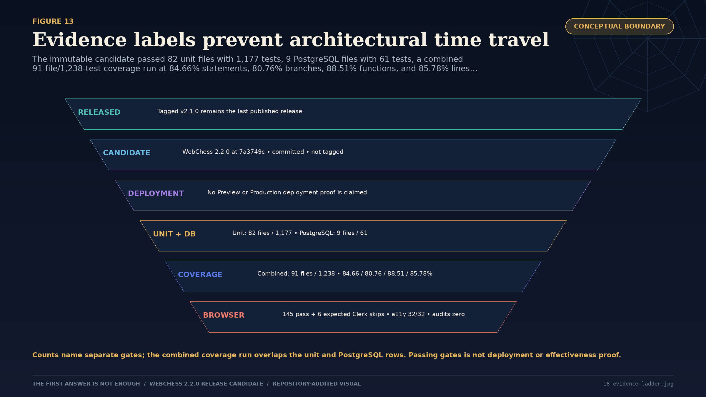

*Figure 13. Evidence must climb from deterministic conformance through controlled diagnostics, blinded component studies, end-to-end cases, and bounded longitudinal learning. An upper rung cannot be inferred from a lower one.*

Every quantity in this chapter is classified as **PROPOSED METRIC**, **STATISTICAL PLANNING FORMULA**, or **OBSERVED SOFTWARE-AUDIT RESULT**. Proposed metrics define future measurements; they are not results. Software-audit results prove only the stated engineering boundary.

## 18.1 Primary hypotheses

The first research program should preregister hypotheses such as:

- **H1 — Field quality:** Anansi produces broader and more independent problem representations than a direct-answer model or an unconstrained brainstorming prompt.
- **H2 — Conflict value:** Chess traversal produces a more useful and diverse terminal candidate set than random subset selection at equal token and time budgets.
- **H3 — Portia precision:** Portia removes unsupported and redundant candidates more accurately than generic self-critique while preserving unconventional but defensible candidates.
- **H4 — Gate calibration:** Gate passage predicts blinded human judgments of interpretive sufficiency and downstream recommendation quality.
- **H5 — Retry value:** Controlled Retry improves adequacy more than it increases answer shopping, cost, and variance.
- **H6 — Charlotte discipline:** Charlotte's qualification of an exact stored Answer produces more actionable and value-consistent guidance, with fewer unsupported claims, than the same frozen Answer presented without Charlotte.
- **H7 — Wilbur learning:** Cases with explicit predictions, interventions, measurements, and stopping rules generate more decision-relevant learning than cases ending at prose.
- **H8 — Web reconstruction now; inheritance later:** Within-case provenance improves reconstruction, accountability, export, and deletion reliability. A future, explicitly consented cross-case memory reduces repeated failure without unacceptable privacy leakage, conformity, contamination, or stale-pattern transfer. The cross-case portion is not implemented and is not presently testable as a product claim.

A result can support one hypothesis and reject another. The architecture should not be graded as one indivisible mythic artifact.

## 18.2 Baseline conditions

At minimum, comparative studies should include:

| Condition | Description |
|---|---|
| **Human-only** | Participant analyzes and responds without an AI aid |
| **Direct model** | One model call answers the original question |
| **Structured direct model** | Model uses the eight dimensions and movements but no game |
| **Equal-token brainstorm** | Same base model explores alternatives up to the full system's generation budget, then answers |
| **Multi-sample selection** | Generate several complete answers, then use a frozen vote or ranking rule |
| **WebChess 2.2.0 candidate** | Exact frozen Division → cast → complete game → Portia → Gate/Retry → Answer → Charlotte → Wilbur/Web implementation at `7a3749c` |
| **Random subset** | Same field; select an equal number of facets randomly |
| **Semantic ranking** | Same field; select facets by model-rated relevance |
| **Random legal Chess** | Same field and rules; choose uniformly among legal actions |
| **Legacy greedy engine** | Same field and rules; substitute the pinned one-ply legacy scorer |
| **Generic self-refine** | Draft, self-critique, and revision without the spider lifecycle |
| **Tree/search baseline** | Explore and score multiple reasoning branches, such as a Tree-of-Thoughts-style implementation |
| **Human devil's advocate** | On a smaller subset, a trained human challenges the answer using a frozen rubric |

Where cost permits, add cross-model debate and expert-panel deliberation. A weak baseline proves little.

Run two complementary comparisons. A **matched-resource track** holds the base model, evidence access, total token or spend ceiling, wall-clock allowance, and judged output length as equal as possible. A **native-product track** lets each method run normally and plots quality against actual cost, latency, human attention, technical failure, and abandonment. Matching only call count is inadequate because calls differ in context, output, reasoning work, caching, and retrieval.

## 18.3 Required ablations

The full system should be dismantled experimentally.

1. Replace the 8 × 8 grid with a flat request for sixty-four items.
2. Remove I Ching-inspired lenses while preserving facets and Chess.
3. Compare fixed pairing, one shared shuffle, and the implemented three domain-separated permutations.
4. Remove Chess and give all sixty-four facets to the same downstream answer path.
5. Replace Engine V2 with random legal play and then with legacy-greedy-v1.
6. Replace Chess selection with a matched random subset and a matched semantic top-k subset.
7. Remove route, attacked-ply, capture, promotion, or outcome fields from survivor packages one at a time.
8. Remove Portia and send the exact board prompt directly to Answer.
9. Replace the thirteen-attack Portia contract with generic same-model self-critique.
10. Compare same-model, cross-model, retrieval-backed, and human Portia channels on a bounded subset.
11. Remove the Gate and force Answer on every technically complete game.
12. Remove each Gate floor independently and test benign-paraphrase sensitivity.
13. Disable Retry; then compare same-field-only and field-regeneration-only policies.
14. Omit Portia's permitted prompt amendments while preserving its disposition record.
15. Remove Charlotte and expose the stored Answer; then compare a generic editor.
16. Relax Charlotte's support and exact-wound constraints one at a time in controlled low-stakes cases.
17. Remove Wilbur follow-up; then remove threshold or observation fields separately.
18. Reduce the Web to a final artifact and then restore failed/dead branches one layer at a time.
19. Compare neutral labels with mythic labels and static presentation with animation.
20. Keep cross-case memory off until a separately approved study can compare consented memory, no memory, stale memory, and adversarially contaminated memory.

The full architecture earns credit only for improvements that disappear when the relevant component is removed.

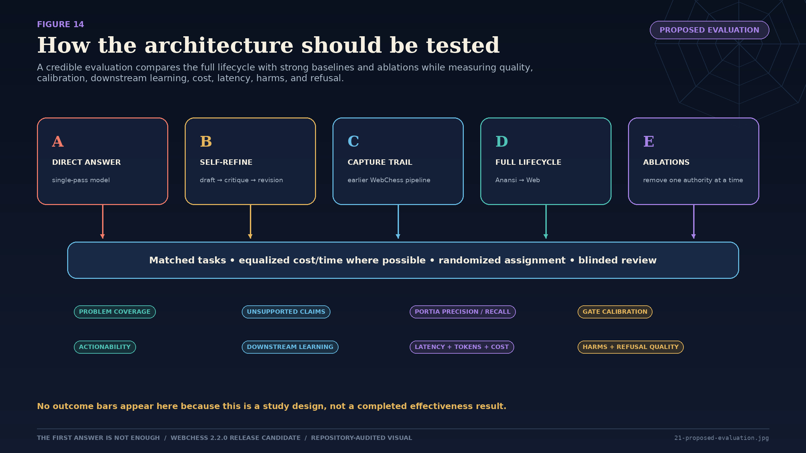

*Figure 14. Proposed evaluation design, not measured performance. Strong baselines and stage ablations feed blinded outcomes, cost and harm accounting, and explicit support, redesign, or retirement decisions.*

## 18.4 Task portfolio

No single benchmark can validate WebChess. The evaluation portfolio should contain distinct task classes.

### 18.4.1 Controlled synthetic tasks

Create cases with known hidden structure, planted assumptions, redundant facets, decisive counterevidence, and measurable optimal actions. These enable precision and recall estimates for Portia and Gate.

### 18.4.2 Expert-authored open-ended cases

Domain experts should author strategy, product design, operations, research planning, organizational, and creative problems with scoring rubrics. Experts must not write the cases to flatter WebChess's categories.

### 18.4.3 Naturalistic user cases

With informed consent, recruit users bringing real but low- or moderate-stakes questions. Record original framing, prior beliefs, chosen actions, and follow-up outcomes.

### 18.4.4 Creativity batteries

AGC-Bench, introduced as a July 2026 preprint, assembles seventy-eight datasets across six creativity domains and reports a broad comparative study across eighty-three language models (Beaty et al., 2026). It is relevant for testing Anansi's generative breadth, Charlotte's idea quality, and sensitivity to prompting. It cannot validate the complete WebChess lifecycle because it does not measure this system's provenance, Portia judgments, Gate calibration, real-world action, or privacy costs.

WebChess evaluation should therefore use AGC-Bench as one external battery, not as a coronation ceremony.

### 18.4.5 Longitudinal field cases

Organizations or research teams can pilot the method on bounded decisions with predeclared metrics and follow-up windows. Early field work should exclude decisions whose errors can materially damage rights, health, safety, employment, or access.

## 18.5 Measurement framework

### 18.5.1 Anansi metrics

- actor, mechanism, evidence, value, temporal, risk, and option coverage;
- semantic independence and cluster diversity;
- hidden-structure recall on synthetic tasks;
- user-rated recognition of the actual problem;
- expert-rated omission severity;
- proportion of generic or template-driven facets;
- novelty and usefulness scored separately; and
- cost, latency, and failure rate.

### 18.5.2 Chess metrics

- survivor diversity;
- capture and route coverage;
- sensitivity to seed, policy, search depth, and node budget;
- semantic relevance of terminal survivors;
- information gain relative to random selection;
- recurrence adjusted for positional advantage;
- marginal downstream quality per unit of compute; and
- user comprehension of what the game did and did not establish.

### 18.5.3 Portia metrics

On controlled cases where candidate status is independently adjudicated:

- false preservation rate;
- false consumption rate;
- qualification accuracy for wounded candidates;
- calibration of severity and uncertainty;
- factual-source precision;
- attack coverage;
- novelty retention;
- inter-evaluator agreement and disagreement quality;
- susceptibility to prompt framing; and
- error correlation with Anansi and Charlotte.

Portia should be penalized for indiscriminate severity. A spider that eats everything is not discerning; it is hungry.

### 18.5.4 Gate metrics

- pass/retry/refusal accuracy against blinded panels;
- calibration curves for a separately frozen experimental probabilistic Gate score, which current Gate V4 does not emit;
- sensitivity to threshold and weight changes in that experimental Gate, while retaining the shipped hard-conjunction Gate as a separate baseline;
- false-pass cost and false-retry cost;
- stability across paraphrases;
- rate of hard-floor violations;
- prediction of downstream answer quality;
- prediction of Wilbur learning or outcome quality; and
- ability to refuse when evidence is genuinely insufficient.

### 18.5.5 Retry metrics

- adequacy gained per retry;
- field versus game retry diagnostic accuracy;
- cross-run stability;
- cost and latency inflation;
- frequency of answer shopping;
- percentage of cases exhausting budget;
- diversity gained versus noise introduced; and
- whether Portia autopsies improve the next Anansi field.

### 18.5.6 Charlotte metrics

- directness;
- claim-to-source traceability;
- fidelity to preserved and wounded candidates;
- absence of consumed-candidate resurrection;
- stakeholder coverage;
- value-constraint compliance;
- uncertainty retention;
- action specificity and reversibility;
- factual consistency across audience variants;
- persuasion-to-evidence ratio; and
- blinded usefulness ratings.

### 18.5.7 Wilbur metrics

- action adoption and completion;
- implementation fidelity;
- time to informative feedback;
- evidence generated;
- stop-rule compliance;
- unexpected harms and affected-party reports;
- decision reversal when thresholds are met;
- learning value even when the action fails; and
- causal confidence appropriate to the design.

### 18.5.8 Web metrics

- completeness of provenance reconstruction;
- ability to reproduce a cast and replay a game;
- traceability from final claim to source and event;
- retention-policy compliance;
- access-control violations;
- deletion and export reliability;
- cross-case benefit under consent;
- stale-memory transfer errors;
- privacy leakage; and
- storage and governance cost.

### 18.5.9 Formula-defined metric register

Let i identify a case, c a condition, s a seed/run, r a blinded rater, n the current set size, F_i the sixty-four-facet field, S_ics the terminal survivor set, T_i a reference concept set created before generation, Q_icsr one rating on one named dimension, C_ics measured cost, L_ics latency, 1[condition] the indicator function, and sim(a,b) a frozen similarity procedure. Delta-star denotes the preregistered smallest effect worth the added cost. None of the following is currently reported as a WebChess research result.

#### Anansi and field quality

**M-A1 — Reference-concept recall — PROPOSED METRIC**

~~~text
ReferenceRecall_i = |Covered(F_i, T_i)| / |T_i|
~~~

Plain meaning: of the important structures known before generation, what fraction did at least one facet materially expose? Use only where a defensible reference set exists.

**M-A2 — Unsupported-facet rate — PROPOSED METRIC**

~~~text
UnsupportedFacetRate_i =
  facets containing a material unsupported factual claim / 64
~~~

Plain meaning: how often did exploration quietly become invented fact?

**M-A3 — Pairwise redundancy — PROPOSED METRIC**

~~~text
PairRedundancy_i(tau) =
  [2 / (n(n - 1))] * sum over a<b of 1[sim(f_a,f_b) >= tau]
~~~

Plain meaning: what fraction of all facet pairs are near-duplicates at the frozen threshold? Report threshold sensitivity and human review. The implemented lexical Jaccard guard is a boilerplate detector, not this semantic metric.

**M-A4 — Effective semantic diversity — PROPOSED METRIC**

~~~text
p_k = facets in semantic cluster k / 64
EffectiveDiversity_i = exp(-sum over k of p_k * ln(p_k))
~~~

Plain meaning: how many equally populated themes would have the same diversity? It penalizes many labels concentrated around one idea.

**M-A5 — Useful novelty — PROPOSED METRIC**

~~~text
UsefulNovelty_i =
  facets rated both non-obvious and task-relevant / 64
~~~

Plain meaning: novelty must also help the task. Strange but irrelevant language does not score.

**M-A6 — Omission severity — PROPOSED METRIC**

~~~text
OmissionBurden_i =
  sum_(j in O_i) w_j / sum_(j in R_i) w_j
~~~

Here `R_i` is the nonempty preregistered set of material reference concepts for case `i`; `O_i` is the subset omitted by the field; and `w_j > 0` is the frozen severity weight for concept `j`. Zero means no weighted omission and one means every weighted reference concept was omitted. Plain meaning: a field cannot compensate for one missed safety constraint by mentioning many minor ideas, and adding another omission cannot lower the burden.

#### Cast, Chess, and terminal ecology

**M-C1 — Cross-seed survivor-theme overlap — PROPOSED METRIC**

~~~text
Jaccard(S_a,S_b) =
  |Themes(S_a) intersect Themes(S_b)|
  / |Themes(S_a) union Themes(S_b)|
~~~

Plain meaning: how much substantive terminal content survives two seeds? Compare semantic themes because regenerated candidates have different identifiers.

**M-C2 — Cross-seed distribution divergence — PROPOSED METRIC**

~~~text
M = (P + Q) / 2
JSD(P,Q) = 0.5 * KL(P||M) + 0.5 * KL(Q||M)
KL(P||Q) = sum over k of P_k * ln(P_k / Q_k)
~~~

Plain meaning: how much does the thematic mixture change across runs? Freeze clustering, smoothing, and empty-cell handling.

**M-C3 — Route and capture coverage — PROPOSED METRIC**

~~~text
RouteCoverage = distinct cells visited / 64
CaptureFacetCoverage = distinct facet IDs in captures / 64
~~~

Plain meaning: how much of the board did play touch? This measures traversal, not insight.

**M-C4 — Selection lift over random — PROPOSED METRIC**

~~~text
SelectionLift_i =
  Q_i(WebChess survivors) - mean_b Q_i(random subset b)
~~~

Plain meaning: does complete play leave a better candidate package than repeated random subsets from the same field with the same survivor count?

**M-C5 — Downstream selection lift — PROPOSED METRIC**

~~~text
DownstreamLift_i =
  Q_i(final output using Chess selection)
  - Q_i(final output using matched alternative selection)
~~~

Plain meaning: did selection improve the final artifact after the rest of the lifecycle, rather than merely producing an interesting board?

**M-C6 — Compute-adjusted lift — PROPOSED METRIC**

~~~text
ComputeAdjustedLift =
  (mean Q_WebChess - mean Q_baseline)
  / (mean C_WebChess - mean C_baseline)
~~~

Plain meaning: how much measured quality changed per incremental unit of cost? Show numerator and denominator separately; do not use the ratio when incremental cost is zero or negative.

**M-C7 — Terminal-theme recurrence — PROPOSED METRIC**

~~~text
Recurrence_k =
  runs in which semantic theme k survives / repeated runs
~~~

Plain meaning: how often did a theme return? Recurrence makes it worth inspecting; it does not make it true.

#### Portia

Controlled cases require independent labels for defensible, indefensible, and genuinely unresolved candidates. For the binary formulas, “kept” means preserved or wounded.

**M-P1 — False-preservation rate — PROPOSED METRIC**

~~~text
FalsePreservationRate =
  indefensible candidates kept / independently adjudicated indefensible candidates
~~~

Plain meaning: how often did bad prey escape?

**M-P2 — False-consumption rate — PROPOSED METRIC**

~~~text
FalseConsumptionRate =
  defensible candidates consumed / independently adjudicated defensible candidates
~~~

Plain meaning: how often did the hunter destroy useful material?

**M-P3 — Usable precision, recall, and F1 — PROPOSED METRIC**

~~~text
Precision = TP / (TP + FP)
Recall = TP / (TP + FN)
F1 = 2 * Precision * Recall / (Precision + Recall)
~~~

TP is a defensible candidate kept, FP an indefensible candidate kept, and FN a defensible candidate consumed. State zero-denominator handling rather than silently substituting perfection.

**M-P4 — Disposition macro-F1 — PROPOSED METRIC**

~~~text
MacroF1 =
  mean class-specific F1 over preserved, wounded, consumed, unresolved
~~~

Plain meaning: each disposition receives equal weight, so the largest class cannot hide failure on a rare consequential class.

**M-P5 — Qualification accuracy — PROPOSED METRIC**

~~~text
QualificationAccuracy =
  materially correct wounded qualifications / candidates independently requiring qualification
~~~

Plain meaning: did the wound name the real defect rather than append generic caution?

**M-P6 — Attack completion and diagnostic yield — PROPOSED METRIC**

~~~text
AttackCompletion = required attack types completed / 13
DiagnosticYield_a =
  independently confirmed material defects found by attack a
  / candidates receiving attack a
~~~

Plain meaning: completion checks the shipped exact-thirteen contract; yield asks whether each attack finds valid defects.

**M-P7 — Novelty retention — PROPOSED METRIC**

~~~text
NoveltyRetention =
  defensible unconventional candidates kept
  / defensible unconventional candidates
~~~

Plain meaning: can Portia discriminate without eating everything strange?

**M-P8 — Evaluator error correlation — PROPOSED METRIC**

~~~text
ErrorCorrelation(A,B) =
  correlation of binary error indicators from evaluators A and B
~~~

Plain meaning: do apparently separate reviewers repeat the same mistakes?

#### Gate

Gate v4 returns a deterministic category, not a probability. Probability calibration metrics apply only if a separate experimental Gate emits a frozen forecast.

**M-G1 — Balanced decision accuracy — PROPOSED METRIC**

~~~text
TruePassRate = correct passes / independently sufficient cases
TrueStopRate = correct retries or refusals / independently insufficient cases
BalancedAccuracy = (TruePassRate + TrueStopRate) / 2
~~~

Plain meaning: can the Gate both pass adequate cases and stop inadequate ones?

**M-G2 — False-pass and false-stop rates — PROPOSED METRIC**

~~~text
FalsePassRate = insufficient cases passed / insufficient cases
FalseStopRate = sufficient cases retried or refused / sufficient cases
~~~

Plain meaning: report dangerous permission and unnecessary stopping separately.

**M-G3 — Brier score — PROPOSED METRIC**

~~~text
Brier = (1/N) * sum_i (p_i - y_i)^2
~~~

Plain meaning: for a future probabilistic Gate, how far are predicted sufficiency probabilities from binary outcomes? Lower is better. This cannot be computed from Gate v4.

**M-G4 — Expected calibration error — PROPOSED METRIC**

~~~text
ECE = sum over bins b of
  (|B_b| / N) * |accuracy(B_b) - mean_probability(B_b)|
~~~

Plain meaning: within forecast bins, how far is confidence from observed frequency? Freeze bins and report a reliability diagram and Brier score.

**M-G5 — Gate predictive lift — PROPOSED METRIC**

~~~text
PredictiveLift =
  (1 / |M|) * sum_((p,f) in M) (Q_p - Q_f)
~~~

Here `M` is a preregistered, nonempty set of matched pass/failure pairs formed without using downstream scores; `Q_p` and `Q_f` are their downstream-quality scores. Report balance diagnostics and do not estimate the quantity when credible matches do not exist. Plain meaning: among observably comparable cases, does a pass predict a better later artifact? Matching reduces measured difficulty imbalance; it does not establish causal control over unobserved differences.

**M-G6 — Paraphrase stability — PROPOSED METRIC**

~~~text
GateStability =
  agreeing decisions across meaning-preserving paraphrase pairs / pairs
~~~

Plain meaning: does benign wording change the Gate? Blinded reviewers must confirm meaning preservation.

#### Retry

**M-R1 — Marginal adequacy gain — PROPOSED METRIC**

~~~text
DeltaAdequacy_j = Adequacy_j - Adequacy_(j-1)
~~~

Plain meaning: how much blinded adequacy changed at each retry. Report the distribution because Retry can help one case and destabilize another.

**M-R2 — Retry gain per cost — PROPOSED METRIC**

~~~text
RetryEfficiency_j =
  DeltaAdequacy_j / (Cost_j - Cost_(j-1))
~~~

Plain meaning: how much adequacy changed per incremental cost? Show both components and preregister zero-cost handling.

**M-R3 — Field-versus-game targeting — PROPOSED METRIC**

~~~text
RetryTargetAccuracy =
  chosen retry targets matching independent defect adjudication
  / adjudicable failed Gates
~~~

Plain meaning: did Retry correctly distinguish a bad trajectory from a bad semantic field?

**M-R4 — Answer-shopping rate — PROPOSED METRIC**

~~~text
AnswerShoppingRate =
  retries moving toward a preregistered preferred conclusion
  without independently judged evidence or coverage gain
  / eligible retries
~~~

Plain meaning: did another attempt earn its change, or merely search for the desired answer? Preference direction must be recorded before Retry.

**M-R5 — Exhaustion rate — PROPOSED METRIC**

~~~text
ExhaustionRate =
  cases ending insufficient_basis after using the allowed retry budget
  / cases entering Retry
~~~

Plain meaning: how often could the bounded policy not repair the basis? Interpret with defect labels; honest refusal is not automatically failure.

**M-R6 — Duplicate-terminal rate — PROPOSED METRIC**

~~~text
DuplicateTerminalRate =
  same-field retries reproducing a prior terminal fingerprint
  / same-field retries
~~~

Plain meaning: how often did a paid-for trajectory add no exact terminal variation? Add semantic near-duplication analysis because exact fingerprints are narrower.

#### Answer and Charlotte

**M-CH1 — Warrant precision — PROPOSED METRIC**

~~~text
WarrantPrecision =
  material claims supported by approved evidence or labeled inference
  / material claims
~~~

Plain meaning: how much substantive prose has an adequate support path? Board weight, survival, and metaphor do not count as evidence.

**M-CH2 — Unsupported-claim rate — PROPOSED METRIC**

~~~text
UnsupportedClaimRate =
  unsupported material claims / material claims
~~~

Plain meaning: how often did the final artifact outrun its warrant? Keep “unclear” as a separate adjudication class.

**M-CH3 — Qualification retention — PROPOSED METRIC**

~~~text
QualificationRetention =
  cited wounded candidates retaining their exact required qualification
  / cited wounded candidates
~~~

Plain meaning: did each cited wound remain visible and exact in the rendered result? The code enforces the data contract; evaluation checks human-visible meaning.

**M-CH4 — Consumed-candidate resurrection — PROPOSED METRIC**

~~~text
ResurrectionRate =
  consumed candidates materially used as final support / consumed candidates
~~~

Plain meaning: did Charlotte revive what Portia killed? Human semantic tracing is needed even when identifiers are absent.

**M-CH5 — Action quality — PROPOSED METRIC**

~~~text
ActionQuality =
  mean blinded score over specificity, feasibility, observability,
  reversibility, ownership, threshold clarity, and affected-party protection
~~~

Plain meaning: are the exactly three actions good actions? Exactly three is a contract, not validation.

**M-CH6 — Persuasion–warrant gap — PROPOSED METRIC**

~~~text
PersuasionWarrantGap = PersuasivenessScore - WarrantScore
~~~

Plain meaning: does the language sound more convincing than its support permits? Use the same frozen scale and show both source scores.

**M-CH7 — Audience factual invariance — PROPOSED METRIC**

~~~text
InvarianceViolationRate =
  core factual propositions contradicted across audience variants
  / core factual propositions compared
~~~

Plain meaning: tone may change; facts, uncertainties, and constraints may not.

**M-CH8 — Decision-rule completeness — PROPOSED METRIC**

~~~text
DecisionRuleCompleteness =
  actions containing actor, assumption, smallest action, expected observation,
  threshold, horizon, reversibility, affected parties, and decision rule
  / actions generated
~~~

Plain meaning: are all fields needed for a bounded experiment present? Independent review still judges their coherence.

#### Wilbur

**M-WI1 — Adoption and completion — PROPOSED METRIC**

~~~text
AdoptionRate = actions started / actions offered
CompletionRate = actions completed / actions started
~~~

Plain meaning: did people begin and finish? Adoption is behavior, not proof of quality.

**M-WI2 — Protocol fidelity — PROPOSED METRIC**

~~~text
ProtocolFidelity =
  preregistered action elements completed as planned
  / preregistered action elements
~~~

Plain meaning: how closely did the real action match the planned test? Record justified adaptation rather than calling every change failure.

**M-WI3 — Informative-observation yield — PROPOSED METRIC**

~~~text
ObservationYield =
  actions producing a decision-relevant observation / actions started
~~~

Plain meaning: did action create information, not merely a completed form?

**M-WI4 — Time to information — PROPOSED METRIC**

~~~text
TimeToInformation =
  time from action start to first decision-relevant observation
~~~

Plain meaning: how quickly did reality answer? Use survival analysis when follow-up ends before an observation.

**M-WI5 — Stop-rule adherence — PROPOSED METRIC**

~~~text
StopRuleAdherence =
  threshold crossings followed by the declared stop or revise decision
  / observed threshold crossings
~~~

Plain meaning: did the reversal condition remain binding after commitment?

**M-WI6 — Learning yield — PROPOSED METRIC**

~~~text
LearningYield =
  completed cases with a traceable observation-supported assumption update
  / completed follow-up cases
~~~

Plain meaning: did the action change what is known? Confirmation, weakening, rejection, and unresolved are all legitimate updates.

**M-WI7 — Adverse-effect rate — PROPOSED METRIC**

~~~text
AdverseEffectRate =
  actions with a preregistered or independently adjudicated adverse effect
  / actions started
~~~

Plain meaning: who was harmed, how often, and how severely? Severity and affected party must remain visible.

#### The Web

**M-WE1 — Provenance completeness — PROPOSED METRIC**

~~~text
ProvenanceCompleteness =
  required entities, activities, agents, and links present
  / required elements in the frozen provenance profile
~~~

Plain meaning: can the case account for Division, cast, game, Portia, Gate, Retry, Answer, Charlotte, Wilbur, research, and deletion?

**M-WE2 — Claim traceability — PROPOSED METRIC**

~~~text
ClaimTraceability =
  final material claims with an inspectable approved support path
  / final material claims
~~~

Plain meaning: can a reader travel from prose back to evidence or labeled inference while distinguishing metaphor and procedural salience?

**M-WE3 — Replay exactness — PROPOSED METRIC**

~~~text
ReplayExactness =
  valid replay attempts reproducing canonical terminal state and outcome
  / valid replay attempts
~~~

Plain meaning: did replay reproduce pieces, event order, captures, outcome, versions, and digests—not merely the winner?

**M-WE4 — Export reliability — PROPOSED METRIC**

~~~text
ExportReliability =
  eligible exports returning a complete schema-valid owner-scoped file
  / eligible export requests
~~~

Plain meaning: can the owner retrieve the complete bounded record? Oversized requests that correctly fail closed belong in a separate test.

**M-WE5 — Deletion reliability — PROPOSED METRIC**

~~~text
DeletionReliability =
  eligible initiated deletion workflows satisfying every frozen rule
  / eligible deletion workflows initiated
~~~

Plain meaning: did content, raw identity, in-flight work, and the intentionally retained HMAC tombstone each follow policy? Timeouts, transaction failures, and incomplete workflows remain in the denominator; invalid or deliberately canceled requests are reported separately.

**M-WE6 — Privacy leakage — PROPOSED METRIC**

~~~text
PrivacyLeakageRate =
  audited records or exports containing prohibited data
  / audited records or exports
~~~

Plain meaning: how often did a forbidden field, purpose, subject, or retention state appear? Zero finite findings is not proof of zero risk.

**M-WE7 — Stale transfer — PROPOSED METRIC**

~~~text
StaleTransferRate =
  outdated or inapplicable prior-case items used / prior-case items used
~~~

Plain meaning: for a future consented memory, how often did inheritance import the wrong past? This metric is not a current product capability.

#### End-to-end and systems outcomes

**M-E1 — Paired quality difference — PROPOSED METRIC**

~~~text
d_i = mean_r Q_i,WebChess,r - mean_r Q_i,baseline,r
MeanDifference = mean_i d_i
~~~

Plain meaning: within the same case, how much did one named blinded quality dimension change? The case, not each rating, is the independent unit.

**M-E2 — Synthetic decision regret — PROPOSED METRIC**

~~~text
Regret_i = Utility_i(best feasible action) - Utility_i(chosen action)
NormalizedRegret_i = Regret_i / UtilityRange_i
~~~

Plain meaning: on controlled cases with defensible utilities, how much value was left on the table? Do not invent utility functions for contested moral decisions.

**M-E3 — Unsupported-claim reduction — PROPOSED METRIC**

~~~text
UnsupportedReduction =
  UnsupportedClaimRate_baseline - UnsupportedClaimRate_WebChess
~~~

Plain meaning: did the lifecycle reduce unsupported material claims? Report useful claims wrongly omitted as a separate harm.

**M-E4 — Recommendation stability — PROPOSED METRIC**

~~~text
DirectionStability =
  agreeing independently coded recommendation directions
  / within-case run pairs
~~~

Plain meaning: do repeated seeds point in compatible directions? Perfect stability may be rigidity; near-zero stability may be dangerous.

**M-E5 — Total measured cost — PROPOSED METRIC**

~~~text
TotalCost =
  provider charges + measured infrastructure allocation + evaluator labor
~~~

Plain meaning: what did the lifecycle actually consume? Report tokens and local hardware time even when marginal cash charge is zero.

**M-E6 — End-to-end latency — PROPOSED METRIC**

~~~text
Latency =
  timestamp(final usable artifact) - timestamp(submission accepted)
~~~

Plain meaning: how long did the user wait? Report median, 90th and 95th percentiles, cold/warm state, and time to first meaningful feedback.

**M-E7 — Human attention — PROPOSED METRIC**

~~~text
HumanBurden =
  active participant minutes + active evaluator or facilitator minutes
~~~

Plain meaning: how much human work did the method require? Separate active labor from waiting.

**M-E8 — Abandonment and technical failure — PROPOSED METRIC**

~~~text
AbandonmentRate =
  eligible user-started sessions abandoned before a usable terminal artifact
  / eligible user-started sessions

TechnicalFailureRate =
  accepted sessions ending in a technical terminal state
  / accepted sessions
~~~

Plain meaning: how often did people leave an eligible session, and how often did accepted work end because the machinery failed? Define eligibility and acceptance before analysis; report overlap as well as the two marginal rates. Keep user choice, Portia/Charlotte unavailability, Gate insufficiency, provider failure, and budget exhaustion distinct.

## 18.6 Human evaluation design

Human judges are not ground truth by divine appointment. They carry domain expertise, taste, ideology, fatigue, and framing effects. The evaluation design should therefore:

- use multiple judges with recorded qualifications;
- blind judges to condition labels and visual theatrics;
- randomize output order;
- score originality, usefulness, evidence, feasibility, risk, and communication separately;
- calibrate judge severity where possible;
- preserve disagreement rather than averaging it out immediately;
- include affected-party perspectives, not only experts and product owners; and
- report inter-rater reliability with its limitations.

Judge Response Theory, used in AGC-Bench to model judge leniency and severity, is one candidate method for creativity scoring. It should not be imported mechanically into domains where disagreement expresses legitimate value conflict rather than measurement noise.

**M-H1 — Inter-rater agreement — PROPOSED METRIC**

~~~text
KrippendorffAlpha = 1 - D_observed / D_expected
~~~

Plain meaning: how much less do raters disagree than expected from the category marginals? Use a nominal or ordinal distance appropriate to the scale. Alpha does not decide which dissenting judge is right.

The primary experimental unit is normally the **case**. Seeds, candidates, outputs, and ratings nested inside one case share the same problem and cannot be counted as independent samples. Prefer within-case paired comparisons, blocked randomization by domain and difficulty, counterbalanced participant order, and seed schedules generated before outputs are inspected.

One preregistered mixed-effects model may be written:

**S-01 — Mixed-effects rating model — STATISTICAL PLANNING FORMULA**

~~~text
Q_icsrp =
  beta_0 + beta_condition[c] + beta_seed[s]
  + u_case[i] + u_rater[r] + u_participant[p]
  + error_icsrp
~~~

Here `i`, `c`, `s`, `r`, and `p` index case, condition, seed, rater, and participant. Plain meaning: estimate the condition effect while accounting for case difficulty, rater severity, repeated seeds, and participant clustering. Use ordinal, logistic, survival, or count models when the outcome requires them.

For a paired continuous primary endpoint:

**S-02 — Paired effect — STATISTICAL PLANNING FORMULA**

~~~text
d_i = Q_i,full - Q_i,baseline
mean_d = (1/N) * sum_i d_i
~~~

Report mean_d, the raw distribution, and a 95% case-clustered bootstrap or model-based confidence interval. A confidence interval describes uncertainty under the design; it is not the probability that WebChess is true.

After an exploratory pilot estimates the standard deviation of within-case differences:

**S-03 — Paired sample approximation — STATISTICAL PLANNING FORMULA**

~~~text
N_pairs approximately =
  [(z_(1-alpha/2) + z_(1-beta)) * sigma_difference / delta-star]^2
~~~

Plain meaning: smaller worthwhile effects, noisier cases, higher power, or stricter error control require more independent cases. Replace this approximation with simulation for crossed raters, ordinal outcomes, unequal clusters, or missing follow-up.

When an average cluster contains m observations with intraclass correlation rho:

**S-04 — Cluster design effect — STATISTICAL PLANNING FORMULA**

~~~text
DesignEffect = 1 + (m - 1) * rho
N_cluster_adjusted = N_independent * DesignEffect
~~~

To allow for an attrition fraction a:

**S-05 — Attrition inflation — STATISTICAL PLANNING FORMULA**

~~~text
N_recruited = ceiling(N_required / (1 - a))
~~~

Every input must come from pilot evidence or a justified external source. These equations do not create a sample size by themselves.

Each hypothesis should have one primary outcome and a limited secondary set. For m ordered primary p-values:

**S-06 — Holm multiplicity control — STATISTICAL PLANNING FORMULA**

~~~text
Order p_(1) <= ... <= p_(m).
Reject H_(k) only while p_(k) <= alpha / (m - k + 1).
~~~

Exploratory outcomes remain valuable but must remain labeled exploratory. Provider failure, schema rejection, Portia exhaustion, Charlotte exhaustion, Gate refusal, user abandonment, and missing follow-up are outcomes. Use intention-to-treat when conditions were assigned, define missingness reasons, and avoid complete-case analysis that rewards brittle methods.

## 18.7 Cross-seed and cross-policy analysis

Every case should be treated as a distribution, not a single blessed run. For a subset of cases, generate multiple independent casts and policies. Report:

- survivor overlap;
- semantic theme overlap;
- Portia disposition stability;
- Gate decision stability;
- recommendation direction stability;
- action overlap;
- uncertainty overlap; and
- outlier runs.

A method that produces a different strategic recommendation from every seed may be useful for ideation and dangerous for decision support. The acceptable stability range depends on the intended use and must be specified before deployment.

## 18.8 Cost, latency, and ecological validity

The full lifecycle may require multiple model calls, game searches, evidence retrievals, human checks, retries, and later follow-up. Quality must therefore be analyzed against:

- token use;
- provider spend;
- elapsed time;
- user attention;
- evaluator labor;
- storage;
- energy and infrastructure footprint; and
- opportunity cost relative to simpler methods.

A system that improves rubric scores by two percent while multiplying cost and abandonment by twenty is not automatically progress.

For a clean completed run with N_D Division calls, game attempts a with k_a survivors, Answer and Charlotte indicators, and N_R research calls:

**X-01 — Model-call count — EXPLANATORY NOTATION**

~~~text
N_model =
  N_D + sum over attempts a of (k_a + 1)
  + I_Answer + I_Charlotte + N_R
~~~

The +1 per attempt is Portia's cross-candidate summary after one call per survivor. Technical retries and field regeneration add calls. Record actual calls rather than presenting X-01 as an invariant ceiling.

At the reporting level:

**M-E5a — Measured model cost — PROPOSED METRIC**

~~~text
ModelCost =
  sum over calls r and provider billing classes b of
  units_(r,b) * frozen_price_b
~~~

Plain meaning: use the provider's contemporaneous billing definitions and actual charge where available. Do not double-count cached, cache-write, reasoning, or output classes. Local inference still consumes measured hardware time and energy.

Decompose user-visible latency:

**X-02 — Latency decomposition — EXPLANATORY NOTATION**

~~~text
L_total =
  L_division + L_cast + L_game + L_research + L_portia + L_gate
  + L_retry + L_answer + L_charlotte + L_client
~~~

This is a scoped successful-case reporting partition, not a claim that stages never overlap. `L_research` is zero when the optional OpenClaw search is not invoked. `L_retry` contains only incremental work beyond the first Division/cast/game/Portia/Gate attempt, so repeated stages are not counted twice. Separate queue/lease delay, provider time, server work, database work, browser time, and human wait where observable. Report median, 90th and 95th percentiles, technical timeouts, and cold versus warm execution.

Plot quality–cost, quality–latency, quality–human-burden, and harm–quality frontiers. A method is Pareto-dominated when another is at least as good on every preregistered dimension and strictly better on at least one. No post hoc weighted average should hide that result.

Ecological validity should climb in declared rungs:

1. deterministic conformance;
2. controlled synthetic structure and error diagnostics;
3. blinded expert-authored cases;
4. naturalistic low- and moderate-stakes immediate use;
5. longitudinal bounded action and learning; and
6. replication across domains, organizations, model families, and time.

Evidence from a lower rung cannot be renamed as evidence from a higher one. Early naturalistic work should exclude medical, legal, financial, employment, civil-rights, crisis, safety, military, and other consequential decision authority.

## 18.9 Preregistration and reproducibility

Before confirmatory studies:

- freeze a clean repository commit and build digest; model provider and exact identifier/snapshot; reasoning and sampling settings; prompts; schemas; migrations and checksums; rules, cast, engine and event versions; Portia attacks; Gate floors and thresholds; Retry and technical-failure limits; research policy; and analysis plan;
- preregister primary and secondary outcomes;
- define inclusion, exclusion, risk, missing-data, outlier, interim-look, safety-stop, and statistical stopping rules;
- publish the seed-generation procedure and assignment schedule before viewing outputs;
- freeze every baseline, ablation, token/node/time budget, pricing sheet, and smallest effect of interest;
- record rater recruitment, qualifications, training, blinding, adjudication, and affected-party representation;
- preserve failed model calls and protocol deviations;
- publish de-identified fixtures where consent permits;
- release evaluation code and negative results; and
- distinguish exploratory tuning from confirmatory testing.

The current repository already preserves many implementation and game versions. Future WebChess evaluation should extend that discipline to every cognitive stage.

A model alias that changes silently is not a reproducible treatment. Development, calibration, and held-out confirmatory cases must remain separate. A confirmatory study should be repeated across independent seed sets, more than one model family where feasible, and at least one independently run replication before a general claim.

## 18.10 Success and failure criteria

A defensible first success claim would require evidence that, on representative low- or moderate-stakes tasks, the full lifecycle:

1. improves independently judged problem coverage or recommendation quality over strong baselines;
2. reduces unsupported claims or unexamined assumptions;
3. produces actions that generate useful evidence;
4. maintains acceptable cross-seed stability;
5. does not cause excessive false consumption, manipulation, or privacy harm; and
6. delivers those gains at a cost users or organizations can justify.

The project should weaken, redesign, or abandon components if:

- Portia cannot outperform generic critique;
- the Gate cannot be calibrated;
- Retry mainly enables answer shopping;
- Chess does not beat random or semantic selection;
- Charlotte increases persuasion more than warrant;
- Wilbur follow-up produces no measurable learning; or
- the Web's privacy burden exceeds its memory value.

A falsifiable architecture must include a dignified path to discovering that its favorite spider is decorative.

## 18.11 Current software-evidence ledger

**MEASURED — August 15, 2026.** This is engineering evidence for immutable commit `7a3749cf7f2c4e4c5ebfeb9b9aa870a11843f3a2`, not a result for any hypothesis above. The audited environment used Node.js 24.19.0 and npm 11.14.1. Every configured release surface named below passed.

| Verification surface | Exact result | Boundary |
|---|---:|---|
| Clean-commit unit tests | **1,177 of 1,177 passed across 82 files** | Deterministic and application tests without the PostgreSQL integration project |
| PostgreSQL integration | **61 of 61 passed across 9 files** | Disposable real PostgreSQL 17 instance; provider generation remains stubbed |
| Coverage invocation | **1,238 of 1,238 passed across 91 files** | The same 1,177 unit tests plus the same 61 PostgreSQL tests; not an additional test population |
| Statement coverage | **84.66 percent** | Configured floor 80 percent |
| Branch coverage | **80.76 percent** | Configured floor 80 percent |
| Function coverage | **88.51 percent** | Configured floor 80 percent |
| Line coverage | **85.78 percent** | Configured floor 80 percent |
| Full Playwright browser suite | **145 passed, 6 skipped; 151 discovered** | Application APIs mocked or intercepted; six real-Clerk checks unavailable in this environment |
| Automated accessibility | **32 of 32 passed** | Included within the 145 browser passes; automated Axe scan only |
| Lint | **Passed** | Configured repository lint gate |
| Type generation and TypeScript | **Passed** | Generated Next.js types plus strict project check |
| Optimized production build | **Passed** | Release-mode application build |
| Internal-link verification | **Passed** | Generated and source document routes and anchors |
| Production dependency audit | **Passed; zero known vulnerabilities** | Production dependency graph |
| Complete dependency audit | **Passed; zero known vulnerabilities** | Production and development dependency graph |
| OpenClaw plugin | **Passed** | Plugin build and generated-distribution consistency |
| Release package | **Passed** | Clean-commit package dry run |

These rows must not be added into a theatrical grand total. The 91-file coverage invocation is exactly the 82-file, 1,177-test unit population plus the 9-file, 61-test PostgreSQL population; it is a rerun under instrumentation, not another 1,238 tests. The 32 accessibility cases are a subset of the 145 Playwright passes. The browser suite exercises rendered flows with mocked or intercepted application-programming-interface responses, while the separate PostgreSQL suite exercises persistence and transactional boundaries. No single number here represents independent observations, and no browser result is being relabeled as browser-to-real-database end to end.

The six expected browser skips are Clerk-dependent checks repeated across the configured desktop and mobile projects. They require a real Clerk instance and authenticated principal, which this isolated verification environment did not provide. The green suite therefore does not prove a live Clerk configuration. Likewise, 32 clean Axe scans under the named Web Content Accessibility Guidelines tags mean that those automated checks detected no violations; they do not establish complete accessibility conformance.

The paired internal arena result—depth-3 Engine V2 against the pinned one-ply `legacy-greedy-v1`, wins–draws–losses 6–0–0 over six paired-color games from three deterministic six-ply openings—is a small regression sweep. It is not an Elo estimate, statistical significance, an external comparison, semantic quality, or general superiority.

The dependency repair is part of the immutable commit, and both the production-only and complete lockfile audits report zero known vulnerabilities. That result is time-bounded to the audit date and registry advisory state; it is not a promise that the dependency graph contains no undiscovered vulnerability.

Finally, this ledger proves neither a live hosted deployment nor a real OpenAI, Clerk, Neon, firewall, backup, or recovery configuration. Provider calls are stubbed where the test boundary says so, and the six real-Clerk browser cases remain skipped. It also supplies no evidence that WebChess improves decision quality, reduces regret, or outperforms a baseline. Those are empirical claims for the study design above, not deductions from a green release candidate.

---
# 19. Remaining engineering and research

Phases 0 through 5 of the original roadmap — freeze the 0.1.0 baseline, derive terminal survivors, put Portia on the critical path, implement Gate and Retry, separate Charlotte, and add a human-controlled Wilbur record — are present in the WebChess 2.2.0 candidate. The remaining work is to deepen those contracts, measure them, and refuse to confuse a shipped rail with a validated method.

The current candidate must remain a selectable research condition. Historical 0.1.0 games keep their original answer semantics; lifecycle artifacts are not fabricated retroactively for them.

## Phase A — Anansi field quality

Section 4.7 describes the richer Anansi work that remains ahead of the product.

Required work:

- assumptions, evidence status, stakeholders, disconfirming observations, and possible tests on each facet;
- source spans tying facet text to user wording;
- user inspect, merge, reject, and add before casting;
- an explicit missing-or-unknown register outside the sixty-four slots; and
- semantic cluster and coverage checks beyond the current lexical filters.

**Exit criterion:** blinded reviewers can distinguish the richer facets from the frozen 2.2.0-candidate field on held-out cases, and Portia autopsies of omitted actors or mechanisms decline on a preregistered fixture set.

## Phase B — Evaluator independence and required research

Portia is prompt-bound and durable. It is not yet error-independent.

Required work:

- deterministic, retrieval-backed, and optional cross-model or human attack adapters;
- source identifiers for every factual attack;
- a Gate floor that fails when research materiality is `required` and status is not `completed`;
- hosted research only through an authorized first-party provider, or an explicit hosted “research not attached” provenance mark; and
- false-source and prompt-injection tests kept in continuous evaluation.

**Exit criterion:** Portia outperforms generic self-critique on preregistered synthetic and expert-authored cases without excessive false consumption, and required-research failure cannot reach Answer.

## Phase C — Gate calibration

The shipped Gate is reproducible hard floors. It is not yet a calibrated sufficiency instrument.

Required work:

- freeze and publish every floor, cluster rule, and contradiction rule under a version ID;
- calibrate pass/retry/refusal against blinded human sufficiency judgments;
- sensitivity analysis around each floor;
- use of cross-run terminal fingerprints and Portia recurrence as reported metrics, not as proof; and
- keep `insufficient_basis` impossible to override with rhetoric.

**Exit criterion:** Gate decisions predict blinded sufficiency better than a survivor-count rule, with published false-pass and false-retry costs.

## Phase D — Charlotte discipline

Charlotte already qualifies a stored board answer and cannot resurrect consumed candidates as support. It does not yet meet section 9's full communicative contract.

Required work:

- explicit protected-outcome confirmation;
- audience-specific variants whose factual core is invariant;
- claim-to-candidate and claim-to-evidence traceability in the rendered text;
- store the player-visible prompt as the public `answer.prompt` and keep transport instructions off the game DTO;
- persuasion-versus-warrant evaluations; and
- keep wounds and uncertainty visible in the default rendering.

**Exit criterion:** Charlotte improves traceability, action quality, and uncertainty retention over the frozen 2.2.0 candidate without increasing unsupported persuasion.

## Phase E — Wilbur as bounded experiment

Wilbur now provides a durable rail for a player-owned action and observation: exact versioned binding to the six-field Wilbur projection of one saved Charlotte suggestion, immutable action content, revisioned status, append-only observation, once-only rate admission, exact committed-result or denial replay, and atomic artifact–activity–ledger settlement. Its lifetime envelope bounds future Wilbur rows and exact UTF-8 artifact text without deleting prior history. These are record-integrity properties. They do not mean the application executed the intervention, verified the report, secured consent, or established a causal effect.

Required work:

- actor authority and affected-party fields;
- consent, objection, exclusion, and independent-approval records where appropriate;
- prediction and metric registration before action;
- deadline, threshold, stopping-rule, and implementation-fidelity records;
- baseline, comparison, confounder, and contextual-event capture;
- causal-confidence labels that can remain inconclusive; and
- no autonomous execution in consequential domains.

**Exit criterion:** in a future evaluated release, an authorized user can translate a recommendation into a consent-aware bounded protocol, record a player-attributed report of what happened, and close the case without the application claiming execution, independent verification, or causality it did not establish.

## Phase F — The Web as exportable provenance

Within-case genealogy and a bounded owner export exist. `webchess-account-export/4` includes owner-scoped application rows, ten lifecycle recovery fields, the Wilbur Charlotte-binding version, sanitized Wilbur mutation-ledger rows, and the owner's pseudonymous user-rate windows. It omits private mutation reservations, owner/IP identifiers, HMAC material, shared IP/global counters, concurrency leases, tombstones, Clerk and vendor records, and database-restore metadata. The export is a synchronous JSON document with a separate response-size ceiling; the Wilbur admission envelope does not guarantee that a whole account will fit it. An explicit redaction-aware provenance graph, database-restorable package, and consented cross-case memory do not exist.

Required work:

- PROV-compatible export of entities, activities, and agents without requiring RDF as the operational store—PROV is the World Wide Web Consortium provenance model, and **RDF** means Resource Description Framework;
- provenance bundles per case and per retry;
- pagination or an explicitly governed asynchronous path for accounts larger than the synchronous ceiling;
- a documented, tested backup-and-restore boundary distinct from account export;
- memory-layer access control and retention;
- consented cross-case retrieval with similarity limits and contradictory outcomes visible;
- stale-memory and contamination tests; and
- deletion as a first-class provenance event.

**Exit criterion:** in a future evaluated release, an authorized reviewer can reconstruct why every final claim exists, what was rejected, who recorded an action, and what was later reported, while the system can export or deliberately forget what a published retention policy requires. That criterion must not be summarized as independent verification of the action or observation.

## Phase G — Evaluation release

Section 18 is still the research program. It has not been executed as a confirmatory study.

Deliverables:

- frozen commit, prompts, schemas, Gate version, and analysis plan;
- baselines and ablations from section 18.2–18.3;
- cross-seed runner;
- cost and latency reporting;
- publication of negative and null results; and
- a dignified path to reducing or removing Chess, Portia, or the lens layer if they fail ablation.

**Exit criterion:** the project can state, for named tasks and costs, which of H1–H8 survived.

## 19.1 Migration and backward compatibility

Existing records retain their original rules, engine, cast, prompt, and event version identities, and the 2.2.0 candidate must not reinterpret them silently. This is not a promise that arbitrary future code can replay every historical game: the current engine fails closed on a version mismatch and has no historical rules dispatcher unless old interpreters are deliberately retained.

Rules in force:

- historical 0.1.0 answers remain immutable artifacts;
- survivor packages and Portia judgments are not fabricated for games that never had a lifecycle row;
- schema changes remain append-only under `npm run db:migrate`;
- application rollback never rewrites provenance history; and
- old cases do not enter cross-case learning without renewed consent, if that memory layer is ever built.

## 19.2 User experience

The 2.2.0-candidate interface already shows a compact lifecycle rail, stage-specific artifacts, Portia progress tied to persisted signal counts, Gate and Retry as inspectable internals, Charlotte qualification, and Wilbur action cards. Remaining UX work is honesty, not ornament:

- keep every animation bound to a durable state transition;
- show retry ancestry and failed Gate records, not only the winning run;
- display research status, including “not attached” on hosted;
- preserve reduced-motion and text equivalents; and
- never use a wandering spider to cover a stalled model call.

## 19.3 Security boundaries

The current repository's server-authoritative principles remain in force, but each runtime has a different threat boundary.

**Hosted source target.** Every protected route must resolve a verified Clerk principal independently of routing middleware; the browser never supplies an authoritative owner. Mutations require exact same-origin checks, bounded strict JavaScript Object Notation (JSON), idempotency keys where applicable, and owner-scoped database operations. The intended OpenAI credential is server-only and the model is fixed. `store: false` does not establish Zero Data Retention. The migration owner and runtime database roles are separate by design. None of these source controls proves that a live Vercel, Clerk, Neon, firewall, backup, or OpenAI environment has been configured.

**Local OpenClaw.** The launcher binds to loopback, disables the path on Vercel, clears hosted identity/database settings, and invokes OpenClaw through an argument array with `shell: false`, bounded output, timeout, termination, and kill escalation. Its fixed request header and installation-scoped owner are not secrets; they distinguish the application inside one operating-system boundary. Another capable local process or user belongs inside that boundary. The launcher uses a development server whose offline policy permits inline script and development evaluation, and the runtime database credential can apply migrations. This is not the hosted least-privilege or hardened multi-user boundary. Its default owner and HMAC values are derived from the installation path; moving the installation without preserving them can make existing records inaccessible under the new principal.

**Local-hosted release candidate.** Authentication now has two explicit modes rather than an accidental hybrid. A valid Clerk configuration selects Clerk; without it, the loopback-only launcher uses the dedicated local-session secret and a seven-day, `HttpOnly`, `SameSite=Lax`, HMAC-authenticated session. The fallback represents one machine boundary, not a verified person. The launcher validates its environment and refuses malformed or non-loopback authority instead of silently widening the trust boundary. These source and test results do not prove a hardened multi-user deployment.

Across all surfaces:

- browser input never becomes authoritative board, capture, pass, outcome, survivor, Portia, Gate, quota, or provenance state;
- user, model, and research text remain untrusted data, not instructions;
- model intents are idempotent and durably accounted, while ambiguous provider-started work becomes `indeterminate` rather than being repeated silently;
- Portia cannot execute arbitrary tools; Charlotte cannot trigger Wilbur action; and model output cannot author a real-world observation;
- Secure Hash Algorithm 256-bit digests are integrity checks, not signatures, truth proofs, or protection from a database writer able to recompute them;
- HMAC identifiers are pseudonyms, not anonymity, and become linkable or guess-testable if their secret is compromised;
- visible research uses limited injection-pattern filtering and discovered links, not verified source-page text;
- application-level retry recovery is not database backup or disaster recovery; and
- cross-case memory, if built, requires explicit consent, access control, retention, and deletion semantics.

The three defects found in the earlier release audit are corrected in the immutable release-candidate commit. Wilbur mutations now use a durable owner-and-idempotency ledger, consume the named user and shared-address rate classes exactly once, preserve exact replay, and settle lifecycle events atomically with the artifact. Account export includes the sanitized lifecycle, binding, recovery, and mutation-ledger fields while excluding HMAC material, network identifiers, and internal reservation fields. Account deletion uses a four-statement transaction ordered around the restrictive Portia and Charlotte references; active-session, forced, and idempotent deletion cases pass against PostgreSQL. These are source-level and isolated-database results, not proof of a live signed webhook or hosted deletion exercise.

Before any hosted promotion, the project should additionally prove the exact runtime-role privilege contract, real Clerk authentication and signed deletion webhook, backup and restore, Point-in-Time Recovery (PITR) configuration if claimed, a measured Recovery Point Objective (RPO), and a measured Recovery Time Objective (RTO). The dependency audits and clean reproducible source gate are green for commit `7a3749cf7f2c4e4c5ebfeb9b9aa870a11843f3a2`; production promotion remains a separate, explicitly approved operation.

## 19.4 Cost architecture

The full lifecycle is already the default 2.2.0-candidate path. Graduated modes remain useful for research and for users who should see cost before they pay it:

| Mode | Stages | Intended use |
|---|---|---|
| **Review** | Anansi → Chess → Portia → Gate → Answer → Charlotte | Default 2.2.0-candidate session |
| **Experiment** | Review + Wilbur follow-up | Action and learning over time |
| **Research** | Multi-seed, multi-policy, human review, full Web export | Evaluation and institutional study |

A cheaper “reflection” mode that skips Portia and the Gate is a research ablation, not a product default. Users should see expected model calls, retry limits, and maximum authorized cost before beginning.

---

# 20. Worked example

The following example is illustrative. It demonstrates the proposed contracts and control flow; it is not a completed experiment or evidence that WebChess improves this decision.

## 20.1 The question

> **Should a mid-sized manufacturing company deploy an AI maintenance copilot across all three plants this year?**

The user supplies initial context:

- three plants with different equipment ages and maintenance practices;
- an experienced but understaffed maintenance workforce;
- fragmented manuals, work orders, and tribal knowledge;
- concern about downtime, safety, data quality, cybersecurity, and worker acceptance;
- an executive desire for a visible AI initiative; and
- no completed pilot.

The protected outcome is not “deploy AI.” It is:

> Improve maintenance reliability and knowledge access without degrading safety, worker authority, security, or operational continuity.

## 20.2 Anansi creates the field

Anansi generates sixty-four facets. A small sample:

| Grid location | Facet |
|---|---|
| Purpose × Clarify | Distinguish a reliability objective from an executive visibility objective |
| People × Receive | Learn how technicians currently verify uncertain procedures |
| Resources × Challenge | Test whether historical work orders are clean enough to ground recommendations |
| Timing × Begin | Identify one bounded asset class suitable for a sixty-day pilot |
| Risks × Connect | Map how wrong instructions could travel from generated text into physical work |
| Values × Consolidate | Preserve technician stop-work authority and source visibility |
| Evidence × Challenge | Separate vendor benchmark claims from plant-specific failure data |
| Possibilities × Adapt | Compare an answer copilot with retrieval-only search, document cleanup, and scheduling support |

Several generated facet texts surface uncertainty around user assertions that have not been verified, such as the amount of preventable downtime and the completeness of manuals. The current facet schema does not carry a separate typed uncertainty label.

## 20.3 The first cast and game

The facets, I Ching-inspired lenses, and board positions are independently permuted. White outside-in evidence moves inward; Black inside-out intent moves outward. Engine V2 plays the complete game.

Suppose Black captures the White King on ply 83. The first terminal board contains five surviving pieces:

| Survivor | Polarity and role | Literal facet at final square |
|---|---|---|
| Black Queen | Intent / Agency | Executive sponsorship and available budget |
| Black Pawn | Intent / Practice | Initial pilot staffing |
| White Bishop | Evidence / Perspective | Technician verification habits |
| White Knight | Evidence / Reframing | Retrieval-only alternative |
| White Pawn | Evidence / Practice | Work-order data quality sample |

The capture trail contains additional salient conflicts, including a Black Bishop challenging the distinction between vendor claims and local evidence. Nothing in this result proves that the five survivors are the right five considerations. They are Portia's prey.

## 20.4 Portia hunts the first ecology

### Candidate A — Executive sponsorship and budget

**Attack:** Causal relevance and adversarial stakeholder.

Portia finds that sponsorship is necessary for procurement but does not establish operational readiness. The CFO may support deployment because the budget is available, while maintenance supervisors bear the failure cost.

**Disposition:** **Wounded.** Preserve as an enabling condition; prohibit it from functioning as evidence of readiness.

### Candidate B — Initial pilot staffing

**Attack:** Evidence and actionability.

The user has no staffing baseline. Portia cannot determine whether a pilot can be supported without overtime or delayed repairs.

**Disposition:** **Unresolved.** Requires a workload sample and a named pilot owner.

### Candidate C — Technician verification habits

**Attack:** Counterevidence and adversarial stakeholder.

Interviews described in the user's context suggest that experienced technicians rely on visual inspection, peer confirmation, and manual cross-checking when procedures are ambiguous, but the claim has not yet been measured locally. A copilot that hides sources would conflict with the hypothesized practice.

**Disposition:** **Wounded.** Retain as a design constraint requiring observation rather than as an established fact.

### Candidate D — Retrieval-only alternative

**Attack:** Redundancy, actionability, and counterfactual removal.

The candidate survives and materially changes the decision. A retrieval-only system could test document access and adoption before allowing generative procedural synthesis.

**Disposition:** **Preserved.** Strong lower-risk comparator.

### Candidate E — Work-order data quality

**Attack:** Evidence and seed sensitivity.

No direct sample has yet been inspected. Portia cannot tell whether the presumed data-quality problem is real, severe, or merely conventional anxiety about industrial records.

**Disposition:** **Unresolved.** Requires direct sampling.

Portia has not disproved the field. It has consumed or narrowed enough of the first ecology that only one preserved candidate remains, accompanied by wounded strands and unresolved questions. The unresolved candidates are not support. The surviving usable set lacks explicit purpose protection, implementation structure, and a high-severity safety or cybersecurity counterposition.

## 20.5 The first Gate decision

The Gate evaluates:

- Purpose coverage: low;
- Evidence coverage: low;
- Risk coverage: low;
- Agency coverage: moderate;
- Tension coverage: moderate;
- Independence: moderate; and
- Unresolved severity: high.

The hard floors fail. There is no independent risk-bearing survivor and no adequate evidence-bearing candidate.

**Decision:** `retry_game`.

The field itself contains purpose, safety, cybersecurity, governance, data, workforce, and alternative-design facets. The failure appears to lie in this traversal and terminal ecology rather than in Anansi's representation. The Web preserves the failed run; Retry does not erase it or reroll in secret.

## 20.6 Retry launches a second game

Retry retains the same sixty-four facets **and the same cast** but creates a new game identity and independently recorded trajectory seed. The second game ends with White capturing the Black King on ply 97. Its terminal ecology includes:

| Survivor | Polarity and role | Literal facet at final square |
|---|---|---|
| White King | Evidence / Core purpose | Maintenance reliability rather than executive visibility |
| Black Rook | Intent / Structure | Standard operating procedure ownership |
| Black Pawn | Intent / Practice | Plant-specific pilot staffing |
| White Bishop | Evidence / Perspective | Technician verification habits |
| White Knight | Evidence / Reframing | Retrieval-only alternative |
| White Rook | Evidence / Structure | Cybersecurity and network segmentation |
| White Pawn | Evidence / Practice | Work-order and manual data quality |

Portia now attacks the new survivor packages. Because the Web preserves both runs, the narrator or a human reviewer can compare their records; the implemented Portia call does not perform cross-run recurrence analysis.

- **Reliability objective — Preserved.** It survives purpose and causal-relevance attacks. The executive desire for a visible AI initiative is demoted to context, not objective.
- **Procedure ownership — Preserved.** No operational answer can be trusted if source approval, versioning, and withdrawal of obsolete content have no owner.
- **Pilot staffing — Wounded.** A Plant 2 pilot appears plausible, but it must begin with a measured workload baseline and an explicit support ceiling.
- **Technician verification habits — Wounded.** The requirement for source visibility persists across games, but local observation is still required.
- **Retrieval-only alternative — Preserved.** It recurs across independently recorded trajectories on the same cast and remains the necessary comparator.
- **Cybersecurity and segmentation — Preserved as a blocking constraint.** The architecture must be reviewed before any pilot connects to operational technology; read-only isolation and no control-system write access are mandatory preconditions.
- **Data quality — Wounded.** A bounded corpus audit must precede any generative use; work-order learning remains excluded until evidence improves.

The recurrence of retrieval-only comparison across both games is informative but not proof. The second ecology is stronger because it adds independent purpose, governance, risk, and implementation strands that survived explicit attacks.

## 20.7 The second Gate decision

The survivor set now contains:

- a protected reliability objective;
- a governance and procedure-ownership requirement;
- an explicit safety and cybersecurity blocking condition;
- a feasible but bounded pilot path;
- a retrieval-only comparator;
- a data-quality limitation; and
- independent tensions among speed, control, worker trust, executive visibility, and operational continuity.

The Gate passes **for a staged, conditional experiment**, not for enterprise deployment. The wounded survivors retain exact qualifications that any later supporting use must preserve: no plant-wide deployment, and no pilot before the security and staffing preconditions are satisfied.

## 20.8 Answer states a case; Charlotte qualifies it

The Gate pass first authorizes a separate Answer. A compact excerpt from that stored artifact is:

> Do not deploy a generative maintenance copilot across all three plants this year. Complete an operational-technology security review and a Plant 2 staffing baseline first. If those preconditions pass, compare source-linked retrieval with a bounded generative assistant on one non-safety-critical asset class, while preserving technician stop-work authority and prohibiting control-system writes.

The full Answer also records the central tensions, recommendation, and exactly three actions. It is stored with the exact prompt Portia reviewed and its digest. At this point it is substantive but not yet Charlotte-qualified.

Charlotte then inspects that exact stored Answer, preserves the required qualifications attached to every wounded source it cites, and returns the following qualified recommendation:

> Do not deploy a generative maintenance copilot across all three plants this year. First complete an operational-technology security review and a Plant 2 staffing baseline. If those preconditions pass, run a sixty-day, read-only pilot at Plant 2 that compares source-linked retrieval with a tightly bounded generative assistant on one non-safety-critical asset class. Preserve technician stop-work authority, display every source and document version, prohibit unsourced procedural instructions, and keep the system disconnected from control functions. Enterprise expansion should depend on predefined evidence: reduced search time without increased error, verified user adoption, no security exceptions, acceptable staffing load, and correction of known document-quality defects.

The recommendation is accompanied by three reversible actions:

1. **Establish the boundary:** complete the security architecture review, staffing baseline, and source-governance assignments; stop if any blocking condition fails.
2. **Curate and compare:** approve the corpus for one asset class and run retrieval-only and bounded-generation conditions under the same users and tasks.
3. **Review at day sixty:** continue, narrow, revise, or stop using predeclared thresholds for search time, task accuracy, source verification, technician trust, security events, and workload.

The current Charlotte stage produces one qualified artifact and exactly three structured action suggestions; it does **not** produce audience variants. To illustrate the proposed extension from section 9, a future study could ask an authorized human communications team to prepare variants such as:

- executives receive a decision memo emphasizing staged evidence, capital discipline, and conditions for expansion;
- technicians receive operating boundaries, source visibility, and stop-work authority; and
- security receives architecture, logging, access, and incident controls.

The proposed variants would be required to keep factual claims and conditions invariant while changing rhetoric for audience needs. They are neither generated nor stored as distinct artifacts by commit `7a3749c`.

## 20.9 Wilbur encounters reality

Wilbur is the Plant 2 maintenance operation, including the technicians, supervisors, production assets, and safety obligations affected by the intervention. This is a hypothetical worked example, not a report that WebChess or its authors executed a pilot. The accountable human organization—not the model—would have to complete the preconditions, secure authority and consent, and decide whether to proceed.

In the current interface, the player selects Charlotte's second suggestion, “Curate and compare.” The new Wilbur action must repeat that suggestion's six Wilbur-bound fields exactly and is stored at suggestion index 1 with binding version `webchess-charlotte-action-binding-v1`, status `planned`, and revision zero. It cannot be edited into a broader intervention while retaining Charlotte's pedigree. A human may later change only its status through an expected-revision write; WebChess still performs none of the work outside the database.

The human team's external pilot protocol—not the current Wilbur schema by itself—would register the fuller expectations:

- retrieval time decreases by at least 25 percent;
- no increase in procedural errors;
- at least 70 percent of participating technicians judge source display adequate;
- no high-severity security incident;
- pilot support consumes no more than eight maintenance hours per week; and
- every generated answer can be traced to approved documents.

The current action record can preserve its tested assumption, expected observation, decision threshold, and review horizon. Actor authority, affected-party consent, complete metric registration, comparison assignment, and implementation-fidelity fields remain proposed. Suppose an authenticated player later submits this mixed report:

- retrieval time improves by 31 percent;
- retrieval-only and generative conditions perform similarly on routine questions;
- the generative condition helps with terminology variation but occasionally synthesizes across two procedures in an unsafe way;
- technicians strongly prefer source-linked retrieval for high-consequence tasks;
- no security incident occurs; and
- support load is twelve hours per week, above threshold.

WebChess stores those statements as an append-only observation together with player-authored evidence classification, expected and unexpected effects, stakeholder response, assumption result, and next decision. It does not inspect the plant, fetch source evidence, verify that the pilot occurred, or calculate the comparison. If the network drops after the append commits, a lifecycle refresh can reveal the observation; if the player must retry, the browser sends the same idempotency intent and the durable ledger returns that observation rather than deliberately creating another. That recovery property says nothing about the truth of the report.

The hypothetical sequence does not prove that generative copilots are bad, that retrieval is universally superior, or that either condition caused the numbers. At most, if the report and protocol were independently substantiated outside WebChess, a human decision maker could adopt the narrower working conclusion that document curation and retrieval appear to produce most of the value in this setting while cross-procedure synthesis and support burden remain unresolved.

## 20.10 The Web remembers

The Web preserves:

- the original question and protected outcome;
- all sixty-four facets and their provenance;
- both casts and complete game histories;
- every survivor package;
- Portia's dispositions and attack evidence from both ecologies;
- the failed and passed Gate records;
- Charlotte's saved qualification and exactly three structured action suggestions;
- the exact current-bound Wilbur projection copied from Charlotte, including its binding version, status revisions, tested assumption, expected observation, threshold, and horizon;
- the authenticated player's append-only observation text, free-text evidence classification, expected and unexpected effects, stakeholder response, assumption label, and next-decision report;
- the corresponding Wilbur lifecycle activities and durable mutation-ledger recovery fields; and
- the new question generated by the case:

> Can a curated retrieval system with narrow terminology normalization deliver the useful behavior without cross-procedure synthesis?

The external pilot protocol, complete metric registry, incident evidence, consent record, organizational decision, and audience variants are not separate current WebChess artifacts. They appear in the Web only to the extent that an authenticated player places bounded text into the implemented action or observation fields; their presence there does not verify them. The reported next decision can motivate the next Anansi input. The lifecycle does not end with an answer. It ends with a better inherited problem—but only a human organization can decide to inherit it.

---
# 21. Conclusion

At the beginning of a case there is one sentence and too much confidence.

WebChess began by making that sentence encounter sixty-four perspectives before it could become an answer. The WebChess 2.2.0 candidate now does considerably more than an ordinary prompt: it preserves the governing question; constructs and validates a structured field; performs three reproducible permutations; plays a complete, semantically blind conflict trajectory; derives a terminal candidate ecology; attacks the exact forthcoming Answer prompt; permits a deterministic Gate to refuse; bounds Retry; binds the generated Answer to its reviewed prompt and digest; lets Charlotte qualify rather than silently replace it; records human-owned action and observation; and preserves the within-case genealogy.

We call the arrangement **the Arachne Method** because its contribution lies in the weave among authorities, not in one model pretending to be wise. Arachne is the architecture's name inside this paper, not another stage and not the title's burden.

The lifecycle implemented by commit `7a3749c`, and still awaiting controlled evaluation, is:

> **Anansi imagines. Chess creates conflict. Portia hunts. The Gate judges sufficiency. Retry renews the search. Answer states a case. Charlotte qualifies it. Wilbur encounters reality. The Web remembers.**

The formal authorities remain eight; Answer is the stored artifact between Gate and Charlotte. Each authority makes a different kind of failure visible:

- Anansi may omit, homogenize, or invent.
- Chess may select an elegant irrelevance.
- Portia may preserve nonsense or destroy novelty.
- the Gate may pass too easily or refuse too often.
- Retry may diagnose failure or merely shop for an answer.
- Charlotte may communicate responsibly or manufacture conviction.
- Wilbur may create a disciplined occasion for evidence—or absorb harm.
- the Web may preserve learning or become surveillance.

The lifecycle is implemented; its claimed benefit is not yet established. Portia is prompt-bound but not error-independent. The Gate is reproducible but not calibrated against blinded sufficiency judgments. Wilbur can record an observation but does not identify a cause. The Web remembers a case but does not yet provide consented cross-case learning or a complete PROV export. The immutable code candidate's configured release gate is green, but the candidate remains untagged, unpushed, undeployed, and unevaluated for decision benefit. A language-model provider still occupies too many of the named offices.

Those admissions do not diminish the engineering achievement. They locate it. WebChess can already refuse some of its own performance: Portia can become technically unavailable without authorizing Answer; the Gate can close; Retry can end at `insufficient_basis`; and Charlotte can fail to qualify an Answer that remains visibly unqualified. The next research obligation is harder: establish, with controlled comparisons, when the field was broader rather than merely larger, when the game added information rather than theater, when Portia found real defects without eating novelty, when the Gate was calibrated, when Retry learned, when Charlotte's force matched its warrant, when Wilbur was protected, and when the Web was obliged to forget.

By the end of a case there may be an answer. There may instead be a refusal. Between those outcomes lies the method's real object: the first frame has been forced to coexist with alternatives; symbolic association has been marked as association; conflict has been recorded without being mistaken for evidence; wounds remain attached to what survived; permission is separate from prose; communication names its protected outcome; action remains under human authority; and memory retains failure as well as success.

That does not make the method wise. It makes the method inspectable enough to discover where it is foolish.

The most honest image of the Arachne Method is not a spider enthroned at the center of a perfect web. It is a working web after weather: some radial lines taut, some broken, some repaired, one vibration unresolved. Its strength is not perfection. Its strength is that tension travels. A pull on the final recommendation can be followed backward—to Charlotte's qualification, the stored Answer, the Gate that admitted it, Portia's surviving wounds, the path selected by Chess, the field constructed by Anansi, the user's first wording, and the evidence that did or did not exist.

Wilbur then pulls in the other direction. The world answers back.

If the result fails, the Web should not hide the failure to protect the method's elegance. If the result succeeds, the Web should not mistake sequence for causality. If the basis is insufficient, the Gate should remain closed even when every model can produce a beautiful paragraph. And if controlled experiments show that a favorite lens, policy, spider, or stage adds theater without benefit, the architecture should be strong enough to cut its own thread.

The first answer is not enough because an answer is not only a sentence. It is the visible end of framing, omission, selection, attack, permission, value, action, and consequence.

> **The web's value is not that it catches an answer. It is that it preserves the struggle by which an answer earns a provisional right to be considered for action.**

---

# Appendix A. Current circular-chess rules and engine specification

This appendix is the complete implementation specification audited against committed source at `7a3749cf7f2c4e4c5ebfeb9b9aa870a11843f3a2`. **IMPLEMENTED FORMULA** means executable source enforces the stated relation. **IMPLEMENTED HEURISTIC** means the code enforces a hand-designed score, threshold, or ordering rule. **EXPLANATORY NOTATION** restates behavior without claiming a separate implementation. **IMPLEMENTATION-DERIVED ESTIMATE** is arithmetic from declared data layouts or constants, not a measured process footprint. **IMPLEMENTED DIAGNOSTIC** is a value computed by the program for inspection. **MEASURED** means the stated result was reproduced on the dated fixture and environment. Appendix D assigns one of these statuses to every quantitative relation. None establishes production deployment, semantic correctness, or decision benefit.

The board is where Arachne becomes visible. White carries **outside-in evidence** from the outer rim toward the center. Black carries **inside-out intent** from the inner ring toward consequence. Rooks bring structure, Bishops perspective, Knights reframing, Pawns practice, Queens agency, and Kings the purpose each polarity protects.

The metaphor is deliberate. The mystification is not. Engine V2 cannot read a facet, assess a source, or know what matters in the user’s world. It sees pieces, cells, turns, counters, and scores. Its blindness is a boundary: Chess creates a reproducible trajectory of attention; it does not create evidence. A captured King rings the bell that wakes Portia. It does not certify that the winning side was right.

## A.1 Logical topology: circular to the eye, cylindrical to the rules

**IMPLEMENTED FORMULAS (A-01 through A-03).** WebChess renders a radial field, but its logical board is an `8 x 8` cylindrical grid. A cell is `(r, s)`, where ring `r` and sector `s` are integers from 0 through 7:

```text
B = { (r, s) | r in {0,...,7}, s in {0,...,7} }
```

Rings are bounded: no move passes inward beyond ring 0 or outward beyond ring 7. Sectors wrap: sector 7 is adjacent to sector 0. The canonical normalization is:

```text
N8(s) = ((s mod 8) + 8) mod 8
```

`N8` means normalize to one of eight sectors; `mod` means remainder. Thus `N8(8) = 0` and `N8(-1) = 7`.

The packed square and semantic-array index are:

```text
q(r, s) = 8r + s
r(q) = floor(q / 8)
s(q) = q mod 8
```

`q` is an integer from 0 through 63, and `floor` discards the fractional part. Cell `(3, 5)` is index 29.

Every ring—including ring 0—contains eight distinct cells. The “center” is therefore an inner logical circumference, not one Euclidean center square. One sector step also has the same game meaning on every ring despite different drawn arc lengths. The engine reasons over a cylinder mapped into a circle, not physical distance on a disk.

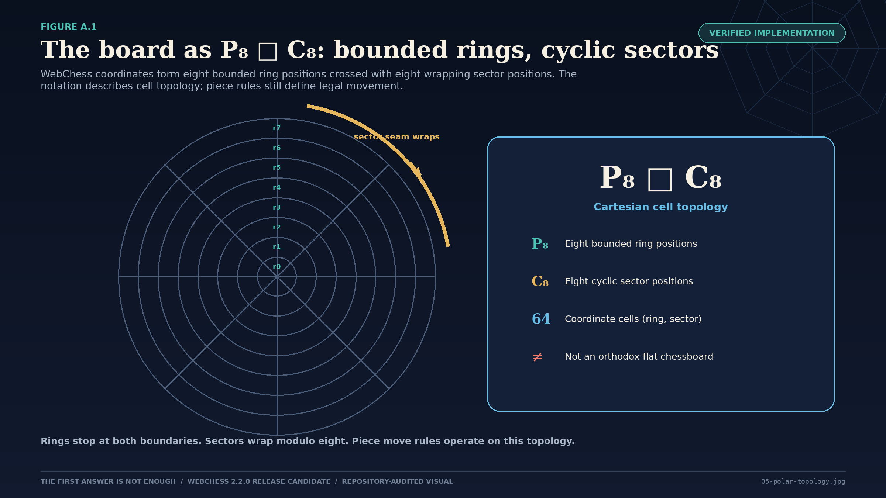

*Figure A.1 — Polar appearance, cylindrical law. Rings 0 and 7 are hard boundaries; sectors 7 and 0 share a seam. The diagram represents implemented coordinate topology, not physical distance on the rendered disk.*

The wrapped angular gap and polar Manhattan distance are:

```text
delta_s = min(|s1 - s2|, 8 - |s1 - s2|)
D(q1, q2) = |r1 - r2| + delta_s
```

`delta_s` is the shorter route around the sector seam. `D` is the sum of radial steps and wrapped angular steps. Its maximum is `7 + 4 = 11`, so the evaluator defines `MAX_POLAR_DISTANCE = 11`.

For a sliding direction `(dr, ds)`, ray step `k` is:

```text
r_k = r + k dr
s_k = N8(s + k ds)
```

`k` runs from 1 through at most 7. The ray ends at a ring boundary, its first occupied cell, or the seven-step maximum. Sector rays never include the origin as an eighth “move.” Because clockwise and counterclockwise routes meet four sectors away, and diagonals can converge, the generator stamps and suppresses duplicate destinations.

## A.2 The three-shuffle semantic cast

**IMPLEMENTED FORMULAS (F-01 and F-05 through F-08).** Semantic casting and chess-piece placement are separate. Anansi must supply exactly sixty-four facets. IDs 1 through 64 must appear once each; title, focus, question, and keyword must be nonempty. Input order is discarded by sorting on ID.

Each original facet ID supplies permanent analytic coordinates:

```text
dimensionIndex = floor((id - 1) / 8)
movementIndex  = (id - 1) mod 8
```

The eight dimensions are Purpose, People, Resources, Timing, Risks, Values, Evidence, and Possibilities. The eight movements are Begin, Receive, Clarify, Connect, Challenge, Adapt, Consolidate, and Release. Their Cartesian product yields sixty-four analytic slots. The sixty-four fixed I Ching-inspired lenses are reflective prompts, not predictions.

For saved seed `seed`, three domain-separated strings are constructed:

```text
S_F = "webchess/division/" + seed + "/facets"
S_H = "webchess/division/" + seed + "/hexagrams"
S_B = "webchess/division/" + seed + "/board"
```

They independently shuffle:

1. the sorted facets;
2. the sixty-four fixed lenses; and
3. the resulting facet-lens pairs onto board locations.

“Independent” here means domain-separated deterministic streams, not statistically independent experiments.

String seeds first use 32-bit **FNV-1a**, Fowler-Noll-Vo hash variant 1a:

```text
h_0 = 0x811c9dc5
h_i = imul(h_(i-1) XOR characterCode_i, 0x01000193) mod 2^32
```

`imul` is exact 32-bit multiplication and `XOR` is exclusive OR. The result seeds Mulberry32, a compact Pseudorandom Number Generator (PRNG):

```text
state = (state + 0x6d2b79f5) mod 2^32
v = imul(state XOR (state >>> 15), state | 1)
v = v XOR (v + imul(v XOR (v >>> 7), v | 61))
U = ((v XOR (v >>> 14)) mod 2^32) / 2^32
```

`>>>` is unsigned right shift and `|` is bitwise OR. Descending Fisher-Yates shuffle then uses:

```text
j_i = floor(U_i (i + 1)), for i = n - 1 down to 1
swap(array[i], array[j_i])
```

The cast is reproducible presentation randomization, not cryptography. Its effective shuffle state is 32 bits, so distinct long seeds can collide. A same-field replay preserves the sixty-four mapped parts; field regeneration creates a new division and field.

## A.3 Canonical initial position and polarities

**IMPLEMENTED.** Chess pieces are not shuffled with the semantic cast. The back-rank order by sector is:

| Sector | 0 | 1 | 2 | 3 | 4 | 5 | 6 | 7 |
|---:|---|---|---|---|---|---|---|---|
| Piece | Rook | Knight | Bishop | Queen | King | Bishop | Knight | Rook |

Black occupies back ring 0 and pawn ring 1. White occupies pawn ring 6 and back ring 7. White moves first. Black advances toward increasing rings; White toward decreasing rings.

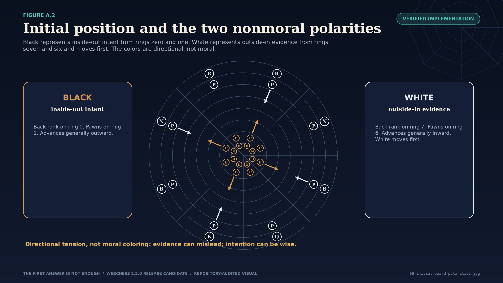

*Figure A.2 — Two currents on one field. White begins outside and moves inward; Black begins inside and moves outward. Chess placement remains canonical while the semantic field is cast.*

Stable piece identifiers preserve identity through replay. Repeated back-rank kinds are numbered in sector order; pawns 1 through 8 correspond to sectors 0 through 7.

The six piece metaphors are:

| Piece | Metaphor | Interpretive role | Prompt |
|---|---|---|---|
| King | **Core purpose** | Outcome that must remain protected | Name the non-negotiable outcome |
| Queen | **Agency** | Options, influence, and resources | Compare available levers |
| Rook | **Structure** | Rules, boundaries, and systems | Make the governing constraint explicit |
| Bishop | **Perspective** | Values and assumptions shaping interpretation | Test the assumption behind the view |
| Knight | **Reframing** | Indirect route or changed viewpoint | Try one materially different framing |
| Pawn | **Practice** | Facts, effort, and small observable steps | Take the smallest observable next step |

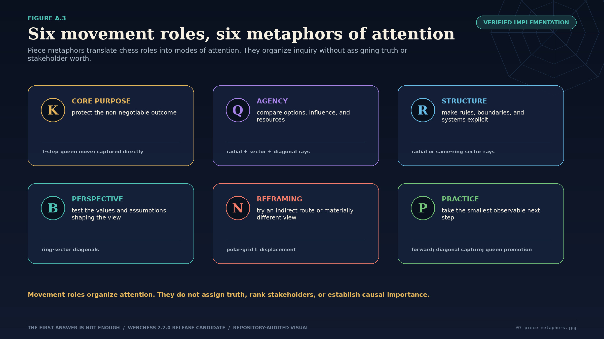

*Figure A.3 — Pieces are interpretive roles: Core purpose, Agency, Structure, Perspective, Reframing, and Practice. They guide reading; they do not assign truth.*

Movement and metaphor reinforce one another without proving one another. A Knight’s jump is a useful picture of reframing; it is not evidence that its destination is a better frame. A Pawn’s promotion makes practice becoming agency memorable; it does not establish that incremental action will solve the problem.

## A.4 Complete move rules

**IMPLEMENTED FORMULAS (A-04a through A-05).** “Legal” means legal under WebChess, not orthodox chess. The code sometimes says *pseudo-legal* because there is no check constraint. A side may leave its King attacked, move its King into attack, or answer an attack elsewhere. The opponent wins only by capturing the King.

No piece may land on a friendly piece. A non-slider may enter an empty cell or capture an opponent. A slider crosses empty cells, stops before a friendly piece, and may capture the first enemy; nothing beyond that occupant is reachable on the same ray.

### A.4.1 Rook, Bishop, Queen, Knight, and King

Rook directions are:

```text
(+1, 0), (-1, 0), (0, +1), (0, -1)
```

Bishop directions are:

```text
(+1, +1), (+1, -1), (-1, +1), (-1, -1)
```

The Queen uses all eight Rook and Bishop rays. Radial components are bounded; sector components wrap.

The Knight jumps over intervening pieces with:

```text
(+2, +1), (+2, -1), (-2, +1), (-2, -1),
(+1, +2), (+1, -2), (-1, +2), (-1, -2)
```

Its destination ring must exist; its sector wraps.

The King-offset set `K` contains exactly the eight nonzero coordinate pairs:

```text
K = ({ -1, 0, +1 } x { -1, 0, +1 }) minus { (0, 0) }
```

Here `x` is the Cartesian product and `minus` is set subtraction. Excluding `(0, 0)` is essential: remaining on the origin is not a move.

Kings may be adjacent or attacked. Their movement is not filtered for check.

### A.4.2 Pawns

```text
direction(Black) = +1
direction(White) = -1
```

| Side | Start ring | Promotion ring |
|---|---:|---:|
| Black | 1 | 7 |
| White | 6 | 0 |

A Pawn moves one ring forward if empty. It may move two rings only from its canonical start ring when `moved` is false and both cells are empty. Capture targets are:

```text
(r + direction, N8(s - 1))
(r + direction, N8(s + 1))
```

Reaching the far ring causes immediate mandatory Queen promotion, by quiet move or capture. There is no underpromotion.

### A.4.3 Deliberately absent orthodox rules

There is no check, checkmate, castling, en passant, repetition draw, insufficient-material draw, voluntary pass, chess clock, or resignation event in the canonical log.

### A.4.4 Forced passes and counters

If the active side has no legal move but the opponent does, the authoritative rules append a `forced-pass` event with reason `no-legal-move`. The client cannot choose or submit it. A pass consumes one ply.

Let `p` be completed plies, including passes, and `q` consecutive quiet plies since the latest capture:

```text
p_next = p + 1
q_next = 0       after a capture
q_next = q + 1   after a non-capture or forced pass
```

A Pawn move and a quiet promotion do not reset `q`, unlike the orthodox fifty-move rule.

### A.4.5 Terminal precedence

After every action:

```text
1. Either King absent        -> king-captured result
2. Neither side can move     -> no-moves draw
3. q >= 100                  -> no-progress draw
4. p >= 256                  -> move-limit draw
5. Otherwise                 -> continue
```

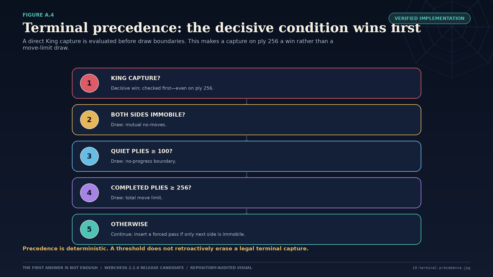

*Figure A.4 — Implemented precedence. King absence is resolved first, then mutual immobility, then 100 quiet plies, then 256 total plies. A King capture on action 256 therefore wins.*

Action 256 is legal; action 257 is not. King capture on action 256 overrides the move-limit draw. If quiet and total limits arrive together without King capture, `no-progress` takes precedence. A pass may consume action 256. The field named `completedTurn` stores a completed **ply** count. A malformed hand-built state with both Kings absent becomes a draw with reason `king-captured`; canonical play cannot capture both Kings in one event.

Seven captures are only the interface’s reflection-depth signal. They do not stop play and do not establish evidence.

## A.5 Capture resonance and three separate value scales

**IMPLEMENTED HEURISTIC (F-09).** A capture narration treats the encounter as a clash between modes of attention. The attacker challenges the captured role on the destination’s facet-lens pair.

Display values are:

| Piece | King | Queen | Rook | Bishop | Knight | Pawn |
|---|---:|---:|---:|---:|---:|---:|
| `V_role` | 10 | 9 | 5 | 3 | 3 | 1 |

For capture ring `r`:

```text
middle(r) = 2 max(0, 3.5 - |3.5 - r|)

resonance = round(
  52
  + 2.5 V_role(captured)
  + V_role(attacker)
  + middle(r)
)
```

On rings 0 through 7, `middle(r)` is `[0, 2, 4, 6, 6, 4, 2, 0]`. Implemented piece combinations range from 56, Pawn challenging Pawn at an edge, to 93, King challenging King on ring 3 or 4.

The base, multipliers, and values are design choices. Resonance is not probability, confidence, source quality, empirical support, causal importance, moral weight, or objective significance.

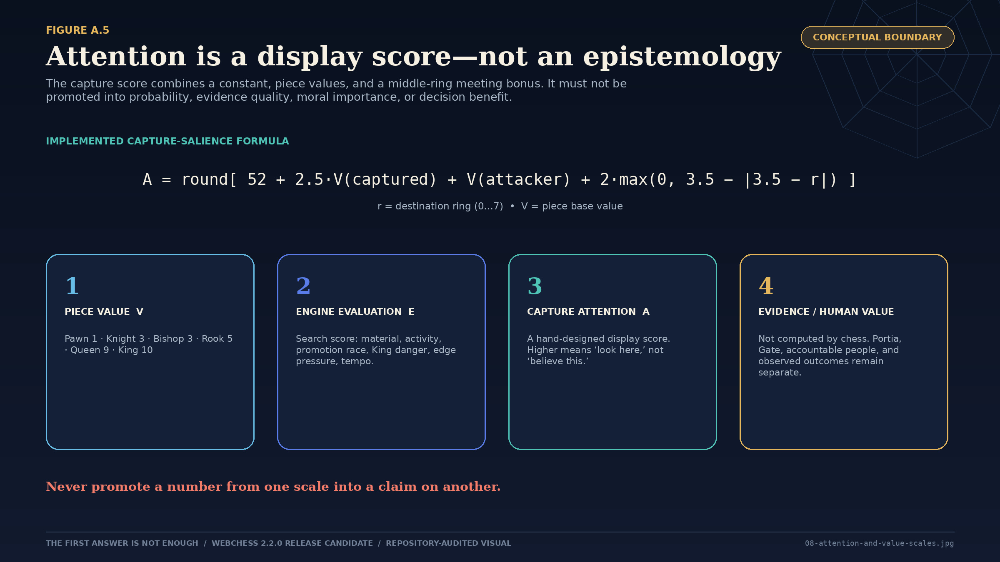

*Figure A.5 — Three scales, three purposes. Capture resonance organizes display attention; centipawn-like values guide search; arena material summarizes surviving non-King force. None is evidence or confidence.*

| Scale | Purpose | King | Queen | Rook | Bishop | Knight | Pawn |
|---|---|---:|---:|---:|---:|---:|---:|
| Capture resonance | Interface attention | 10 | 9 | 5 | 3 | 3 | 1 |
| Engine evaluation | Search, in centipawn-like units | 30,000 | 900 | 500 | 330 | 320 | 100 |
| Arena material | Test summary | 0 | 9 | 5 | 3 | 3 | 1 |

They are not interchangeable. Arena King value is zero because outcome already records victory. The engine’s 30,000 prices the King out of ordinary exchange; direct capture receives 1,000,000.

> A capture makes a facet inspectably salient under one cast and trajectory. It does not make the facet true.

## A.6 Server-authoritative replay

**IMPLEMENTED FORMULAS (A-06a, A-06b, E-05, and E-06).** Browser animation and worker search do not own game state. Durable authority is reconstruction of an append-only log from one canonical origin.

Current identifiers are:

| Boundary | Identifier |
|---|---|
| Event schema | `1` |
| Rules | `circular-direct-king-v1` |
| Cast | `independent-three-shuffle-v1` |
| Engine | `engine-v2` |

At the durable boundary the browser sends game ID, expected revision, a Universally Unique Identifier (UUID) idempotency key, piece ID, and destination. It does not author origin, mover side, next ply, capture, promotion, pass, counters, outcome, resonance, or narration. The repository derives:

```text
nextPly = replay.completedPlies + 1
```

Expected **revision** and next **ply** differ. A ply counts a game action. A revision is a Compare-And-Swap (CAS) concurrency number. One accepted client move advances the revision once even if the server derives and appends a forced pass in the same transition.

For one accepted client command:

```text
r' = r + 1
p' = p + Delta, where Delta is 1 or 2
```

In this transition only, `r` and `r'` are the prior and committed game revisions; `p` and `p'` are the prior and committed completed-ply counts; and `Delta` is the number of canonical events appended. `Delta = 1` for the client move alone and `Delta = 2` when the move is followed by the one forced pass possible under the current two-sided rules. Thus event/ply count may advance twice, but game revision advances exactly once.

Replay begins with the canonical thirty-two-piece setup and requires the saved immutable set of exactly sixty-four problem parts. It validates:

- method and event versions;
- division integrity digest;
- positive contiguous plies;
- exact side to move;
- canonical integer coordinates;
- actual origin and legal destination;
- captured-piece and promotion metadata;
- mandatory and nonvoluntary passes; and
- absence of post-terminal events.

If the log ends while a pass is required, or persisted metadata disagrees with reconstruction, replay fails closed.

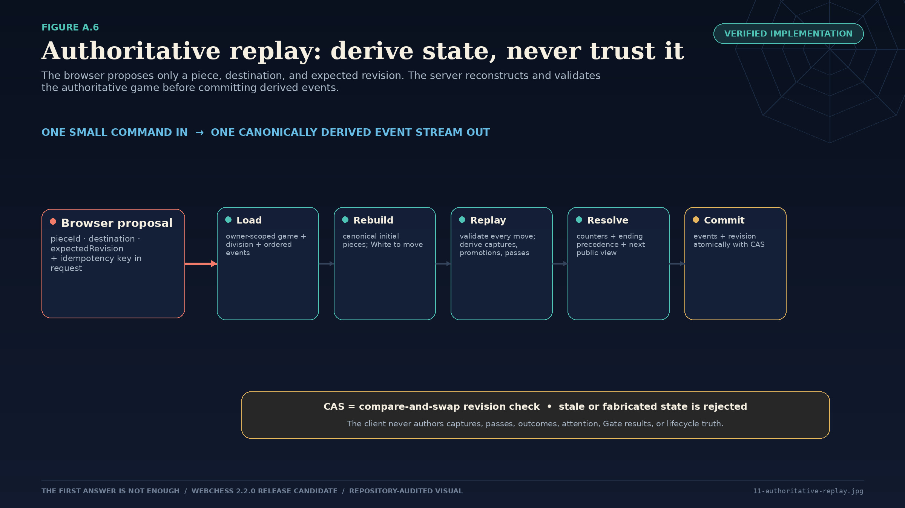

*Figure A.6 — Proposal is not authority. The server reconstructs the board, validates the command, derives every consequence, and commits by expected revision. The browser never authors captures, promotions, passes, or outcomes.*

A move transition must contain exactly one `source = client` event. Forced passes use `source = server`, null move coordinates, and no client idempotency key. All events derived from one accepted command receive the new game revision.

The request is canonicalized as JavaScript Object Notation (JSON) and bound with the 256-bit Secure Hash Algorithm (SHA-256):

```text
requestDigest = SHA256(canonicalJSON({
  operation: "game-move/1",
  expectedRevision,
  command
}))
```

The following are necessary eligibility conditions for the atomic mutation:

```text
commit
  implies storedRevision == expectedRevision
      and owner matches
      and game is current and playing

on commit:
  storedRevision = storedRevision + 1
  append every derived event
```

The implication is deliberately one-way. Matching revision, ownership, and state are necessary, not sufficient: idempotency identity, canonical replay, schema constraints, deletion barriers, and every other transactional guard must also pass. Failure of any guard rejects the mutation.

Same idempotency key and digest returns the historical result rather than applying twice. Same key with a changed body conflicts. Racing identical requests recover the winner’s committed record when possible. The repository verifies that inserted rows equal canonical events; partial transition is an integrity error.

Player views clone pieces, coordinates, events, captures, last move, outcome, and terminal capture. They expose no provider, quota, or ownership state and cannot mutate replay objects.

### A.6.1 Critical version limitation

Version tags prevent a current process from silently reinterpreting a stored game. The repository rejects any event, rules, cast, or engine identifier unequal to the current constants.

There is no historical rules-dispatch registry. The implementation cannot yet promise that future source can replay every old game under retained old rules. That stronger guarantee requires legacy interpreters. Current version pinning detects drift and fails closed; it does not implement historical dispatch.

## A.7 Engine V2: scope and packed state

**IMPLEMENTED FORMULAS (A-07 and A-08).** Engine V2 is purpose-built for the cylinder. An orthodox engine cannot simply be substituted: check, castling, en passant, repetition, and planar boundaries would be wrong.

| Engine knows | Engine does not know |
|---|---|
| Kind, side, cell, moved flag | Facet or lens meaning |
| Side to move | Whether a claim is factual |
| WebChess move rules | Source credibility |
| Material, activity, runway, King exposure | Stakeholder harm |
| Draw counters | Practical wisdom |
| Seeded equal-score ordering | Deserved semantic salience |

The packed position contains:

- a 64-entry signed 8-bit `board` array;
- a 64-entry unsigned 8-bit `moved` array;
- side to move;
- two 32-bit hash words; and
- an undo stack.

Piece identity is absent below the root; origin square maps back to durable `Piece.id` after selection.

```text
White = 0, Black = 1
Pawn = 0, Knight = 1, Bishop = 2,
Rook = 3, Queen = 4, King = 5

pieceCode(side, kind) = 1 + 6 side + kind
```

Empty is 0; White pieces are 1 through 6, Black 7 through 12.

### A.7.1 Packed moves

One signed 32-bit integer uses seventeen meaningful bits:

```text
bit 16       promotion
bits 12-15   captured piece code, 0 if quiet
bits 6-11    destination, 0...63
bits 0-5     origin, 0...63
```

```text
m = from | (to << 6) | (captured << 12) | (promotion << 16)

from      = m & 0x3f
to        = (m >> 6) & 0x3f
captured  = (m >> 12) & 0x0f
promotion = (m & (1 << 16)) != 0
```

`|` is bitwise OR, `&` bitwise AND, and `<<`/`>>` shifts. Origin and destination uniquely identify a move in a fixed position, so universal capacity is:

```text
MAX_MOVES = 64(64 - 1) = 4,032
```

A regression position has 257 legal moves, proving a 256-entry buffer unsafe.

### A.7.2 Exact make/unmake

Each undo record stores packed move, original moving code, captured code, and original moved flags at origin and destination. `make` removes old hash contributions, clears origin, writes piece or promoted Queen, marks destination moved, and toggles side. `unmake` restores every value. Pass and unpass toggle only side.

This preserves a captured unmoved Pawn’s two-step right when another branch is searched. Candidate arrays are preallocated, but each `make` still allocates a JavaScript undo-record object: reduced allocation is not allocation-free search.

### A.7.3 Dual-word Zobrist hash

For each word `w` in `{low, high}`:

```text
H_w = XOR over occupied cells of Zpiece_w[pieceCode, cell]
    XOR over moved cells of Zmoved_w[cell]
    XOR Zside_w if Black moves next
```

Zobrist hashing is named for Albert Zobrist; it is not an acronym or cryptographic proof. Two independent 32-bit halves provide a practical 64-bit fingerprint without JavaScript `BigInt` in the hot path.

Keys use fixed initial state `0x6d2b79f5`:

```text
state = (state + 0x9e3779b9) mod 2^32
v = imul(state XOR (state >>> 16), 0x21f0aaad)
v = imul(v XOR (v >>> 15), 0x735a2d97)
Z = (v XOR (v >>> 15)) mod 2^32
```

Fixed generation makes hashes reproducible, not collision-free. Moved state is hashed for every kind although only Pawn double moves depend on it; exactness can therefore reduce TT reuse among rule-equivalent non-Pawn states.

### A.7.4 Move generation and attacks

Precomputed rays serve sliders; precomputed targets serve King and Knight. The generator writes an `Int32Array` in three modes:

- `all` — every move;
- `captures` — captures only;
- `tactical` — captures plus quiet promotions.

`isAttacked` detects whether a side could capture a target while ignoring its current occupant. `leastValuableAttacker` supplies the cheapest recapturing origin for exchange analysis.

The public game helper delegates to this same packed generator. That unifies rules, but random wrapper/engine “parity” tests are not a fully independent second rule oracle.

## A.8 Engine V2 search

**IMPLEMENTED.** Engine V2 combines iterative deepening, Principal Variation Search (PVS), negamax, alpha-beta pruning, aspiration, a Transposition Table (TT), quiescence, Static Exchange Evaluation (SEE), and deterministic root ordering. Because this section mixes exact mechanics with hand-set search choices and compact mathematical summaries, each formula group carries its own D.1 status.

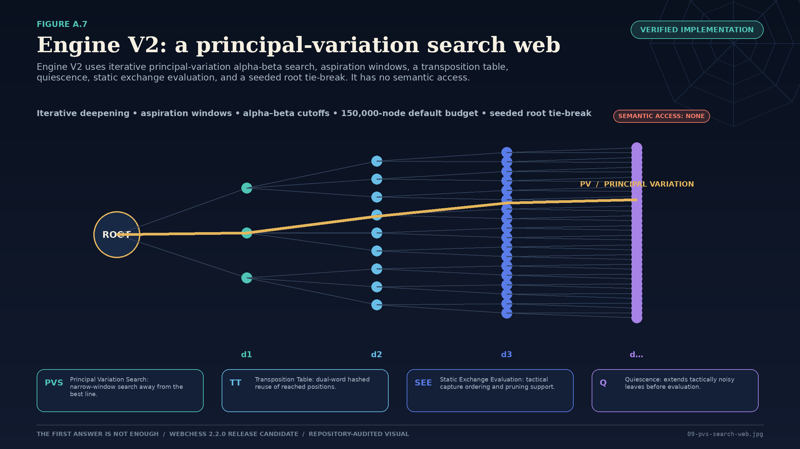

*Figure A.7 — The search web. Completed shallow iterations guide deeper ones; aspiration narrows the first attempt; PVS tests likely refutations cheaply; the TT reconnects transposed branches; quiescence carries unstable leaves toward bounded tactical rest.*

### A.8.1 Negamax and alpha-beta

**EXPLANATORY NOTATION (A-09a).** Ignoring special terminals:

```text
N(P, d, alpha, beta)
  = max over legal m of
      -N(P after m, d - 1, -beta, -alpha)
```

`P` is position, `d` remaining depth, `m` a move, `alpha` (`α`) the best established lower bound, and `beta` (`β`) the upper bound still relevant to the caller.

**IMPLEMENTED FORMULA (A-09b).** The executable bound update and cutoff are:

```text
alpha = max(alpha, score)
prune remaining moves when alpha >= beta
```

Direct King capture uses `MATE_SCORE = 1,000,000`. At internal search ply `p_s`:

```text
mate(p_s) = MATE_SCORE - p_s
```

Here `p_s` is distance in plies from the current search root, not the persisted completed-ply count `p` used in A.4 and A.6. Faster capture is therefore preferred. Root capture is exactly `MATE_SCORE`. Draws score zero. A no-move side passes if the opponent can move; mutual immobility draws. Quiet and total-ply counters travel through the tree.

### A.8.2 Principal Variation Search

**IMPLEMENTED FORMULA (A-10).** The **principal variation (PV)** is the preferred continuation. The first child uses full window:

```text
[-beta, -alpha]
```

Later children first use null window:

```text
[-alpha - 1, -alpha]
```

If `alpha < score < beta`, the later move is re-searched at full window. This is implemented PVS, not ordinary minimax carrying the label.

### A.8.3 Iterative deepening and fallback

**IMPLEMENTED FORMULA (A-11).** Depths complete from 1 upward. One `Search` keeps TT, killer moves, history, and shared work budget across iterations. Only the deepest fully completed iteration is published; partial later work cannot replace it.

```text
targetDepth = clamp(floor(requestedDepth), 1, 12)
```

Default target is 12. If depth 1 cannot complete, a deterministic legal root fallback is returned with depth 0, score 0, and a one-move PV.

### A.8.4 Aspiration windows

**IMPLEMENTED HEURISTIC (A-12).** From depth 3, unless the prior score is near mate:

```text
alpha = max(-MATE_SCORE, previousScore - 50 cp)
beta  = min( MATE_SCORE, previousScore + 50 cp)
```

Result at or outside either bound triggers a full `[-MATE_SCORE, +MATE_SCORE]` re-search. The completed PV is snapshotted before a later retry can alter TT entries.

### A.8.5 Work and time limits

Default fixed work is `NODE_BUDGET = 150,000`. Root, negamax, and quiescence entries count nodes. The finite node cap is checked before increment and shared across iterative depths and retries. Node definitions are engine-specific.

Optional wall time is checked on node 1 and every `TIME_CHECK_INTERVAL = 1,024` nodes. It is a safety bound, not precise real-time enforcement. A source comment records roughly three to four seconds for a stable depth-five opening result on one reference host at 150,000 nodes; this audit did not reproduce that as a portable benchmark.

### A.8.6 Seeded root tie-break

**IMPLEMENTED HEURISTIC (A-13).**

```text
identity = seed + "/" + side + "/" + pieceId + "/" + destination
bias(move) = FNV1a32(identity) & 0x000fffff
```

The low twenty bits produce `0...1,048,575`. Bias changes ordering, not evaluation. Exact score ties retain the first searched move, making choice reproducible and variable across seeds.

### A.8.7 Pass and draw search

Internal no-move handling generates the opponent’s moves. If neither side can move, score zero. If a pass hits 100 quiet or 256 total plies, score zero. Otherwise side toggles, counters increment, recursion continues, and the pass is unmade. At root, zero moves returns `null`; the authoritative game layer supplies the pass.

### A.8.8 Quiescence

At an ordinary leaf the static value may stand pat, after which the engine searches captures and quiet promotions. If the current King is attacked, stand pat is forbidden and every legal move is searched. This does not impose check: a remote quiet action remains legal.

At quiet count 99, a quiet move can claim the draw while captures reset the counter. At action 256, King capture wins and other moves draw. Passes extend through quiescence.

**IMPLEMENTED FORMULA (A-14).**

```text
MAX_QUIESCENCE_PLIES = 64
MAX_SEARCH_PLIES = 96
```

At the extension cap the current static or threat-sensitive value is returned. Quiescence has no SEE pruning, delta pruning, or TT probes; SEE orders captures but does not discard them.

## A.9 Move ordering and Static Exchange Evaluation

**IMPLEMENTED HEURISTICS (A-15 through A-17).** Ordering priorities—not final values—are:

| Candidate | Ordering score |
|---|---:|
| Preferred PV/TT move | 2,000,000,000 |
| King capture | 1,900,000,000 |
| Other capture | 1,000,000,000 + victim value x 1,024 + SEE |
| Quiet promotion | 900,000,000 |
| First killer | 800,000,000 |
| Second killer | 799,000,000 |
| Other quiet | History score |

Root bias is added afterward. Highest remaining score is selected incrementally rather than by allocating and sorting; worst-case selection work is quadratic for a large unpruned list.

A quiet non-promotion beta cutoff becomes first killer. Here `side` is encoded as 0 or 1, while `from` and `to` are packed squares from 0 through 63. History is indexed and updated:

```text
historyIndex = side * 64 * 64 + from * 64 + to
H[side, from, to] = H[side, from, to] + depth^2
```

If the updated entry exceeds 1,000,000, every history entry is halved and truncated.

**SEE** means **Static Exchange Evaluation**. It copies the 64-byte board, makes a capture, and repeatedly recaptures on that cell with the least valuable attacker. Removing attackers exposes slider x-rays. Let `g_d` be the gain recorded at exchange depth `d`, with `d = 0` for the initial capture and `d >= 1` for successive recaptures:

```text
g_0 = V_engine(captured)
    + 800 if the initial capture promotes

g_d = V_engine(piece currently on target) - g_(d-1)
    + 800 if the recapturing Pawn promotes
```

`800 = V_engine(Queen) - V_engine(Pawn)`. A side declines a losing continuation when:

```text
max(-g_(d-1), g_d) < 0
```

Backward folding is:

```text
g_(d-1) = -max(-g_(d-1), g_d)
```

Final `g_0` orders the capture. King capture bypasses SEE. The scratch array permits forty exchange levels; longer synthetic stacks truncate. SEE follows WebChess geometry and lack of check/pin legality. It is not full search or an orthodox exchange oracle.

## A.10 Evaluation, term by term

**IMPLEMENTED HEURISTICS (A-18 through A-23).** Scores are from White’s point of view and negated for Black in search. Units are centipawn-like (`cp`), where 100 resembles one Pawn, but are heuristic—not probability or confidence.

Let `sign(i) = +1` for White and `-1` for Black:

```text
E_white
  = sum over non-King i of
      sign(i) [material(kind_i) + placement(i)]
  + danger(Black King)
  - danger(White King)
  + tempo
  + mopUp
```

### A.10.1 Material

| Piece | Pawn | Knight | Bishop | Rook | Queen | King |
|---|---:|---:|---:|---:|---:|---:|
| `V_engine` | 100 | 320 | 330 | 500 | 900 | 30,000 |

Kings are excluded from ordinary material. Their exchange value prevents casual treatment; direct capture uses one million.

### A.10.2 Pawn advancement and runway

```text
progress(White, r) = 6 - r
progress(Black, r) = r - 1

PAWN_ADVANCEMENT = [0, 8, 22, 48, 96, 180, 180]
```

Nonpositive progress receives zero; positive progress indexes the clamped table.

Let `d = |promotionRing - currentRing|`:

```text
PAWN_RUNWAY = [0, 360, 150, 65, 28, 12, 4, 0]
BLOCKED_PAWN = [0, 120, 50, 22, 10, 4, 0, 0]
```

Pawn placement is:

```text
advancement - BLOCKED_PAWN[d]
    if the immediately forward cell is occupied

advancement
    if the next cell is clear but a later runway cell is occupied

advancement + PAWN_RUNWAY[d]
    if the whole runway is clear

advancement + PAWN_RUNWAY[d] + 90
    if the runway is clear, d = 1, and this side moves next
```

The 90-unit `PROMOTION_TEMPO` rewards immediate conversion. Runway reward remains below the guaranteed `900 - 100 = 800` Pawn-to-Queen gain.

### A.10.3 Centrality and local activity

```text
RING_CENTRALITY = [-14, -4, 6, 12, 12, 6, -4, -14]
```

For a non-Pawn, non-King, let `a` count immediately available directions or Knight jumps whose target ring exists and target is empty or enemy. This is not full mobility.

```text
activity(Queen)  = 1 * a
activity(Rook)   = 2 * a
activity(Bishop) = 3 * a
activity(Knight) = 3 * a

placement = RING_CENTRALITY[r] + activity
```

### A.10.4 Tempo

```text
tempo = +10 if White moves next
tempo = -10 if Black moves next
tempo =   0 if side is omitted
```

### A.10.5 King danger

The evaluator counts adjacent ring-valid, sector-wrapped cells not occupied by the King’s side and not attacked by the opponent. Let `safe` be that count:

```text
constrained = clamp(8 - safe, 0, 8)
KING_CONSTRAINT = [0, 2, 5, 9, 16, 26, 40, 60, 85]

danger = KING_CONSTRAINT[constrained]

if current King cell is attacked:
    danger += 160 + 16 constrained
    if attacker moves next:
        danger += 180
```

This is urgency, not legality or proof of forced capture. The safe-step probe is approximate: it checks target attacks on the current board rather than fully moving the King and removing the origin for every probe, so the old King cell can still block a slider line.

### A.10.6 Mop-up gradient

When both Kings exist and non-King material edge has magnitude at least 400:

```text
edgePressure = |3.5 - losingKingRing|
closingIn    = 11 - polarDistance(Kings)
trapped      = 8 - losingKingSafeSteps

mopMagnitude = round(
    14 edgePressure
  +  6 closingIn
  + 30 trapped
)
```

The result is positive if White has the material edge, negative if Black. Only inner and outer rings are edges; no sector corners are invented. Zero safe cells is not terminal.

The evaluation weights are hand-set. There is no learned evaluator, tuning corpus, calibration curve, or feature ablation proving optimality. Fixture tests show intended directions, not validated strength.

## A.11 Transposition table

**IMPLEMENTED FORMULAS (A-24 through A-26).** The direct-mapped TT caches states reached through different move orders. Default capacity is:

```text
2^17 = 131,072 entries
```

Requested size is at least 1,024 and rounded up to a power of two. An entry stores low/high keys, depth, score, bound flag, best move, and occupied bit. Flags are:

- `EXACT` — exact within the completed search;
- `LOWER_BOUND` — fail-high value at least this large;
- `UPPER_BOUND` — fail-low value at most this large.

Exact may return immediately; lower raises `alpha`; upper lowers `beta`; either can close the window.

### A.11.1 Draw-aware key

Let `H_L`, `H_H` be the low and high position-hash halves, `q = max(0, quietPlies)`, and `u = max(0, remainingPlies)`. The symbol `u` avoids overloading `r`, which denotes board ring in A.1 and game revision in A.6:

```text
K_L = H_L
  XOR imul(q + 1, 0x85ebca6b)
  XOR rotl(imul(u + 1, 0xc2b2ae35), 11)

K_H = H_H
  XOR imul(u + 1, 0x27d4eb2f)
  XOR rotl(imul(q + 1, 0x165667b1), 17)

index = (
    K_L
    XOR rotl(K_H, 13)
    XOR imul(K_H, 0x9e3779b1)
  ) & (tableSize - 1)
```

`K_L` and `K_H` are the draw-aware low and high key halves. `rotl(x, n)` rotates a 32-bit word left `n` bits. Both key halves must match. A deeper non-exact same-state entry is protected from shallower non-exact replacement; a new exact may replace. Unrelated collision replaces the old slot.

### A.11.2 Mate normalization

```text
MATE_TT_THRESHOLD
  = MATE_SCORE - MAX_SEARCH_PLIES
  = 1,000,000 - 96
  = 999,904

storeScore(S, p_s) = S + p_s   if S >= MATE_TT_THRESHOLD
                   = S - p_s   if S <= -MATE_TT_THRESHOLD
                   = S         otherwise
```

`S` is the search score and `p_s` is internal search ply as defined in A.8.1. Probe reverses the adjustment so mate distance remains relative to the current root. The same symbol `MATE_TT_THRESHOLD` governs both positive and negative piecewise branches; a generic undefined `threshold` would be incorrect.

**IMPLEMENTATION-DERIVED ESTIMATE (A-27).** Raw default TT arrays occupy approximately:

```text
20 bytes x 131,072 = 2,621,440 bytes, about 2.5 MiB
```

before object overhead. The table survives iterative depths within one move, not later application moves. It has no buckets, aging, generations, or quiescence entries. Hash collision remains possible.

## A.12 PV and diagnostics

After each completed depth, the engine follows TT best moves, confirming each move is generated, each pass forced, and no draw already reached. Temporary actions are unmade in `finally`. Passes are internal PV actions omitted from the public coordinate line, but traversal continues through them.

**IMPLEMENTED DIAGNOSTIC (A-28).** Public result reports move or `null`, nodes, deepest completed depth, score, elapsed milliseconds, Nodes Per Second (NPS), TT hits, PV, and stop reason: `depth`, `nodes`, `time`, `no-move`, or `game-over`.

```text
NPS = {
  round(1,000 * nodes / elapsedMs), if elapsedMs > 0
  nodes,                           if elapsedMs = 0
}
```

Here `elapsedMs` is elapsed milliseconds for the search. An empty no-move or game-over outcome has zero nodes and therefore reports zero NPS under the same boundary. NPS is one-run diagnostics, not portable performance. `ttHits` includes depth-sufficient uses and shallower ordering hits, not only cutoffs.

## A.13 Worker, cancellation, and stale results

**IMPLEMENTED.** Normal search runs in a dedicated module Web Worker. Request and response are structured-clone-safe:

```text
request  = { id, pieces, side, seed, options? }
response = { id, move, analysis?, error? }
```

Analysis may include nodes, depth, elapsed time, score, NPS, TT hits, PV, and stop reason. Thrown engine errors become error responses.

The facade permits one pending request. A newer request supersedes the old, terminates its worker, and resolves it as `superseded`. Replaced-worker events are ignored. IDs must match. Reset and disposal terminate work. A 30-second watchdog retires a silent worker. Malformed replies, worker errors, and message errors fail closed. Construction or request-cloning failure uses bounded main-thread fallback.

Cancellation is `Worker.terminate()`, not cooperative polling in recursive search.

Main-thread fallback yields through a zero-delay timer, caps work at 20,000 nodes, and caps explicitly requested fixed depth at 2. Without explicit depth, target remains 12 and the node budget bounds it.

The application adds a generation-and-mode check. Pause, reset, restoration, or unmount invalidates the generation. A late result is ignored unless generation and mode still match. Even a current proposal goes to server-authoritative replay; rejection stops autoplay and restores durable state.

**IMPLEMENTATION-DERIVED ESTIMATE (A-27).** Search buffers use 96 frames, each containing 4,032 moves and 4,032 scores as four-byte integer arrays:

```text
96 x 4,032 x 2 x 4
  = 3,096,576 bytes
  about 2.95 MiB
```

With default TT, principal typed-array storage is roughly 5.5 MiB per search, excluding undo objects and runtime overhead. This is an implementation-derived estimate, not measured whole-worker heap.

## A.14 Measured implementation evidence

**MEASURED, 15 August 2026.** Node.js 24.19 and npm 11.14 ran all nine engine test files: **64 of 64 tests passed**. One recorded Vitest run took 59.90 seconds. The engine, canonical-rule, and engine-test files at committed revision `7a3749c` are byte-identical to the files in that measured run. This identifies fixture results and an environment-specific elapsed time; it is not a product performance guarantee.

### A.14.1 Perft

**EXPLANATORY NOTATION (A-29a).** **Perft** is engine shorthand for exact game-tree leaf enumeration. For state `X` and remaining depth `d`:

```text
P(X, 0) = 1

P(X, d) = 1
    if X terminates before depth d

P(X, d) = P(pass(X), d - 1)
    if the side must pass

P(X, d) = sum over legal m of P(X after m, d - 1)
    with direct King capture contributing one terminal leaf
```

**MEASURED (A-29b).**

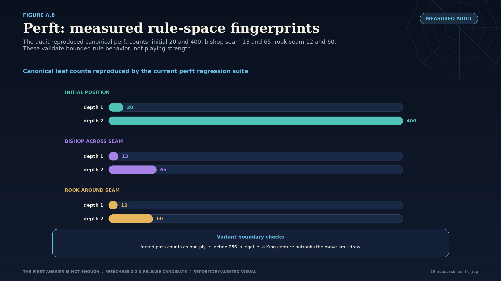

*Figure A.8 — Measured perft regressions. These shallow exact counts protect opening and seam behavior; they are not exhaustive proof of the full tree.*

| Fixture | Depth 1 | Depth 2 | Boundary protected |
|---|---:|---:|---|
| Initial position | 20 | 400 | Opening Pawn/Knight behavior |
| Bishop crossing seam | 13 | 65 | Wrapped diagonals and deduplication |
| Rook circling seam | 12 | 60 | Wrapped ring ray and blockers |

Additional measured boundaries:

- forced-pass state at depth 1: 1 leaf and 1 pass;
- same at depth 2: 8 leaves and 1 pass;
- before action 255 at depth 2: 25 leaves and no move-limit draw;
- before action 256 at depth 2: 5 leaves, all move-limit draws; and
- forced pass consuming action 256: 1 leaf, 1 pass, 1 move-limit draw.

These depths are shallow regression fixtures, not exhaustive proof.

### A.14.2 Move and attack regressions

The passing suite covers:

- all sixty-four coordinate/index round trips;
- opening wrapper/generator agreement for both sides;
- both colors over 400 deterministic pseudo-random positions;
- duplicate suppression over 200 positions per color;
- capture-only subsets over 200 positions per color;
- the 257-move capacity regression;
- capture and quiet-promotion tactical generation; and
- 7,680 attack comparisons: 60 positions times 2 colors times 64 cells.

Because the public helper delegates to the packed generator, the random equality test strongly checks mapping and consistency but is not an independent second move-rule implementation.

### A.14.3 Search, tactics, and evaluation regressions

Passing tests establish bounded behavior for immediate King capture, genuine no-move, same-seed determinism, varied equal-score openings across seeds, greater node work at greater depth, fixed node and time stops, legal one-node fallback, 40,000-node deterministic fields, quiet and total-ply boundaries, action-256 precedence, forced-pass PV restoration, and quiet-promotion quiescence.

Tactical/evaluation fixtures cover a Queen captured across the `0/7` seam, capture-promotion, a poisoned Queen declined because its shielding Rook exposes the King, a remote quiet draw while the King is attacked, sign symmetry, material preference, Pawn runway, King escape scarcity, mop-up direction, SEE defense, declined recapture, x-rays, and promotion recaptures for both colors.

No stable NPS number is published. These tests validate relations, boundaries, legal fallbacks, and deterministic fields—not portable throughput.

### A.14.4 Paired internal arena

**MEASURED (A-30a).** Fixed-depth-3 Engine V2 played pinned one-ply `legacy-greedy-v1`. Three deterministic six-ply openings—`clarity`, `tempo`, and `risk`—were played with colors swapped:

```text
W-D-L 6-0-0, 6/6 points
```

**W-D-L** means wins, draws, losses from Engine V2’s perspective.

**EXPLANATORY NOTATION (A-30b).** The point convention applied to the measured game outcomes is:

```text
points = wins + 0.5 * draws
```

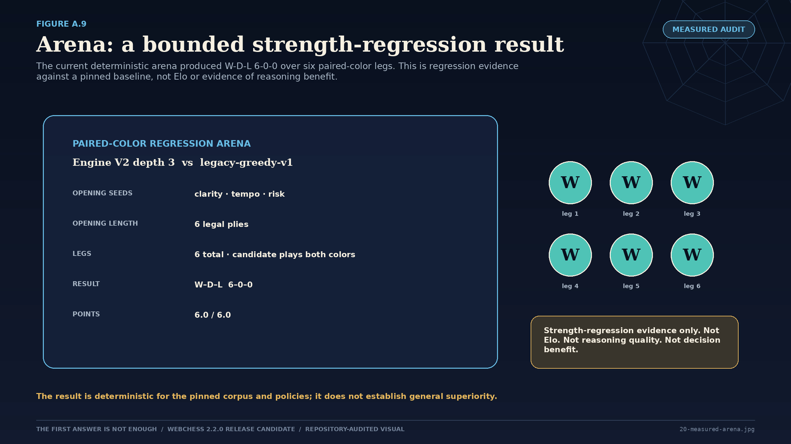

*Figure A.9 — Six wins, no draws, no losses across three openings with colors swapped. This is a pinned internal regression sweep, not Elo or reasoning validation.*

| Opening | Candidate color | Ending | Plies | Candidate material | Baseline material |
|---|---|---|---:|---:|---:|
| `clarity/6` | White | Win, King captured | 25 | 28 | 20 |
| `clarity/6` | Black | Win, King captured | 24 | 28 | 12 |
| `tempo/6` | White | Win, King captured | 31 | 20 | 13 |
| `tempo/6` | Black | Win, King captured | 10 | 35 | 39 |
| `risk/6` | White | Win, King captured | 11 | 36 | 38 |
| `risk/6` | Black | Win, King captured | 28 | 26 | 10 |

Two wins despite lower material illustrate the actual objective: King capture, not material accumulation.

Other passing strength criteria found greater aggregate material than the greedy baseline across seeds `weighing` and `sequence`; greater finishing material for depth 3 than depth 1 from either color in two bounded matches; and correct refusal of the poisoned Queen at depth 2. The depth test’s assertion is finishing material despite its title saying “beat.”

The arena result is not an Elo rating—Elo is Arpad Elo’s surname, not an acronym—nor external comparison, statistical significance, general superiority, or decision evidence. It uses one internal baseline, three synthetic openings, and six games. The arena harness defaults to a 220-ply cutoff labeled `move-limit`, earlier than production’s 256.

### A.14.5 Worker evidence

Current worker tests pass request-tagged legal response with diagnostics, no-move response, and caught failure. The autoplay suite covers supersession, reset, disposal, stale rejection, malformed replies, failure, watchdog, and bounded fallback.

Earlier real-browser smoke returned a legal move after a 3,000-node worker search and `{status: "superseded"}` after reset with no console errors. That historical smoke is useful integration evidence, not current browser-to-database end-to-end measurement.

## A.15 Claim boundaries and limitations

The defensible interpretation is:

> Engine V2 is a reproducible trajectory selector for a complete custom game. It is not a semantic judge.

Source and measurements support exact reversible state, dual-word hashing, unified cylindrical move generation, direct King capture and pass search, draw-aware iterative PVS, aspiration, TT bounds, SEE/killer/history/seeded ordering, tactical quiescence, hand-authored variant evaluation, fixed-node determinism, worker isolation, stale-result rejection, the stated regression counts, and the pinned 6-0-0 sweep.

Every one of the following qualification statements remains necessary:

1. **Semantic blindness.** The engine never reads facets, lenses, the question, sources, stakes, or consequences.
2. **Salience is not evidence.** A preferred move or capture is a consequence of the game evaluation, not factual support.
3. **Survival is not truth.** A survivor depends on field, cast, seed, rules, policy, and trajectory.
4. **Hand-set weights.** Evaluation is neither learned nor calibrated; no feature ablation establishes marginal value.
5. **Bounded search.** Default work is 150,000 nodes and target depth at most 12; optimal play is not proved.
6. **Variant specificity.** Competence does not transfer to orthodox chess or another circular variant.
7. **Small internal arena.** Six games against a one-ply baseline cannot yield Elo or general-strength claims.
8. **Shallow perft.** Depth-one and depth-two fixtures do not cover the reachable state space.
9. **Shared test oracle.** Wrapper parity is consistency evidence, not independent move-rule verification.
10. **Heuristic King safety.** Attack and safe-step terms guide search without creating legality or proving capture.
11. **Finite tactical horizon.** Quiescence stops after 64 extensions; SEE after forty exchange layers.
12. **Per-search knowledge.** TT, history, and killers do not survive to the next application turn.
13. **Possible hash collision.** Dual 32-bit words provide practical, not mathematical, identity.
14. **Hard cancellation.** Active work stops by terminating a worker, not cooperative recursion.
15. **Timing variability.** Time is polled every 1,024 nodes and a 30-second watchdog is external.
16. **Weaker fallback.** Main-thread work is capped at 20,000 nodes and explicit depth 2.
17. **Trusted engine input.** Below server replay, invalid rings may be skipped, integer sectors wrap, and the last duplicate-cell piece wins. Canonical replay is expected to prevent malformed state.
18. **No historical rules dispatch.** Version mismatch fails closed; old-rule replay needs retained interpreters.
19. **No real-world outcome evidence.** Software correctness and game strength are separate from usefulness, safety, or decision benefit.

Chess gives Arachne a loom with tension. It forces facets to move, block, expose, protect, converge, and disappear. Engine V2 makes that path coherent enough to replay rather than improvise one move at a time.

But the web catches what its geometry makes catchable. The engine does not know whether the strongest strand is tied to the world. The King’s capture is therefore the end of Chess and the beginning of examination. Portia may find the tactically elegant survivor unsupported or irrelevant; Gate may refuse; Retry may change the path; Charlotte may qualify; a later player report or appropriately designed external test may expose failure in action.

The engine’s proper achievement is narrower: one path through the field becomes explicit, deterministic under fixed work, technically nontrivial, and available for adversarial inspection.

## A.16 Acronym and term ledger

| Term | Expansion or origin | Meaning here |
|---|---|---|
| AI | Artificial Intelligence | Model assistance in the larger lifecycle; Engine V2 itself is classical search code |
| API | Application Programming Interface | Structured boundary for durable client requests |
| CAS | Compare-And-Swap | Commit only while revision equals the expected value |
| cp | Centipawn | Heuristic unit analogous to one hundredth of a Pawn |
| FNV-1a | Fowler-Noll-Vo hash, variant 1a | Stable noncryptographic 32-bit string hash |
| JSON | JavaScript Object Notation | Structured request and persistence representation |
| MiB | Mebibyte | `2^20` bytes, used in storage estimates |
| NPS | Nodes Per Second | `round(1,000 x nodes / elapsedMs)` when elapsed time is positive; otherwise the node count, which is zero for empty outcomes |
| npm | The npm package manager | Package/script runner used for verification; its project name is not treated here as an acronym |
| PRNG | Pseudorandom Number Generator | Deterministic saved-cast number stream, not cryptographic randomness |
| PV | Principal Variation | Preferred legal continuation reconstructed from TT moves |
| PVS | Principal Variation Search | Full-window first child, null-window later children, with re-search as needed |
| SEE | Static Exchange Evaluation | Least-valuable-attacker exchange sequence on one cell |
| SHA-256 | Secure Hash Algorithm, 256-bit | Digest binding an idempotent move request |
| TT | Transposition Table | Cache for draw-aware states reached by different move orders |
| UI | User Interface | Visible controls and animation, never durable rule authority |
| UUID | Universally Unique Identifier | Identifier form for games and idempotency records |
| V2 | Version 2 | Current purpose-built engine generation |
| W-D-L | Wins-Draws-Losses | Candidate arena result order |

Other terms:

- **alpha (`α`) and beta (`β`)** are lower and upper search bounds.
- **Elo** is a rating system named for Arpad Elo; it is not an acronym, and no Elo is claimed.
- **negamax** is symmetric minimax expressed through score negation.
- **perft** is exact game-tree enumeration on a pinned fixture.
- **ply** is one action by one side; a forced pass is one ply.
- **quiescence** is bounded tactical continuation beyond nominal depth.
- **Zobrist hash** is an exclusive-OR position fingerprint named for Albert Zobrist.

## A.17 Implementation evidence map

| Subject | Primary source |
|---|---|
| Topology, packing, hash, make/unmake | `src/lib/engine/position.ts` |
| Rays, targets, Pawns, attacks, least attacker | `src/lib/engine/movegen.ts` |
| Initial position, public rules, outcome, resonance | `src/lib/game.ts` |
| Version identifiers | `src/lib/game-contract.ts` |
| Event parsing and replay | `src/lib/game-replay.ts` |
| Durable ownership, idempotency, CAS | `src/server/games/repository.ts` |
| Evaluation and SEE | `src/lib/engine/evaluate.ts` |
| PVS, quiescence, ordering, draw search | `src/lib/engine/search.ts` |
| Iterative driver, aspiration, seed, diagnostics | `src/lib/engine/index.ts` |
| TT state mixing | `src/lib/engine/transposition.ts` |
| Worker and protocol | `src/lib/engine/worker.ts`, `src/lib/engine/protocol.ts` |
| Cancellation and fallback | `src/lib/auto-play.ts`, `src/App.tsx` |
| Cast | `src/lib/division.ts`, `src/lib/problem.ts` |
| Perft | `src/test/engine-perft.ts`, `src/test/engine-fixtures.ts` |
| Arena | `src/test/engine-arena.ts`, `src/test/greedy-baseline.ts`, `src/test/play-match.ts` |
| Regressions | `src/lib/engine/*.test.ts` |

Every formula above maps to executable source. Every measurement maps to a pinned fixture. Every limitation names a boundary the code does not cross.

# Appendix B. Portia attack and Gate reference tables

## B.1 Portia attack matrix

| # | Exact `webchess-portia-review-v2` identifier | Primary target | A material defect commonly implies |
|---:|---|---|---|
| 1 | `relevance_to_original_problem` | Drift from the saved question | Consume or qualify |
| 2 | `unsupported_assumption` | Hidden load-bearing premise | Consume, wound, or leave unresolved |
| 3 | `evidence_grounding` | Confusion among fact, synthesis, inference, and symbol | Qualify, consume, or leave unresolved |
| 4 | `redundancy` | False independence | Cluster, wound, or consume |
| 5 | `contradiction` | Conflict within the candidate ecology | Qualify, consume, or leave unresolved |
| 6 | `causal_overreach` | Correlation or salience promoted into cause | Wound or consume |
| 7 | `stakeholder_or_opponent_response` | Strategic or affected-party fragility | Wound, consume, or leave unresolved |
| 8 | `seed_or_path_sensitivity` | Dependence on one cast or route | Wound or leave unresolved |
| 9 | `actionability` | No observation or decision follows | Wound or consume |
| 10 | `reversibility` | Inability to stop or repair action | Wound or consume |
| 11 | `harm_or_exclusion` | Downside, lost agency, or omitted party | Wound, consume, or deny prompt |
| 12 | `metaphor_overreach` | Chess/Yijing treated as evidence | Wound or consume |
| 13 | `narrative_overfitting` | Story coherence exceeds factual basis | Wound, consume, or retry |

Each attack returns `passed`, `qualified`, `failed`, `unresolved`, or `not_applicable`, plus `low`, `moderate`, `severe`, or `fatal` severity. The disposition contract, not this illustrative last column, determines legal persistence.

## B.2 Exact Gate V4 reference

| Clause | Required value |
|---|---|
| Portia prompt decision | `permit` |
| Usable candidates | At least 3 |
| Independent usable clusters | At least 3 |
| Coverage | Protected outcome, evidence/reality, risk/countercase, agency/action |
| Independent tension | At least 1 valid pair |
| Cross-candidate contradiction | No unaddressed severe or fatal item |
| Usable-candidate finding | No severe/fatal failed or unresolved item |
| Field repair | No field-repair reason |
| Wounds | Every wounded candidate has its exact qualification |

$$
Pass=
Permit
\land U\ge3
\land I\ge3
\land C_{req}\subseteq C_{obs}
\land T\ge1
\land\neg B
\land\neg O
\land\neg F
\land Q
$$

This is an **IMPLEMENTED FORMULA**. A weighted Gate score is not.

## B.3 Retry V2 reference

| Allowance | Maximum |
|---|---:|
| Same-field replay children | 2 |
| Regenerated fields | 1 |
| Games in one root genealogy | 4 |
| Distinct fields in one root genealogy | 2 |

Decisions are `replay_game`, `regenerate_field`, or `insufficient_basis`. A duplicate terminal fingerprint requires regeneration when available; otherwise it terminates as insufficient.

# Appendix C. Reference audit

## C.1 Audit method

The reference list was rebuilt rather than inherited mechanically from the previous paper. Each retained item was checked against at least one of the following:

- the publisher or proceedings record;
- the DOI landing page;
- an official university or institutional repository;
- an official standards or documentation site;
- the current WebChess repository; or
- the original book or a reputable library/publisher record.

The audit checked title, author, year, publication venue, volume or proceedings where available, pages or article number where available, and DOI or stable URL. References were retained only when they support a specific claim in the paper. A long bibliography is not an epistemic achievement; it is a larger attack surface.

## C.2 Sources deliberately removed or narrowed

The revised paper does not rely on:

- the unofficially compiled Bobby Fischer interview transcript previously used for a memorable quotation;
- claims that nobody else has ever connected *Charlotte's Web* with AI;
- unsourced statements that a historical figure “anticipated” modern AI;
- future-dated publication claims without a publisher or authoritative record;
- citation counts or popularity metrics as evidence of truth;
- marketing pages as scientific support;
- model-generated quotations; or
- the WebChess white paper itself as proof that WebChess works.

Fischer remains relevant through official FIDE Chess960 rules. Jung remains historical context, not a causal authority. AGC-Bench is labeled a 2026 preprint rather than established validation. Current OpenAI model and API facts are linked to official OpenAI documentation and should be rechecked whenever the implementation changes.

## C.3 Repository audit boundary

Implementation statements were checked across three deliberately separate repository boundaries:

1. the released `v2.1.0` tag at `9980328581ba3e6fed6f2c4fc99b555fec4773bc`;
2. the intervening committed `main` / `origin/main` baseline at `fe388d64770e626d17bcfad61adcf7f9d7936c45`; and
3. the immutable package-2.2.0 release-candidate commit `7a3749cf7f2c4e4c5ebfeb9b9aa870a11843f3a2` on `feat/local-clerk-runtime`.

The audit inspected, among other files:

- `README.md`;
- `docs/ARCHITECTURE.md`;
- `src/lib/problem.ts`;
- `src/lib/division.ts`;
- `src/lib/game.ts`;
- `src/lib/game-replay.ts`;
- `src/lib/engine/index.ts`;
- `src/lib/lifecycle/`;
- `src/server/openai/division.ts`;
- `src/server/openai/portia.ts`;
- `src/server/openai/answer.ts`;
- `src/server/openai/charlotte.ts`;
- `src/server/research/`;
- `src/server/openclaw/`; and
- the server HTTP and service-adapter layers;
- the canonical migrations `0001`–`0013` and database verifier;
- the OpenClaw plugin launcher and command transport;
- the local-hosted launcher, signed-session code, and direct PostgreSQL adapter; and
- the executable test, build, accessibility, coverage, browser, arena, and dependency-audit surfaces reported in sections 14, 18, 19, and Appendix E.

Implemented behavior, measured audit results, the post-candidate publication layer, explanatory notation, and proposed research are labeled separately throughout this edition. The formal model describes the versioned lifecycle at the immutable candidate where an executable contract exists and marks extensions as proposals where it does not. No claim in this edition inherits an obsolete earlier baseline merely because it appeared in a previous paper.

Later repository changes may make implementation claims stale. The immutable tag and candidate identifiers, branch name, audit date, and reproduced verification ledger are therefore part of the citation. Commit `7a3749c` is reconstructible as a local Git object and fixes the implementation boundary for this paper, but the audit found no tag or remote branch containing it and no deployed runtime tied to it. The separately gated publication layer must not be mistaken for candidate code merely because it explains that code.

# Appendix D. Glossary, acronyms, and formula registry

This appendix is a claim-control device as much as a vocabulary list. It keeps
metaphor separate from authority, abbreviation separate from explanation, and
implemented arithmetic separate from proposed measurement. When the same
implemented relation appears in both the main text and Appendix A, the
registry lists the relation once and points to both explanations; repetition
in the paper is not a second implementation.

General readers can use D.2 for the method vocabulary and D.3 for acronyms,
then return to the conclusion. D.4 is an auditor's index: it does not repeat
every derivation, and the low-level engine mathematics remains in Appendix A.
Keeping the registry here serves the paper's requirement that every formula be
classified without forcing every reader through every hash and search rule.

## D.1 Status words used with formulas

| Status | Meaning | What it does not mean |
|---|---|---|
| **IMPLEMENTED FORMULA** | Executable source or schema enforces the stated relation in the audited implementation | Empirically optimal, calibrated, or validated for decisions |
| **IMPLEMENTED HEURISTIC** | Executable source enforces a hand-designed score, threshold, or search rule | Probability, confidence, evidence strength, or natural law |
| **IMPLEMENTED CONFORMANCE CHECK** | Executable validation checks a structural or lexical contract | Semantic truth, completeness, usefulness, or fairness |
| **IMPLEMENTED DIAGNOSTIC** | Executable code computes a test or performance diagnostic | Product benefit or portable benchmark |
| **MEASURED** | The stated result was reproduced against the named immutable candidate and audit environment | A universal guarantee, deployment result, or scientific validation |
| **IMPLEMENTATION-DERIVED ESTIMATE** | Arithmetic derives a bounded size or cost from declared code constants and data layouts | A measured process footprint, benchmark, or capacity guarantee |
| **EXPLANATORY NOTATION** | Mathematics compactly describes a pipeline, accounting identity, or reporting partition | A separately executed algorithm or causal model |
| **INTERPRETIVE** | A metaphor or mnemonic helps people understand the design | An executable trace or empirical mechanism |
| **PROPOSED ARCHITECTURE** | A design candidate is specified for future implementation and testing | Current product behavior |
| **PROPOSED METRIC** | A future measurement is defined with its denominator and interpretation | A measured result or a current product score |
| **STATISTICAL PLANNING FORMULA** | A preregistration or analysis relation is specified | A sample size or conclusion until its inputs and design are supplied |

`RELEASED`, `COMMITTED RC`, `PUBLICATION`, `PARTIAL`, and `PROPOSED` in Appendix E
describe source/evidence location. They do not raise an implementation fact to
a deployment fact.

## D.2 Method, lifecycle, and metaphor glossary

| Term | Exact meaning in this paper | Boundary that must remain visible |
|---|---|---|
| **The Arachne Method** | The complete deliberative architecture: structured plurality, deterministic casting and conflict, adversarial review, sufficiency control, bounded repair, a separately generated Answer, qualification, human action/observation, and within-case provenance | It is not one model persona, and its claimed decision benefit is not yet validated |
| **ANANSI** | **Analyze, Name, Associate, Navigate, Synthesize, Iterate**, the project-authored mnemonic for generative-field work | “Synthesize” means construct candidates, not write the final Answer; “Iterate” means local field repair, not lifecycle Retry; it is not Akan etymology |
| **Anansi** | The generative authority represented in current code by one structured Division request plus deterministic validation and possible bounded field repair | The code does not execute six mnemonic agents or six serial cognitive passes |
| **Answer** | The separate substantive model artifact generated only after Portia permits the exact prospective prompt and Gate passes | Answer is between Gate and Charlotte; it is not Charlotte, not a ninth named authority, and not a lifecycle state |
| **Answer prompt** | The exact player-visible, board-derived prompt package that Portia reviews before Answer exists and that is persisted with its digest | It is distinct from provider transport instructions and cannot be silently substituted after review |
| **Attention weight / capture resonance** | The implemented hand-designed display weight attached to a capture | It is not probability, evidence, confidence, source quality, causal importance, moral weight, or objective significance |
| **Cast** | Three domain-separated deterministic permutations: facets, I Ching-inspired lenses, and the completed facet–lens pairs onto board cells | Reproducibility is not cryptographic randomness, statistical independence, or evidence |
| **Charlotte** | The authority that qualifies the exact stored Answer after Gate passage. It may support claims only through preserved or wounded candidates, must retain every cited wound's exact required qualification, and emits the validated action structure | Charlotte does **not** convert survivors directly into the Answer and may not resurrect consumed candidates as support |
| **Chess** | The semantically blind constrained-conflict authority on the cylindrical board, producing a replayable trajectory and terminal ecology | Tactical survival, capture, and King victory do not establish truth or importance |
| **Consumed** | Portia disposition for a candidate with no surviving interpretation under the implemented review | A consumed candidate cannot support Charlotte; consumption is still a fallible model judgment |
| **Core purpose** | The King's interpretive role: the outcome each polarity protects | King capture ends the game but does not prove the winning polarity correct |
| **Division** | The current implementation of Anansi's field-generation operation: exactly sixty-four structured facets followed by deterministic contract and lexical checks | A complete grid is not a complete understanding |
| **Facet** | One problem-specific `id`, title, focus, question, and keyword bound to an exact dimension × movement slot before casting | The model supplies the prose, but code does not prove semantic adherence to the requested slot |
| **Gate** | The deterministic `webchess-gate-v4` sufficiency authority following Portia | Current Gate is a hard Boolean conjunction, not a weighted score, calibrated probability, truth certificate, or model call |
| **I Ching-inspired lens** | One of sixty-four project-authored English change metaphors associated with a traditional hexagram name and deterministically cast with a facet | It is not a translation, changing-line reading, prophecy, source, evidence, or claim of traditional divination |
| **Inside-out intent** | Black's interpretive polarity: purpose, commitment, values, and desired direction moving outward toward conditions | It is not morally superior or inferior to White |
| **Living food** | The paper's Portia metaphor for a terminal candidate that still carries an active interpretation into adversarial review | No candidate is a living organism, and survival is procedural rather than epistemic |
| **Outside-in evidence** | White's interpretive polarity: facts, constraints, feedback, and conditions moving inward toward purpose | It is not automatically factual merely because it is called evidence |
| **Portia** | The prompt-bound adversarial authority that reviews each exact survivor through all thirteen implemented attack classes, then performs a separate cross-candidate summary | Portia runs before Answer, is ordinarily the same provider family as other model stages, and is not error-independent verification |
| **Preserved** | Portia disposition for a candidate with a surviving interpretation, no fatal finding, and attacks that passed or did not apply | Preserved means the implemented attacks did not destroy it; it does not mean true |
| **Provenance** | Information about the entities, activities, agents, versions, derivations, and responsibility involved in producing an artifact | Perfect provenance can preserve a falsehood perfectly; traceability is not truth or consent |
| **Retry** | The deterministic bounded-repair authority after Gate failure: same-field replay, field regeneration, or explicit insufficient basis | It is not a hidden provider retry and must not reroll until a desired answer appears |
| **Salience** | Procedurally generated priority for inspection through cast, route, capture, recurrence, or display | Salience does not imply truth, warrant, confidence, or importance |
| **Survivor package** | The terminal representation of a living piece: canonical identity and kind, role, polarity, final coordinate, facet, lens, route, captures, exact `attackedPlies`, promotion/move state, attempt/game identity, method versions, and source digest | `attackedPlies` records legal chess capture opportunities, not generalized criticism or evidential pressure |
| **Terminal ecology** | The complete set of terminal survivor packages plus their shared game, trajectory, outcome, and fingerprint context | It is one procedural outcome under one field and trajectory, not an ontology of the problem |
| **The Web** | The implemented within-case provenance genealogy spanning question, field, cast, events, survivors, reviews, Gate, retries, Answer, Charlotte, Wilbur, versions, research records, owner deletion, and tombstone controls | Consented cross-case learning, inheritance, retrieval, and broader cross-case retention/forgetting policy remain proposed; committed account deletion now orders lifecycle-dependent removal before the remaining model-request cleanup, but deployment and vendor-retention claims still require separate evidence |
| **Unresolved** | Portia disposition containing at least one unresolved attack | It remains a question and cannot serve as affirmative Charlotte support |
| **Wilbur** | The human-facing authority and protected real-world bearer of consequence. The implementation stores player-authored actions, thresholds, horizons, and observations | A recorded observation is not autonomous action, a verified outcome, or causal proof |
| **Wounded** | Portia disposition for a candidate with a surviving interpretation, at least one qualified attack, no failed, unresolved, or fatal attack, and an exact required qualification | It may support later work only while that exact scar remains visible |

The implemented successful path and failure branches are therefore:

```text
Question -> Anansi/Division -> Cast -> Chess -> terminal ecology
         -> exact board prompt -> Portia -> deterministic Gate

Gate fail -> Retry
  replay_game      -> Chess on the same field and cast, with a new trajectory
  regenerate_field -> Anansi/Division -> new Cast -> Chess
  exhausted        -> insufficient_basis

Gate pass -> generate and store Answer -> Charlotte
          -> player-authored Wilbur action/observation

The Web records the successful path, every failed branch, and their versions.
```

## D.3 Acronym and abbreviation glossary

| Term | Expansion | Meaning or caution in this paper |
|---|---|---|
| **ACM** | Association for Computing Machinery | Professional society and publisher named in the references |
| **AGC-Bench** | Artificial General Creativity Benchmark | External creativity benchmark; it cannot validate the complete WebChess lifecycle |
| **AI** | Artificial Intelligence | Broad category for model-assisted stages, not a claim of autonomy or human equivalence |
| **API** | Application Programming Interface | Structured software boundary for requests and responses |
| **Base64url** | URL- and filename-safe Base64 encoding | Alphabet used to render some HMAC-derived provider identifiers without ordinary Base64 URL punctuation |
| **CAS** | Compare-and-Swap | Commit a mutation only while stored revision/state still match expected revision/state |
| **CFO** | Chief Financial Officer | Financial executive in the worked example, not a lifecycle authority |
| **CLI** | Command-Line Interface | Text-command surface used by the OpenClaw transport |
| **cp** | centipawn | Engine score unit convention: one hundred cp resembles one Pawn, but the score remains heuristic rather than probability |
| **CSP** | Content Security Policy | Browser policy restricting executable and loadable resources |
| **CTE** | Common Table Expression | SQL statement component used to compose atomic Wilbur artifact, lifecycle, activity, and mutation-ledger settlement |
| **DOI** | Digital Object Identifier | Persistent scholarly-publication identifier |
| **DTO** | Data Transfer Object | Structured object crossing a software boundary; the public Answer prompt DTO excludes provider-only instructions |
| **E2E** | End-to-End | Test spanning the declared user-to-system boundary; the audited browser and PostgreSQL suites are separate, not one browser-to-real-PostgreSQL chain |
| **ECE** | Expected Calibration Error | Binned confidence-versus-frequency difference; it requires a probabilistic experimental Gate score that current Gate V4 does not produce |
| **ed. / Eds.** | edition / editors | Bibliographic shorthand used by the references |
| **Elo** | Named for Arpad Elo; not an acronym | Comparative playing-strength rating; the six-game arena is not an Elo estimate |
| **et al.** | Latin *et alii*, *et aliae*, or *et alia*: “and others” | Bibliographic shorthand for additional authors |
| **F1** | F1 score; F-measure with beta equal to 1 | Harmonic mean `2PR/(P+R)` for a defined positive class and zero-denominator rule |
| **FIDE** | Fédération Internationale des Échecs | International Chess Federation, cited for Chess960 rules; WebChess is a custom variant |
| **FN** | False Negative | Reference-positive item incorrectly missed |
| **FNV-1a** | Fowler–Noll–Vo hash, variant 1a | Implemented noncryptographic 32-bit string hash for deterministic seeds and tie-breaking |
| **FP** | False Positive | Reference-negative item incorrectly accepted |
| **GPT** | Generative Pre-trained Transformer | Model-family term; the exact identifier and snapshot still must be frozen for evaluation |
| **HMAC** | Hash-based Message Authentication Code | Secret-key digest used for purpose-separated pseudonyms and deletion barriers |
| **HMAC-SHA-256** | HMAC using the Secure Hash Algorithm 256-bit function | Keyed integrity/pseudonym function; not encryption or anonymity |
| **HTTP / HTTPS** | Hypertext Transfer Protocol / Hypertext Transfer Protocol Secure | Web request protocol / HTTP carried over Transport Layer Security |
| **ID** | Identifier | Name or key for an entity; not necessarily a credential or verified identity |
| **IP** | Internet Protocol; often an IP address | Network address kept request-local and converted to a purpose-separated HMAC for stored rate keys |
| **IPv4** | Internet Protocol version 4 | Four-byte network-address format; the OpenClaw launcher binds its local service to IPv4 loopback |
| **JSON** | JavaScript Object Notation | Text data-interchange format used in requests, contracts, and exports |
| **JSD** | Jensen–Shannon Divergence | Symmetric distribution divergence built from Kullback–Leibler divergence |
| **KL** | Kullback–Leibler divergence | Directed distribution divergence used inside JSD |
| **KiB** | kibibyte | Binary data unit equal to `2^10 = 1,024` bytes |
| **LF** | Line Feed | Newline byte/character normalization used in migration checksum identity |
| **LLM** | Large Language Model | Generative model used by Division, Portia, Answer, and Charlotte |
| **MIT** | Massachusetts Institute of Technology | Institution named by MIT Press in the references |
| **MiB** | mebibyte | Binary data unit equal to `2^20 = 1,048,576` bytes |
| **n.d.** | no date | Bibliographic marker for a source with no publication date stated |
| **NFKC** | Normalization Form Compatibility Composition | Unicode normalization form used before some lexical comparisons |
| **NPS** | Nodes Per Second | Search-throughput diagnostic, not a quality score or portable benchmark |
| **PITR** | Point-in-Time Recovery | Restore a database to a selected moment using backups and transaction logs; not proven for this deployment |
| **PLOS** | Public Library of Science | Publisher name in the `PLOS ONE` reference |
| **PRNG** | Pseudorandom Number Generator | Seeded deterministic generator used in casting; variation is not evidence |
| **PROV** | W3C provenance-family short name | Family of World Wide Web Consortium provenance specifications; it is not treated here as a letter-by-letter acronym |
| **PROV-DM** | PROV Data Model | W3C model of entities, activities, agents, and their relationships |
| **PV** | Principal Variation | Engine's preferred continuation from the latest completed search |
| **PVS** | Principal Variation Search | Alpha-beta variant using a full window first and narrow windows for later moves |
| **RDF** | Resource Description Framework | W3C graph-data model; a future PROV export need not use RDF as its operational database |
| **RPO** | Recovery Point Objective | Maximum acceptable recent data loss, expressed as time; no measured RPO is established |
| **RTO** | Recovery Time Objective | Target service-restoration time; no measured RTO is established |
| **SDK** | Software Development Kit | Platform libraries and types; “no SDK retry” means application code disables automatic client retry |
| **SEE** | Static Exchange Evaluation | Engine heuristic for a least-valuable-attacker recapture sequence on one cell |
| **SHA-256 / SHA256** | Secure Hash Algorithm, 256-bit | Cryptographic digest used for integrity binding; it does not prove truth, authorship, or untampered storage by itself |
| **SQL** | Structured Query Language | Language used for PostgreSQL schema, transactions, and queries |
| **TP** | True Positive | Reference-positive item correctly accepted |
| **Trans. / trans.** | translator or translated by / translation | Bibliographic shorthand identifying a translated work or its translator |
| **TT** | Transposition Table | Engine cache for draw-aware positions reached through different move orders |
| **UI** | User Interface | Visible controls, text, status, and animation |
| **URL** | Uniform Resource Locator | Address of a web resource |
| **UTC** | Coordinated Universal Time | Timestamp and bucket reference used by durable records and quotas |
| **UTF-8 / UTF8** | Unicode Transformation Format, 8-bit | Byte encoding used by prompt and integrity digests |
| **UTF-16** | Unicode Transformation Format, 16-bit | JavaScript string code-unit representation used by the implemented seed hash input |
| **UUID** | Universally Unique Identifier | Identifier form used for games, requests, and idempotency records |
| **UX** | User Experience | Comprehension, latency, trust, accessibility, and interaction experience |
| **W3C** | World Wide Web Consortium | Standards body responsible for PROV, RDF, and Web standards |
| **W-D-L** | Wins–Draws–Losses | Order used for the six-game engine arena result |
| **XOR** | Exclusive OR | Bitwise operation used by FNV, Mulberry32, Zobrist generation, and transposition-key mixing |
| **ZDR** | Zero Data Retention | Provider data-control term; `store:false` alone does not establish it |

Proper names including Anansi, Arachne, Portia, Charlotte, Wilbur, OpenClaw,
Clerk, Neon, Vercel, PostgreSQL, Playwright, Vitest, Zod, and WebChess are not
acronyms. `perft` is engine shorthand for performance-test-style game-tree
enumeration, not an acronym. Zobrist and Elo are surnames. Formula symbols such
as `N8` and version labels such as V2 and V4 are local
notation, not glossary acronyms. `npm` is the lowercase product/command name for the JavaScript package manager,
not an expansion used here. `GET`, `POST`, `DELETE`, `TERM`, and `KILL` are
protocol or signal tokens/mnemonics, not paper-specific acronyms. `FNV1a32`
names the 32-bit FNV-1a function; `imul` means exact 32-bit integer multiply;
and `rotl` means rotate a 32-bit word left.

## D.4 Implemented, explanatory, estimated, measured, and proposed formula registry

### D.4.1 Field, lifecycle, and formal-chain formulas

| ID | Relation | Status | Where fully shown and plain meaning |
|---|---|---|---|
| **F-01** | Facet ID and inverse dimension/movement indices | IMPLEMENTED FORMULA | §§4.4 and A.2; maps one of 64 IDs to one exact cell of the 8 × 8 analytic request grid |
| **F-02** | Four-decimal ratio `r(c,n)` | IMPLEMENTED HEURISTIC | §4.5; converts a count to a bounded reported ratio with an explicit zero-denominator case |
| **F-03** | Jaccard similarity | IMPLEMENTED HEURISTIC | §4.5; measures meaningful-token overlap, not semantic identity, for token sets whose union is nonempty; the implemented high-overlap path compares sets of at least six tokens |
| **F-04** | Unordered pair count `n(n-1)/2` | EXPLANATORY NOTATION | §4.5; derives 2,016 comparisons for 64 facets |
| **F-05** | Three domain-separated seed strings and `i = 8r+s` placement | IMPLEMENTED FORMULA | §§4.6 and A.2; separates facet, lens, and board permutation streams and maps array index to cell |
| **F-06** | FNV-1a 32-bit recurrence | IMPLEMENTED FORMULA | §§4.6 and A.2; reduces a JavaScript UTF-16 seed string to reproducible noncryptographic state |
| **F-07** | Mulberry32 state/mixing recurrence | IMPLEMENTED FORMULA | §§4.6 and A.2; produces the deterministic unit-interval stream used by casting |
| **F-08** | Descending Fisher–Yates index `j = floor(U(i+1))` | IMPLEMENTED FORMULA | §§4.6 and A.2; selects one remaining prefix position at each shuffle step |
| **F-09** | Piece-role values and capture-attention/resonance equation | IMPLEMENTED HEURISTIC | §§5.3 and A.5; gives display salience from captured role, attacker, and meeting ring, not evidence |
| **F-10a** | Survivor record notation | EXPLANATORY NOTATION | §5.4; names the principal fields of the exact terminal candidate package without replacing its executable contract |
| **F-10b** | `candidateId = attemptId:pieceId` | IMPLEMENTED FORMULA | §5.4; gives the stable within-attempt candidate identity |
| **F-11** | Legacy recurrence lift `1 + 0.08 min(3,n-1)` | IMPLEMENTED HEURISTIC | §5.6; on the legacy compatibility path, `n >= 1` is the positive occurrence count. The lift raises a repeated display signal and caps at 1.24 for `n >= 4` |
| **F-12** | Clean Portia call count `N+1` | EXPLANATORY NOTATION | §6.6; restates the technical-failure-free topology of one call per survivor plus one cross-candidate summary; a failed unfinished candidate or summary call can be repeated |
| **F-13** | Gate V4 hard conjunction | IMPLEMENTED HEURISTIC | §§7.2 and B.2; every permit, count, coverage, tension, contradiction, repair, and wound clause must pass |
| **F-14** | Duplicate-heavy test `U>0 and I/U<0.6` | IMPLEMENTED HEURISTIC | §7.3; routes repair when usable candidates collapse into too few independent clusters |
| **F-15** | Retry limits and remaining allowances | IMPLEMENTED FORMULA | §§8.2 and B.3; at most two same-field retry children and one regenerated-field child, hence at most four games across two fields |
| **F-16** | Complete lifecycle and conditional Retry branches | EXPLANATORY NOTATION | §§3.1, 12.1–12.3, and D.2; records both the passed-Gate `Answer -> Charlotte` path and failed-Gate replay, regeneration, and insufficiency paths, while the Web spans all of them |
| **F-17** | Clean successful provider-call count `C_normal = N+4` | EXPLANATORY NOTATION | §12.5; restates Division, `N+1` Portia calls, Answer, and Charlotte for one clean successful game; technical retries and research are additional |
| **F-18** | Chess960 count `4×4×6×C(5,2)×1 = 960` | EXPLANATORY NOTATION | §16.7; explains the official constrained-start count and does not describe WebChess casting |
| **P-01** | Weighted Gate expression `G = w_pP + … - w_uU` | PROPOSED METRIC | §7.2; not Gate V4 and not yet usable: the ellipsis, weights, threshold, and several symbols are undefined, and `U` conflicts with the implemented Gate's usable-candidate symbol |

### D.4.2 Circular board and Engine V2 formulas

| ID | Relation | Status | Where fully shown and plain meaning |
|---|---|---|---|
| **A-01** | Board set, sector normalization, square/index inverse | IMPLEMENTED FORMULA | A.1; defines 64 bounded-ring, wrapping-sector cells and their packed indices |
| **A-02** | Wrapped sector gap and polar Manhattan distance | IMPLEMENTED FORMULA | A.1; measures radial plus shortest wrapped-sector steps, maximum 11; the later mop-up weight using it is heuristic |
| **A-03** | Sliding-ray step | IMPLEMENTED FORMULA | A.1; advances bounded rings and normalized sectors without an eighth self-returning step |
| **A-04a** | Rook, Bishop, Knight, King, and Pawn direction sets | IMPLEMENTED FORMULA | A.4.1–A.4.2; exact custom-variant movement geometry, including `K = ({-1,0,+1} × {-1,0,+1}) minus {(0,0)}` for the King's eight nonstationary offsets |
| **A-04b** | Pawn start and mandatory-Queen promotion rings | IMPLEMENTED FORMULA | A.4.2; Black starts on ring 1 and promotes on 7, while White starts on 6 and promotes on 0 |
| **A-05** | Ply/quiet-counter update and terminal precedence | IMPLEMENTED FORMULA | A.4.4–A.4.5; captures reset quiet count, other actions increment it, and King capture precedes draw limits |
| **A-06a** | `nextPly = replay.completedPlies + 1` | IMPLEMENTED FORMULA | A.6; distinguishes the next event/ply number from the separate command revision |
| **A-06b** | Canonical move-request digest | IMPLEMENTED FORMULA | A.6; binds operation, expected revision, and command to one SHA-256 identity; E-05 and E-06 separately index commit eligibility and transition accounting |
| **A-07** | Piece code, packed move bit fields, and 4,032 universal capacity | IMPLEMENTED FORMULA | A.7–A.7.1; encodes side/kind/capture/promotion and sizes a safe move buffer |
| **A-08** | Dual-word Zobrist position hash and fixed word generator | IMPLEMENTED FORMULA | A.7.3; reproducible practical state fingerprint, not collision-free cryptography |
| **A-09a** | Simplified negamax recurrence | EXPLANATORY NOTATION | A.8.1; compactly describes the recursive sign symmetry while deliberately omitting special terminals, cache reuse, and pruning |
| **A-09b** | Alpha update, beta cutoff, and mate distance | IMPLEMENTED FORMULA | A.8.1; enforces search bounds and prefers faster direct King capture |
| **A-10** | PVS full and null windows | IMPLEMENTED FORMULA | A.8.2; searches the first child fully and tests later children narrowly before re-search |
| **A-11** | Requested-depth clamp | IMPLEMENTED FORMULA | A.8.3; restricts fixed depth to 1–12 |
| **A-12** | ±50-centipawn aspiration window | IMPLEMENTED HEURISTIC | A.8.4; narrows the first search from depth 3 and falls back to the full mate window |
| **A-13** | Seeded root tie-break low-20-bit FNV bias | IMPLEMENTED HEURISTIC | A.8.6; makes exact-score tie order reproducible without changing evaluation |
| **A-14** | Search and quiescence ply ceilings | IMPLEMENTED FORMULA | A.8.8; caps normal frames at 96 and quiescence extensions at 64 |
| **A-15** | Capture, promotion, killer, and history ordering scores | IMPLEMENTED HEURISTIC | A.9; changes search order, not final minimax meaning |
| **A-16** | History index/update/halving | IMPLEMENTED HEURISTIC | A.9; rewards quiet beta cutoffs by depth squared and bounds accumulated magnitude |
| **A-17** | Static Exchange Evaluation forward gains and backward fold | IMPLEMENTED HEURISTIC | A.9; estimates a least-valuable-attacker exchange sequence on one cell |
| **A-18** | White-perspective static evaluation sum | IMPLEMENTED HEURISTIC | A.10; combines non-King material/placement, King danger, tempo, and mop-up |
| **A-19** | Pawn progress, advancement, blocked/runway, and promotion-tempo tables | IMPLEMENTED HEURISTIC | A.10.2; rewards progress and a clear path to mandatory Queen promotion |
| **A-20** | Ring centrality and local activity | IMPLEMENTED HEURISTIC | A.10.3; scores ring placement and immediately available directions/jumps |
| **A-21** | Side-to-move tempo | IMPLEMENTED HEURISTIC | A.10.4; adds +10 for White or −10 for Black |
| **A-22** | King constraint/danger schedule | IMPLEMENTED HEURISTIC | A.10.5; raises urgency as approximate safe adjacent cells disappear and attacks occur |
| **A-23** | Mop-up gradient | IMPLEMENTED HEURISTIC | A.10.6; rewards edge pressure, King approach, and trapped squares after a material edge of at least 400 |
| **A-24** | TT power-of-two capacity | IMPLEMENTED FORMULA | A.11; default `2^17 = 131,072` entries |
| **A-25** | Draw-aware transposition key | IMPLEMENTED FORMULA | A.11.1; mixes position halves with quiet and remaining-ply counters before direct indexing |
| **A-26** | Mate-score store/probe normalization | IMPLEMENTED FORMULA | A.11.2; uses `MATE_TT_THRESHOLD = MATE_SCORE - MAX_SEARCH_PLIES = 999,904` in both signed branches and preserves mate distance when a cached score is reused at another root ply |
| **A-27** | TT and search-buffer byte estimates | IMPLEMENTATION-DERIVED ESTIMATE | A.11.2 and A.13; arithmetic over typed-array layouts, not measured whole-worker heap |
| **A-28** | Nodes per second | IMPLEMENTED DIAGNOSTIC | A.12; `round(1000 × nodes / elapsedMs)` for positive elapsed time, otherwise `nodes`; not portable speed evidence |
| **A-29a** | Perft recurrence including terminal and forced-pass cases | EXPLANATORY NOTATION | A.14.1; defines exact enumeration of the declared legal-action tree at a chosen depth |
| **A-29b** | Perft fixture results | MEASURED | A.14.1; pinned depth-1/depth-2 counts are initial `20/400`, Bishop seam `13/65`, and Rook seam `12/60`, with the listed pass/ply-limit boundaries |
| **A-30a** | Paired internal arena result | MEASURED | A.14.4; Engine V2 finished `6-0-0` over six paired-color games against `legacy-greedy-v1`; this is not Elo, statistical significance, or general superiority |
| **A-30b** | Arena points `wins + 0.5 draws` | EXPLANATORY NOTATION | A.14.4; states the scoring convention applied to the six measured games |

### D.4.3 Infrastructure, integrity, usage, and export formulas

| ID | Relation | Status | Where fully shown and plain meaning |
|---|---|---|---|
| **E-01** | Migration checksum identity | IMPLEMENTED FORMULA | E.3; normalizes exact migration text and hashes its UTF-8 bytes so ledger and release bytes must match |
| **E-02** | Exact-text SHA-256 digest | IMPLEMENTED FORMULA | E.4.1; binds exact bytes, not truth or authorship |
| **E-03** | Canonical structured digest | IMPLEMENTED FORMULA | E.4.1; recursively sorts object keys, preserves arrays, rejects unsupported values, then hashes |
| **E-04** | Purpose-separated HMAC tag | IMPLEMENTED FORMULA | E.4.2; combines secret, purpose, null separator, and identifier bytes into a stable pseudonym |
| **E-05** | Necessary Compare-and-Swap commit condition `commit ⇒ (r_db = r_e) ∧ (s_db ∈ S_allowed)` | IMPLEMENTED FORMULA | A.6 and E.5.1; the implication is one-way. Matching expected revision and an allowed state is necessary, never sufficient by itself: ownership, deletion barriers, idempotency identity, schema constraints, canonical replay, and the full transaction still govern commit |
| **E-06** | Game revision and completed-event accounting `r' = r + 1`; `p' = p + Delta`, `Delta ∈ {1,2}` | IMPLEMENTED FORMULA | A.6 and E.5.1; `r` is game revision, `p` is completed canonical events/plies, and `Delta` counts the accepted move plus the at-most-one derived forced pass. A command advances revision once even when event count advances twice |
| **E-07** | UTC day/hour buckets | IMPLEMENTED FORMULA | E.6.1; places durable counters in fixed UTC windows |
| **E-08** | Daily reservation admission | IMPLEMENTED FORMULA | E.6.1; admits only when used plus reserved capacity remains below the effective limit |
| **E-09** | Nonnegative daily quota remainder | IMPLEMENTED FORMULA | E.6.1; reports `max(0,L-U-R)` |
| **E-10** | Fixed-hour per-bucket rate increment and decision | IMPLEMENTED FORMULA | E.6.2; increments one named bucket and permits that bucket only at or below its limit; whole-request admission has additional ordered guards |
| **E-11** | Nonnegative rate remainder | IMPLEMENTED FORMULA | E.6.2; reports `max(0,L-C')` after increment |
| **E-12** | Durable concurrency predicate | IMPLEMENTED FORMULA | E.6.3; requires no active user slot and a free enabled global slot, with at most four global slots |
| **E-13** | Lease expiry | IMPLEMENTED FORMULA | E.6.3; adds configured lease duration to reservation time |
| **E-14** | Client retry delay | IMPLEMENTED FORMULA | E.6.3; rounds next availability upward and enforces at least one second |
| **E-15** | Account-export preflight byte estimate | IMPLEMENTED FORMULA | E.9; sums the largest row representation plus fixed per-row and document overhead |
| **E-16** | Export guard `estimate ≤ configured bound` | IMPLEMENTED FORMULA | E.9; prevents bulk selection when the conservative estimate already exceeds the ceiling |
| **E-17** | Lifetime Wilbur durable-row admission | IMPLEMENTED FORMULA | E.6.5; counts existing artifacts, Wilbur lifecycle events, mutation-ledger history, pending reservations, the new ledger row, and operation-specific future rows before admitting a fresh mutation |
| **E-18** | Lifetime Wilbur exact UTF-8 text admission | IMPLEMENTED FORMULA | E.6.5; counts all stored action and observation fields plus live pending and proposed text bytes before admitting a fresh text-bearing mutation |

### D.4.4 Proposed evaluation metrics

Every formula in this table is a **PROPOSED METRIC**, not an observed result.
Section 18.5.9 gives its current formula and a plain-language interpretation.
Before use, preregistration must add any missing unit, denominator, empty-set
rule, aggregation, adjudication, or missing-data rule; the registry does not
pretend an underspecified proposal is already a validated instrument.

| ID | Metric | What it is intended to measure |
|---|---|---|
| **M-A1** | Reference-concept recall | Coverage of adjudicated concepts by the generated field |
| **M-A2** | Unsupported-facet rate | Facets containing unsupported material claims |
| **M-A3** | Pairwise redundancy | Semantically redundant facet pairs |
| **M-A4** | Effective semantic diversity | Entropy-derived breadth across adjudicated themes |
| **M-A5** | Useful novelty | Uncommon facets judged both defensible and useful |
| **M-A6** | Normalized omission burden | Frozen positive severity weight omitted divided by total frozen reference-concept weight, yielding zero for no weighted omission and one when all weighted concepts are omitted |
| **M-C1** | Cross-seed survivor-theme overlap | Stability of terminal themes across casts |
| **M-C2** | Cross-seed distribution divergence | Jensen–Shannon difference between seed outcomes |
| **M-C3** | Route and capture coverage | How much of the field the trajectory touches |
| **M-C4** | Selection lift over random | Candidate-package quality versus equal-size random subsets under the same field |
| **M-C5** | Downstream selection lift | Final-output quality versus a frozen matched alternative-selection policy |
| **M-C6** | Compute-adjusted lift | Selection gain per measured compute unit |
| **M-C7** | Terminal-theme recurrence | Reappearance of semantic themes across independent trajectories |
| **M-P1** | False-preservation rate | Indefensible candidates incorrectly kept by Portia |
| **M-P2** | False-consumption rate | Defensible candidates incorrectly destroyed by Portia |
| **M-P3** | Usable precision, recall, and F1 | Portia's binary keep/reject quality |
| **M-P4** | Disposition macro-F1 | Balanced accuracy across preserved, wounded, consumed, and unresolved |
| **M-P5** | Qualification accuracy | Correctness and sufficiency of wounds and their required qualifications |
| **M-P6** | Attack completion and diagnostic yield | Contract completion and useful findings produced by the thirteen attacks |
| **M-P7** | Novelty retention | Unconventional but defensible candidates retained |
| **M-P8** | Evaluator error correlation | Dependence among evaluator/model errors; the estimator, common adjudicated units, missingness rule, and zero-variance case must be frozen |
| **M-G1** | Balanced decision accuracy | Gate pass/stop discrimination under imbalanced labels |
| **M-G2** | False-pass and false-stop rates | Unsafe continuation versus needless refusal |
| **M-G3** | Brier score | Probabilistic Gate forecast error in a future experiment; current Boolean Gate emits no probability |
| **M-G4** | Expected calibration error | Forecast-frequency mismatch for a future probabilistic score; not current Gate output |
| **M-G5** | Gate predictive lift | Mean downstream-quality difference over a preregistered nonempty set of pass/failure pairs matched without using downstream scores; matching reduces observed difficulty imbalance but does not prove causality |
| **M-G6** | Paraphrase stability | Sensitivity of Gate decisions to meaning-preserving wording changes |
| **M-R1** | Marginal adequacy gain | Improvement contributed by one additional semantic Retry |
| **M-R2** | Retry gain per cost | Adequacy improvement divided by added cost |
| **M-R3** | Field-versus-game targeting | Whether Retry selected the repair type adjudicators judged appropriate |
| **M-R4** | Answer-shopping rate | Retry paths that continue toward a preferred answer despite sufficient basis to stop |
| **M-R5** | Exhaustion rate | Retry cases ending at insufficient basis after the bounded budget |
| **M-R6** | Duplicate-terminal rate | Same-field retries that reproduce a prior exact terminal fingerprint |
| **M-CH1** | Warrant precision | Material final claims with approved evidence or labeled inference |
| **M-CH2** | Unsupported-claim rate | Material final claims that outrun their warrant |
| **M-CH3** | Qualification retention | Cited wounded candidates whose exact scar remains visible |
| **M-CH4** | Consumed-candidate resurrection | Consumed candidates improperly reused as support |
| **M-CH5** | Action quality | Specificity, feasibility, observability, reversibility, ownership, thresholds, and protection |
| **M-CH6** | Persuasion–warrant gap | How much rhetorical force exceeds substantive support |
| **M-CH7** | Audience factual invariance | Contradictory factual propositions across audience variants |
| **M-CH8** | Decision-rule completeness | Presence of every field needed for a bounded real-world test |
| **M-WI1** | Adoption and completion | Offered actions begun and begun actions completed |
| **M-WI2** | Protocol fidelity | Planned action elements actually followed |
| **M-WI3** | Informative-observation yield | Begun actions producing decision-relevant observations |
| **M-WI4** | Time to information | Delay from action start to first useful observation |
| **M-WI5** | Stop-rule adherence | Declared stop/revise decisions honored after threshold crossings |
| **M-WI6** | Learning yield | Follow-up cases with a traceable observation-supported assumption update |
| **M-WI7** | Adverse-effect rate | Begun actions causing preregistered or independently adjudicated harm |
| **M-WE1** | Provenance completeness | Required case entities, activities, agents, and links present |
| **M-WE2** | Claim traceability | Final material claims with inspectable support paths |
| **M-WE3** | Replay exactness | Valid replays reproducing the canonical terminal state and outcome |
| **M-WE4** | Export reliability | Eligible exports returning complete schema-valid owner-scoped files |
| **M-WE5** | Deletion reliability | Eligible initiated workflows satisfying every frozen content, identity, in-flight, and tombstone rule; timeouts, transaction failures, and incomplete workflows remain in the denominator |
| **M-WE6** | Privacy leakage | Audited records or exports containing prohibited data |
| **M-WE7** | Stale transfer | Future inherited items that are outdated or inapplicable; no current cross-case feature exists |
| **M-E1** | Paired quality difference | Within-case blinded quality change versus a named baseline |
| **M-E2** | Synthetic decision regret | Utility left unrealized on controlled cases with defensible utilities |
| **M-E3** | Unsupported-claim reduction | Baseline minus WebChess unsupported-claim rate |
| **M-E4** | Recommendation stability | Agreement in independently coded direction across repeated runs |
| **M-E5** | Total measured cost | Provider charges, infrastructure allocation, and evaluator labor |
| **M-E5a** | Measured model cost | Actual billed units by frozen provider billing class and price |
| **M-E6** | End-to-end latency | Submission acceptance to final usable artifact |
| **M-E7** | Human attention | Active participant plus evaluator/facilitator minutes |
| **M-E8** | Abandonment and technical failure | Abandonment among eligible user-started sessions and technical-terminal outcomes among accepted sessions, with eligibility, acceptance, and overlap defined before analysis |
| **M-H1** | Krippendorff's alpha | Rater disagreement relative to chance-expected disagreement |

### D.4.5 Statistical and systems notation

| ID | Relation | Status | Meaning and boundary |
|---|---|---|---|
| **S-01** | Mixed-effects rating model | STATISTICAL PLANNING FORMULA | Uses indexed case, condition, seed, rater, and participant effects; the link and outcome distribution must match the endpoint |
| **S-02** | Paired within-case mean effect | STATISTICAL PLANNING FORMULA | Treats the case—not each nested rating—as the primary independent unit |
| **S-03** | Paired sample-size approximation | STATISTICAL PLANNING FORMULA | Requires pilot variance, smallest worthwhile effect, power, and error rate; complex designs require simulation |
| **S-04** | Cluster design effect | STATISTICAL PLANNING FORMULA | Inflates independent-sample requirements for within-cluster correlation |
| **S-05** | Attrition inflation | STATISTICAL PLANNING FORMULA | Recruits enough cases to retain the required analyzable sample after expected loss |
| **S-06** | Holm multiplicity control | STATISTICAL PLANNING FORMULA | Controls family-wise error across an ordered, preregistered primary family |
| **X-01** | Model-call decomposition | EXPLANATORY NOTATION | Counts Division, per-survivor Portia plus summary, Answer, Charlotte, and research calls; actual technical retries must be recorded |
| **X-02** | Latency decomposition | EXPLANATORY NOTATION | Partitions a scoped successful case across Division, cast, game, optional research, Portia, Gate, incremental Retry work, Answer, Charlotte, and client time without claiming stages never overlap |

The registry's most important negative statement is simple: no current formula
turns a survivor, capture, attention weight, Gate pass, Charlotte sentence,
Wilbur observation, or provenance digest into truth. The evaluation formulas
are designed to test the method; they are not decorations that pre-award it a
victory.

---

# Appendix E. Infrastructure, persistence, security, and recovery audit

This appendix records the infrastructure at the released 2.1 tag and the immutable 2.2.0 candidate commit `7a3749cf7f2c4e4c5ebfeb9b9aa870a11843f3a2`. It is intentionally more exact than the architectural overview because operational metaphors become dangerous when they blur a foreign key, a retry, a rate debit, a backup boundary, or a deployment claim.

## E.1 Evidence and formula labels

| Label | Meaning here | Excluded inference |
|---|---|---|
| **RELEASED** | Present in tag `v2.1.0` at `9980328581ba3e6fed6f2c4fc99b555fec4773bc` | Public hosted deployment |
| **COMMITTED RC** | Present in package-2.2.0 commit `7a3749cf7f2c4e4c5ebfeb9b9aa870a11843f3a2` | Tagged, pushed, published, previewed, or deployed capability |
| **PUBLICATION** | Paper, figures, and downloads produced after the immutable candidate | Candidate-code, tagged-release, or deployed capability |
| **PARTIAL** | Source exists but a named operational or evidentiary boundary remains topology-dependent or unproven | Ready or validated product surface |
| **MEASURED** | Reproduced during this audit with its environment and limit named | Universal guarantee |
| **PROPOSED** | Repair, metric, experiment, or future architecture | Current behavior |

**IMPLEMENTED FORMULA** marks mathematics enforced by current code or schema. **EXPLANATORY NOTATION** restates code behavior compactly. **PROPOSED METRIC** marks a future evaluation measure. A formula's label is part of its claim.

The evidence ladder is:

1. Git tag, commit, branch, and working-tree identity;
2. executable migrations, Structured Query Language (SQL), route handlers, repository code, provider clients, and launchers;
3. focused and aggregate tests, including disposable PostgreSQL 17 migration, deletion, Wilbur-admission, and recovery cases;
4. checked-in architecture, security, privacy, installation, research, and operations documents; and
5. explicit non-evidence: no live Vercel, Clerk, Neon, OpenAI, Domain Name System, firewall, backup, or restore configuration was established, and no tag or remote branch was found to contain `7a3749c`.

## E.2 The exact relational Web

The canonical database contains **19 application tables plus `webchess_schema_migrations`, for 20 physical tables in all**. The nineteenth application table is the Wilbur mutation ledger added by migration `0013`. **MEASURED:** a disposable PostgreSQL 17 catalog contained the exact checksum-matching migration prefix `0001` through `0013`, all 19 application tables, and the migration ledger. That measurement says nothing about an unproven hosted database.

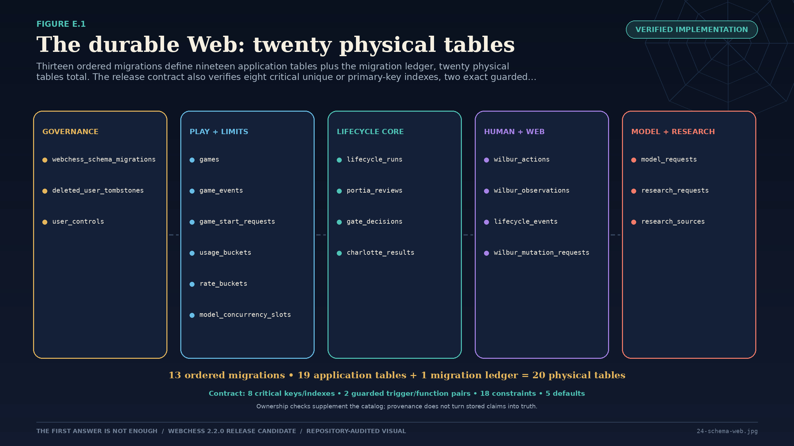

*Figure E.1 — The canonical durable Web contains nineteen application tables plus one migration ledger. The visual groups authority; the exact table below states keys and constraints.*

| Table | Durable content | Principal keys and constraints |
|---|---|---|
| `webchess_schema_migrations` | Ordered migration identifier, normalized checksum, application time | Migration identifier is primary; checksum is 64 lowercase hexadecimal characters |
| `deleted_user_tombstones` | Purpose-separated HMAC of a deleted raw owner identifier and deletion time | HMAC is primary; raw Clerk identifier and content are absent |
| `user_controls` | Suspension, temporary block, quota overrides, timestamps | One row per Clerk or machine owner; positive overrides; schema permits concurrency override 1–4 even though runtime does not use it |
| `games` | Owner, source replay, current flag, revision, normalized question, Division, seeds, versions, outcome, Answer | Owner cascades on deletion; source game sets null; at most one current game per owner; Division requires exactly 64 facets and 64 composed parts |
| `game_events` | Append-only accepted moves and server-forced passes | Primary key `(game, ply)`; unique `(game, idempotency key)`; ply 1–256; exact move/pass and client/server shapes |
| `model_requests` | Logical operation, request digest, provider/model/prompt provenance, status, bounded token accounting, safe failure metadata, validated result payload | Unique `(owner, operation, idempotency key)`; game reference sets null; one succeeded operation of each kind per game; result payload exists only on success |
| `game_start_requests` | Replay intent, source, expected revision, child identifier, activation time | Idempotency key is primary and becomes child game Universally Unique Identifier (UUID); `source_game_id` has no database foreign key |
| `usage_buckets` | Per-user and global daily used/reserved game-start and model-operation counts | Composite subject/metric/window key; used and reserved are nonnegative |
| `rate_buckets` | Fixed-window user or Internet Protocol (IP) address counter under an HMAC key | Composite key includes key type, tag, action, window; raw addresses are absent; expiry is no earlier than window end |
| `model_concurrency_slots` | Four physical slots with enabled flag, request, owner, lease token, and expiry | Slots are 1–4; request and owner are independently unique; lease fields are all present or all null |
| `lifecycle_runs` | State, revision, root/parent genealogy, independent seeds, Retry counters, survivor set, terminal fingerprint, Portia/Charlotte progress and active-request fences, versions | One run per game; unique `(root, field generation, game attempt)`; two same-field retries and one regeneration are schema-bounded |
| `portia_reviews` | Immutable input/output digests, versions, structured Portia review, supporting model request | Run and model request are individually unique; model-request reference uses `ON DELETE RESTRICT` |
| `gate_decisions` | Immutable deterministic Gate result, input digest, exact player-visible Answer prompt and digest | One per run; Answer prompt and hash are both absent or both present on a passed Gate |
| `charlotte_results` | Immutable qualification and rendered Answer, input/output digests, supporting model request | One per run; model-request reference uses `ON DELETE RESTRICT`; rendered answer is 100–20,000 characters |
| `wilbur_actions` | Actor, bounded action, tested assumption, expected observation, threshold, horizon, status, revision, Charlotte binding version | Legacy rows may remain unbound; every current-bound action identifies one exact Charlotte suggestion; at most one current-bound action per run/suggestion |
| `wilbur_observations` | Append-only user report of observation, evidence class, effects, stakeholder response, assumption result, next decision | Unique `(action, idempotency key)`; assumption is supported, rejected, or unresolved |
| `lifecycle_events` | Append-only stage/activity provenance, actors, input/output entity identifiers, configuration digest | Unique `(run, sequence)`; status is started, completed, failed, or refused |
| `wilbur_mutation_requests` | Durable create/update/observation intent, digest and target, once-only rate admission, pending capacity, denial or committed replay result | Primary key `(owner, idempotency key)`; pending insertion is unadmitted; identity/reservations freeze; terminal rows and admission time are immutable |
| `research_requests` | Visible policy decision, query, strict bounds, status, synthesis, configuration/content digests, injection signals | Unique `(game, stage, policy version)`; one invocation; no direct page fetch; retrieved facts forced empty |
| `research_sources` | Normalized public Hypertext Transfer Protocol Secure (HTTPS) links found in search activity or synthesis | Composite `(research request, owner)` foreign key; unique request/ordinal and request/URL; ordinal 1–8 |

Normal application queries bind both owner and parent, but the catalog does not always encode that relationship as one composite foreign key. A privileged or faulty SQL writer could create an owner/parent mismatch in several lifecycle tables even though owner-scoped repositories prevent it. `research_sources` is the stronger counterexample: its composite reference makes a mismatched owner impossible at the database layer. The replay intent's source game is likewise validated and locked by application SQL but has no catalog foreign key.

The deployment schema checker now verifies exact migration identifiers and checksums; the 20-table column/type/nullability contract; **eight** valid and ready contract unique or primary-key indexes; exactly **two** enabled, unfiltered, origin `BEFORE INSERT OR UPDATE FOR EACH ROW` Wilbur trigger/function pairs with exact events, bodies, ownership, security, configuration, and no arguments; **18** critical Wilbur constraints; and **five** `0013` defaults—zero future rows, zero reserved text bytes, status `pending`, and database `now()` for creation and update time—plus the effective privilege allowlist. Unexpected application tables, columns, noninternal triggers, trigger filters or arguments, altered constraint validation/deferrability/parent shape, disabled foreign-key enforcement triggers, or privilege drift fail the check. This is deliberately stronger than the earlier two-index audit, but it is still a reviewed critical contract rather than a proof of every relation in PostgreSQL.

The eight index contracts cover one current game per owner; one succeeded operation per game; one lifecycle run per game; one current-bound Wilbur action per Charlotte suggestion; the Wilbur owner/idempotency primary key; one research request per game/stage/policy version; and one source per research ordinal and per normalized URL. Their names and normalized definitions are checked, not merely their count.

The two trigger/function pairs are `wilbur_actions_charlotte_binding_guard` with `webchess_guard_wilbur_charlotte_binding`, and `wilbur_mutation_requests_state_guard` with `webchess_guard_wilbur_mutation_request`. Both must be the expected origin-enabled row triggers; replicas or disabled triggers do not satisfy the contract.

Portia's database fence is weaker than Charlotte's. Both persist active request identifiers and bounded failure counters, but Charlotte has a catalog rule tying an active request to `charlotte_running` and exhaustion to `charlotte_unavailable`. Portia relies more heavily on repository compare-and-swap logic for the equivalent invariant.

## E.3 Migrations `0001`–`0013`

| Migration | Exact forward change | Recovery or provenance purpose |
|---|---|---|
| `0001_durable_webchess` | Creates nine base tables: tombstones, controls, games, events, model requests, replay intents, usage, rates, and a concurrency table seeded with four physical slots | Replaces process memory with a serverless-safe authority |
| `0002_webchess_2_lifecycle` | Adds lifecycle runs, Portia, Gate, Charlotte, Wilbur actions, Wilbur observations, and lifecycle events; expands model/rate operation kinds | Makes the full lifecycle durable rather than an interface performance |
| `0003_prompt_review_answer_stage` | Adds `portia_unavailable`, reviewed Answer-prompt digest, persisted candidate progress, active request fence, and failure count/limit | Resumes a known prefix and stops visibly after bounded technical failure |
| `0004_detached_provider_recovery` | Resets the failure count only for unfinished version-2 Portia runs affected by earlier browser-coupled execution | Repairs a technical budget without rewriting terminal or immutable artifacts |
| `0005_align_completed_portia_progress` | Rebuilds completed candidate identifiers and drafts from immutable reviews in scrutiny order | Uses the stronger artifact to repair progress presentation |
| `0006_permitted_portia_amendments` | Upgrades only runs without immutable Portia artifacts to lifecycle 2.2, Portia 3, and Gate 3 | Applies amendments prospectively without changing completed semantics |
| `0007_bounded_charlotte_attempts` | Adds `charlotte_unavailable`, active request fence, failure count, and default three-attempt limit | Prevents qualification from retrying forever; preserves the unqualified Answer |
| `0008_visible_research_broker` | Adds research requests and sources with strict status, bound, and no-page-fetch checks | Makes the research decision, output, and failure visible |
| `0009_expand_research_timeout_ceiling` | Raises stored timeout ceiling from 60 to 120 seconds | Extends the bounded local search allowance without editing migration 0008 |
| `0010_player_visible_answer_prompt` | Stores exact player-visible Answer input and its Secure Hash Algorithm 256-bit (SHA-256) digest after a passed Gate | Exposes what was authorized while excluding credentials, system instructions, and provider-only contracts |
| `0011_extend_research_timeout_ceiling` | Raises timeout ceiling from 120 to 150 seconds | Allows a 120-second provider window plus a 30-second broker envelope |
| `0012_unique_wilbur_charlotte_actions` | Adds nullable `charlotte_binding_version`, a partial current-binding unique index, and an action guard trigger | Preserves every legacy row as explicitly unbound while making new current actions exact, immutable Charlotte-suggestion bindings |
| `0013_wilbur_mutation_requests` | Adds the durable Wilbur intent ledger, owner/key primary key, state guard, admission/result fields, pending capacity reservations, and supporting indexes | Makes exact replay, rate admission, storage admission, artifact/event settlement, and denial durable across transport ambiguity |

**IMPLEMENTED FORMULA — migration identity.** For migration SQL text `s`:

\[
M(s)=\operatorname{SHA256}\!\left(\operatorname{UTF8}\!\left(\operatorname{trim}(\operatorname{LF}(s))+\texttt{"\\n"}\right)\right)
\]

Here `M(s)` is the 256-bit checksum rendered as 64 lowercase hexadecimal characters; `s` is the migration SQL; `LF` normalizes carriage-return line endings to line feed; `trim` removes surrounding whitespace; exactly one final line feed is added; `UTF8` encodes Unicode Transformation Format 8-bit bytes; and `SHA256` is SHA-256.

Migration identifiers must be unique and strictly increasing in the form `NNNN_lowercase_name`. Unexpected migration-directory entries, embedded transaction control, and commands that cannot participate in the atomic transaction are rejected. The database ledger must be an exact prefix of the candidate list and every applied checksum must match. Recognizable WebChess objects without a ledger are not automatically adopted.

The protected hosted migration owner uses only `MIGRATION_DATABASE_URL`. Its public wrapper verifies a clean attached checkout published at the exact configured live remote commit before loading migration bytes and again before connecting. Pending hosted migrations run as one atomic tail under a transaction-scoped advisory lock. The source-checkout runtime may apply the same canonical tail only when the one-purpose local-hosted environment contract is present; the launcher normally supplies that contract. Bare loopback, ordinary development, OpenClaw, hosted, and Vercel starts cannot activate the path. The local runner locks and validates the ledger before applying pending bytes and refuses unexpected relation names or a noncanonical ledger. Neither route silently adopts or rewrites history.

Migration `0012` is upgrade-safe without choosing among historical actions: pre-`0012` rows remain null-bound even when suggestion indexes repeat. A `BEFORE INSERT OR UPDATE` guard stamps current inserts, requires their suggestion index, `planned` status, and revision zero, then freezes identity, action content, and binding. An accepted status change advances revision exactly once and cannot move `updated_at` backward. Migration `0013` requires every fresh mutation claim to enter as pending and unadmitted; freezes its owner, key, operation, digest, targets, rate kind, and reservations; requires rate admission before terminal settlement; takes admission time from the database clock; prevents backward time; zeroes reservations at settlement; and freezes every terminal row. Neither migration deletes or selects a legacy action.

The hosted owner reapplies an exact runtime grant allowlist. The intended runtime role can connect, use the schema, select the migration ledger, and perform only the named table operations. It cannot create or own schema objects or assume the owner. `wilbur_actions` permits column-scoped updates only to `status`, `revision`, and `updated_at`. `wilbur_mutation_requests` permits only `rate_admitted_at`, `denial_code`, `retry_at`, `reserved_future_rows`, `reserved_text_bytes`, `status`, `result_entity_id`, `result_revision`, `result_status`, `result_updated_at`, and `updated_at`; it grants no identity update. A read-only, repeatable-read build check compares the exact contract described in E.2, including privileges inherited through roles or `PUBLIC`. This is strong source-level least privilege, not proof of a deployed role.

## E.4 Hashes, HMACs, and digest binding

### E.4.1 Canonical integrity digests

**IMPLEMENTED FORMULA.** For exact text `x`:

\[
H(x)=\operatorname{SHA256}(\operatorname{UTF8}(x))
\]

Here `H(x)` is the 256-bit digest rendered as 64 hexadecimal characters; `x` is the exact text; `UTF8` is its byte encoding; and `SHA256` is Secure Hash Algorithm 256-bit.

**IMPLEMENTED FORMULA — canonical structured digest.** For structured value `v`:

\[
H_c(v)=H(J_c(v))
\]

Here `H_c(v)` is the canonical structured digest; `J_c(v)` is WebChess's deterministic JavaScript Object Notation (JSON) serialization; and `H` is the text hash above. `J_c` sorts object keys recursively, preserves array order, and rejects unsupported values and non-finite numbers rather than silently deleting them. A smaller set of Gate, survivor-source, and terminal-fingerprint digests uses `JSON.stringify` over deliberately constructed, insertion-ordered objects. Those constructions are deterministic in current JavaScript, but the paper must not claim that every digest uses the canonical serializer.

The digest graph binds:

- normalized question text;
- the exact Division prompt and the complete Division bundle of question digest, seed, 64 facets, 64 composed parts, model, prompt, rules, cast, engine, and event versions;
- a move intent to piece, destination, and expected revision;
- model-request inputs to their validated result payloads;
- each terminal survivor to its game, attempt, Division, rules, engine, cast, event version, route, captures, attacked plies, and board-derived package;
- a sorted terminal semantic fingerprint for detecting recurrent retry ecologies while excluding arbitrary game and retry identifiers;
- Portia input/output, deterministic Gate input, exact player-visible Answer prompt, generated Answer provenance, and Charlotte input/output;
- lifecycle configuration, Wilbur actions and observations, research configuration and synthesis, lifecycle events, and migration bytes.

A digest is an integrity label. It is **not** a digital signature, Message Authentication Code, encryption, proof of authorship, proof of factual correctness, or tamper-proof storage. A writer able to change both a value and its digest can make them agree again. Digests are strongest against accidental mismatch, stale state, and partial corruption while the application/database boundary remains trustworthy.

### E.4.2 Purpose-separated HMAC pseudonyms

**IMPLEMENTED FORMULA.** A Hash-based Message Authentication Code (HMAC) with SHA-256 derives a stable pseudonym without storing the raw identifier:

\[
T_{K,p}(v)=\operatorname{HMAC\mbox{-}SHA256}\!\left(K,\operatorname{UTF8}(p)\parallel0x00\parallel v\right)
\]

Here `T_(K,p)(v)` is the 256-bit tag; `K` is a server-only secret of at least 32 bytes; `p` is a non-empty purpose label; `v` is the identifier's byte representation; `0x00` is one null separator byte; and the parallel bars mean byte concatenation.

Purpose namespaces include:

| Purpose | Stored or transmitted tag |
|---|---|
| `webchess-rate-user-v1` | HMAC user key for fixed-window rates |
| `webchess-rate-ip-v1` | HMAC Internet Protocol address key; raw address remains request-local |
| `webchess-deleted-user-v1` | Lifetime deletion barrier under a separate stable secret |
| `webchess-openai-idempotency-v1` | Provider idempotency value hiding owner and browser key |
| `webchess/openai-safety-identifier/v1` | Base64url HMAC prefixed `wc_`, hiding the raw authenticated owner from the provider |

HMAC pseudonymization is not anonymization. Stable tags remain linkable within a purpose. Secret compromise permits guess testing, especially for the relatively small Internet Protocol address space. After forced deletion, the raw owner identifier is intentionally unavailable, so existing deletion tombstones cannot be re-keyed; the deletion secret must remain stable while those tombstones remain authoritative.

## E.5 Compare-and-swap and idempotency

### E.5.1 Revision fences

**IMPLEMENTED FORMULA — necessary condition.** Compare-and-swap (CAS) can commit a revisioned mutation only when the stored revision still equals the caller's expected revision and the state remains eligible:

\[
\operatorname{CAS\_commit}(m)\rightarrow(r_{db}=r_e)\land(s_{db}\in S_{allowed})
\]

Here `m` is the requested mutation; `CAS_commit(m)` means that mutation commits; `r_db` is the database revision; `r_e` is the expected revision; `s_db` is the database state; `S_allowed` is the set of states from which the mutation is legal; the wedge means logical “and”; and the single implication arrow means “commit implies.” It is deliberately not an if-and-only-if claim: ownership, deletion barriers, exact idempotency identity, rate/storage admission, target binding, schema constraints, and every other transactional guard must also pass. A stale caller receives a conflict and must reload.

**IMPLEMENTED FORMULA — revision and event deltas.** For a game mutation that appends canonical plies or events:

\[
r'=r+1,\qquad p'=p+\Delta,\qquad \Delta\in\{1,2\}
\]

Here `r` is the prior game revision; `r'` is the committed revision; `p` is the prior completed-ply or canonical-event count; `Delta` is the number of canonical events appended by the command—one accepted move plus zero or one immediately derived forced pass, so it belongs to the set `{1,2}`—and `p'` is the new count. The revision increment is always exactly one per accepted client mutation; it is not `Delta`. A Wilbur action status update separately enforces `r'_w=r_w+1`, while its corresponding Wilbur lifecycle event advances the event sequence by one.

### E.5.2 Intent ledgers

An idempotency key identifies one logical intent, not merely one Hypertext Transfer Protocol request. WebChess stores or derives a request digest as well, so the same key with different content is a conflict.

- **Moves:** `(game, idempotency key)` is unique. Same key and digest recovers the historical accepted result; changed piece, destination, or revision conflicts.
- **Model operations:** `(owner, operation, key)` is unique. Same key/digest recovers success or reports durable `reserved`/`in_progress`; changed content conflicts. A provider-started lease that expires without definitive settlement becomes `indeterminate`, and the same intent is not sent again.
- **Replays:** the key is both the replay ledger primary key and child game UUID. Source validation, quota/rate debit, clone, prior-current retirement, and child activation are atomic. Same-key retry returns the existing child without another debit and does not re-promote it over a newer current game.
- **Lifecycle:** Portia and Charlotte persist active model-request identifiers that fence late callbacks. A deliberately new technical attempt is permitted only inside its three-attempt run budget; it is not hidden replay of an ambiguous request.
- **Wilbur:** `(owner, key)` first claims one durable `wilbur_mutation_requests` row for create, update, or observation. Same key and exact operation/digest/target replays pending, committed, or denied state without a second rate debit; changed identity conflicts. A fresh claim reserves its lifetime row/text envelope, then records rate admission once. Artifact, lifecycle revision, Wilbur activity event, and terminal ledger result commit in one transaction. A committed action replay returns the saved status, revision, and original result timestamp; a committed create replay does not reconstruct from an action later changed by another mutation. A pending claim abandoned for 24 hours settles durably as `WILBUR_MUTATION_EXPIRED`, releases its private reservations, and remains counted as terminal history.
- **Research:** `(game, stage, policy version)` permits one durable policy record, and settlement proceeds only from `searching`.

This is not a universal exactly-once guarantee across an external provider. The narrower promise is explicit: do not knowingly repeat an ambiguous provider intent; preserve uncertainty as `indeterminate`; and require a new fenced attempt when policy allows one.

## E.6 Usage, rate, and concurrency arithmetic

The legacy prototype could count in one Node.js process. Serverless instances cannot share that memory reliably. New usage, rate, and slot decisions therefore serialize under one PostgreSQL transaction-scoped advisory lock.

### E.6.1 Time buckets and daily admission

**IMPLEMENTED FORMULA.** Coordinated Universal Time (UTC) buckets are:

\[
D(t)=\operatorname{date\_trunc}_{UTC}(t,\text{day}),\qquad
H(t)=\operatorname{date\_trunc}_{UTC}(t,\text{hour})
\]

Here `t` is the current timestamp; `D(t)` is the UTC midnight beginning its day; `H(t)` is the UTC whole hour beginning its fixed rate window; and `date_trunc` truncates in UTC.

**IMPLEMENTED FORMULA — daily admission.** For subject `s`, daily metric `m`, and day `D`, a new reservation is admitted when:

\[
U_{s,m,D}+R_{s,m,D}<L_{s,m,D}
\]

Here `U_(s,m,D)` is settled used capacity; `R_(s,m,D)` is reserved but unsettled capacity; `L_(s,m,D)` is the effective limit; and `D` is the UTC day. The implemented subject–metric pairs are `(user, game_starts)`, `(user, model_requests)`, and `(global, model_requests)`; there is no separate global game-start bucket. Admission increments `R` atomically.

**IMPLEMENTED FORMULA — displayed quota remainder.** Displayed remaining capacity is:

\[
Q_{remaining}=\max(0,L-U-R)
\]

Here `Q_remaining` is the nonnegative remainder and `L`, `U`, and `R` are the corresponding limit, used, and reserved values.

A model reservation moves from reserved to used when the provider call begins, so provider-started failure still consumes one logical operation. A reservation that expires before provider start is failed and refunded. Division retains its game-start reservation until it creates the field; definitive failure releases it. Replay's quota debit and child creation are one transaction.

### E.6.2 Fixed-hour rates

**IMPLEMENTED FORMULA.** For pseudonymous key `k`, action `a`, and hour `H`:

\[
C'_{k,a,H}=C_{k,a,H}+1,\qquad
\operatorname{allow}_{bucket}(k,a,H)\iff C'_{k,a,H}\le L_{k,a,H}
\]

Here `C_(k,a,H)` is the prior count; `C'_(k,a,H)` is the prospective count after one visit to that bucket; `k` is an HMAC user or Internet Protocol key; `a` is the action; `H` is the UTC hour; `L_(k,a,H)` is the limit; and `allow_bucket` is the decision for this one bucket only. The inequality means “less than or equal to,” and the double arrow means “if and only if.” Whole-request admission also depends on identity, storage, quota, concurrency, and the ordered second bucket. Persistence is path-specific: Wilbur visits the user bucket first, stops before the shared-IP bucket on user denial, and persists each visited bucket's increment even when that bucket denies; model, move, and export paths likewise persist eligible visited increments before a later denial. Replay game starts differ: a rate-denied replay computes the prospective counts but inserts neither user nor IP rate row because insertion is gated by the accepted replay intent. Recovery of an existing idempotent intent takes no second rate debit.

**IMPLEMENTED FORMULA — persisted rate remainder.** For a visited bucket whose increment is persisted, remaining rate allowance is:

\[
R_{rate}=\max(0,L-C')
\]

Here `R_rate` is the stored remaining allowance for that bucket; `L` is the applicable fixed-window limit; and `C'` is the persisted post-increment count. A rate-denied replay game start is the exception described above: it evaluates a prospective `C'` but persists no rate-row increment, so its stored state remains based on the prior `C`. Reset is `H(t) + 3,600 seconds`. Persisted rows have expiry two hours after bucket start, and request-driven cleanup deletes no more than 500 expired rows at once. There is no scheduled cleanup service proven by the repository.

### E.6.3 Durable concurrency leases

**IMPLEMENTED FORMULA.** A new model request requires:

\[
C_u=0\quad\land\quad\exists s\,[1\le s\le G\land enabled(s)\land free(s)]\quad\land\quad G\le4
\]

Here `C_u` is the number of unexpired active slots held by that user; `s` is a physical slot number; `G` is the configured global enabled-slot limit; `enabled(s)` and `free(s)` are Boolean predicates; the existential symbol means “there exists”; and four is the schema maximum. The lowest eligible slot is selected. The unique owner column independently reinforces one active request per user.

**IMPLEMENTED FORMULA — lease expiry.** Lease expiry is:

\[
E=t_r+\lambda
\]

Here `E` is expiry; `t_r` is reservation time; and `lambda` is a duration measured in seconds. The default is 180 seconds and the permitted configuration range is 150–900 seconds.

**IMPLEMENTED FORMULA — retry delay.** The client retry delay is:

\[
T_{retry}=\max\!\left(1,\left\lceil\frac{t_{available}-t_{now}}{1000}\right\rceil\right)
\]

Here `T_retry` is the integer delay in seconds; `t_available` and `t_now` are millisecond timestamps for the next availability and current time; the ceiling brackets round upward; and `max` enforces at least one second.

The schema permits a `concurrent_model_limit` override from one through four, but the active query and typed configuration hard-cap the per-user value at one and never consult the row. The override is latent, not implemented behavior.

### E.6.4 Default controls by surface

| Control | Hosted source defaults | Local OpenClaw launcher | Loopback source-checkout launcher |
|---|---:|---:|---:|
| Daily game starts per user | 2 | 1,000 | 1,000 |
| Daily logical model operations per user | 100 | 10,000 | 10,000 |
| Daily logical model operations globally | 200 | 10,000 | 10,000 |
| Hourly model operations, user / IP | 20 / 40 | 1,000 / 1,000 | 1,000 / 1,000 |
| Hourly game starts, user / IP | 20 / 40 | 1,000 / 1,000 | 1,000 / 1,000 |
| Hourly moves, user / IP | 600 / 1,200 | 600 / 1,200 | 6,000 / 12,000 |
| Hourly account exports, user / IP | 2 / 10 | Account API unavailable | 20 / 40 |
| Hourly Wilbur actions or status updates, user / IP | 120 / 240 | 120 / 240 | 1,200 / 2,400 |
| Hourly Wilbur observations, user / IP | 60 / 120 | 60 / 120 | 600 / 1,200 |
| Lifetime Wilbur durable rows / exact text bytes | 500 / 250,000 | 500 / 250,000 | 500 / 250,000 |
| Concurrent model operations, user / global | 1 / 4 | 1 / 4 | 1 / 4 |
| Lease duration | 180 seconds | 180 seconds | 180 seconds |

These limits count logical operations, not tokens. One Portia model-request record can aggregate bounded per-survivor calls plus the final review while token provenance accumulates provider-reported usage. Application quotas are therefore not a provider hard-spend proof. OpenAI budget alerts are notifications; even an external hard limit can enforce with delay.

### E.6.5 Wilbur admission envelope and research accounting boundary

Wilbur no longer has an unmetered write gap. A fresh create or update that passes lifetime storage admission consumes the action user/IP window; a fresh observation that passes storage admission consumes the observation window. A storage-limit rejection occurs before ledger insertion and rate admission. For a claimed request, the mutation ledger records admission so transport retry does not double-debit. User admission is decided before shared-IP admission, and a terminal rate or semantic denial replays durably rather than probing a new window.

**IMPLEMENTED FORMULA — lifetime Wilbur row admission.** For a fresh claim:

\[
N_{owned}+N_{pending}+1+F\le L_{rows}
\]

Here `N_owned` counts the owner's existing Wilbur actions, observations, Wilbur-stage lifecycle events, and mutation-ledger rows; `N_pending` is the sum of live pending claims' reserved future rows; one is the new ledger row; `F=2` for create/observation because the artifact and lifecycle event are still future, and `F=1` for update because only the lifecycle event is new; and `L_rows` is the configured lifetime row limit, default 500. Committed and denied ledger rows remain counted. Existing pending and committed replays add no new row and remain replayable if an operator later lowers the cap.

**IMPLEMENTED FORMULA — lifetime Wilbur text admission.** For exact Unicode Transformation Format 8-bit field bytes:

\[
B_{actions}+B_{observations}+B_{pending}+B_{new}\le L_{text}
\]

Here `B_actions` is the sum of actor, action, tested assumption, expected observation, decision threshold, and review horizon bytes; `B_observations` also includes `assumption_result` with the other six observation fields; `B_pending` is live pending text reservation; `B_new` is the exact new create/observation text, or zero for a status update; and `L_text` defaults to 250,000 bytes. Claim and capacity comparison occur under the same owner-scoped transaction lock. Commit atomically substitutes the actual artifact and event rows for the pending reservation and zeroes the ledger's private reservation fields.

Automatic Codex Search is also outside the durable model-operation rate, daily quota, and concurrency ledger. It has its own one-invocation policy bound and runs before the Portia model reservation. The paper must not imply that every external model/search operation crosses the same accounting boundary.

## E.7 Application recovery

No database transaction remains open during a remote model call.

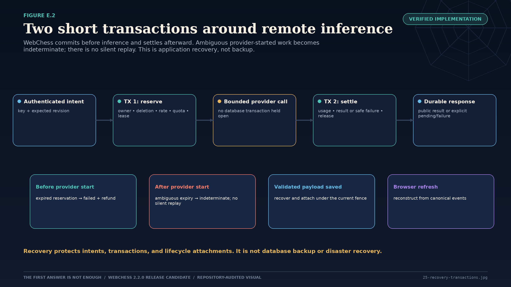

*Figure E.2 — No database transaction remains open during remote inference. Durable leases and statuses permit bounded recovery without silently repeating ambiguous provider-started work.*

The first short transaction runs at `READ COMMITTED` under the shared usage lock. It checks deletion, suspension, temporary block, rate, daily user/global quota, prior idempotency, and concurrency; reserves usage and a lease; then commits. The bounded provider call follows. A second short transaction stores normalized usage, validated result or safe failure metadata, and releases the slot.

| Interruption | Durable interpretation | Recovery behavior |
|---|---|---|
| Before provider start | `reserved` lease expires | Mark failed, refund reservation, free slot |
| After provider start, before definitive settlement | `in_progress` lease expires | Mark `indeterminate`, charge ambiguous logical work, free slot, never silently replay same intent |
| Settlement committed, lifecycle attachment interrupted | Validated `result_payload` exists in model ledger | Recover that payload and attach it under the current revision fence |
| Portia stops after some candidates | Completed identifiers and assessment drafts persist | Resume the saved scrutiny prefix with a new fenced attempt, within three provider-started failures |
| Charlotte stops | Separate active request and failure count persist | Resume or exhaust at three; retain the generated Answer visibly as unqualified |
| Wilbur response is lost after claim, denial, or commit | Owner/key mutation ledger preserves operation digest, rate admission, target, and terminal result | Exact retry returns pending, the same durable denial, or the original committed result without another rate debit or artifact |
| Gate or Retry stops | Inputs and lifecycle revision persist; no model is required | Recompute deterministically and commit only under compare-and-swap |
| Browser refresh or worker cancellation | Initial cast, events, and lifecycle persist | Reconstruct by canonical event replay |

This is request-, transaction-, and lifecycle-level recovery. It addresses refresh, stale clients, duplicate intents, function interruption, and ambiguous provider settlement. It is not recovery from a destroyed or corrupted database.

## E.8 Visible research boundary

The research contract names seven visible stages—Anansi, Chess, Portia, Answer, Charlotte, Wilbur, and Web—but the service currently invokes it only immediately before Portia and only Local OpenClaw constructs the broker. Hosted and local-hosted service dependencies do not inject it.

Policy `webchess-visible-research-v3` is deterministic regular-expression code, not a hidden model deciding whether to browse. It refuses saved questions outside 12–240 normalized characters. Chess never researches because external material cannot alter legal moves or board weights; Web never adds evidence after the lifecycle is complete. Volatile conflicts, current officeholders, law, medicine, price, release, schedule, and similar changeable dependencies are generally `required`. Technical comparisons, recommendations, travel, products, markets, software, models, research, or a “novel approach” are generally `helpful`. An explicit fiction-context exception avoids treating a fictional war as a current-world requirement. This lexical policy can produce false positives and false negatives.

**IMPLEMENTED BOUNDS on the OpenClaw Portia path:**

| Bound | Exact value |
|---|---:|
| Codex Search invocations for game/stage/policy | 1 |
| Requested result limit | 5 |
| Stored source limit | 5, although schema permits 8 |
| Total broker timeout ceiling | 150,000 milliseconds |
| Persisted synthesis | 12,000 characters |
| Captured subprocess output | 512 kibibytes, where one kibibyte is 1,024 bytes |
| Search activities | 24 |
| Stale-search grace | Timeout plus 5,000 milliseconds |

The broker invokes the local OpenClaw Command-Line Interface (CLI) Codex Search transport. It accepts only HTTPS source candidates without embedded credentials or a nonstandard port. It rejects `localhost`, `.localhost`, `.local`, and `.internal`; IPv4 literals in 0/8, 10/8, 127/8, 169.254/16, 172.16/12, 192.168/16, or with first octet 224–255; and IPv6 unspecified, loopback, unique-local, and link-local literals. This is a selected private/loopback/link-local/multicast-or-higher filter, not an exhaustive registry of every special-use address range. It removes fragments and common tracking parameters and requires at least one admissible source. A `.gov` or `.edu` suffix produces the label `government_or_education`; this is a hostname heuristic, not institutional or evidentiary verification.

The broker **does not fetch source-page text**. The schema forces `direct_page_text_fetched=false`; reconstructed records always expose an empty `retrievedFacts` array. URLs come from search activities or the synthesis. A normalized link proves that a link was discovered, not that WebChess read the page, verified a quotation, or established that the source supports the synthesis.

Search output remains untrusted. The normalizer requires an exact external-content boundary, removes lines matching three limited patterns—ignore/override-instructions language, `system:`/`developer:`/`assistant:` role impersonation, or model-control tokens—and records signal codes. This is heuristic defense in depth, not complete prompt-injection prevention.

When required research fails, the Portia prompt instructs the model not to invent the missing basis. There is no independent deterministic Gate validator that cross-checks a Portia permit against failed, refused, or timed-out required research. The current safe description is therefore “visible bounded research with a prompt-level fail-visible instruction,” not “the Gate cryptographically or deterministically blocks every missing required source.”

OpenClaw privacy prose must name this network path. Codex Search may transmit a bounded query through the user's configured OpenClaw provider. It does not add a WebChess-operated cloud service, but local WebChess with research is not necessarily offline.

## E.9 Account export

The code emits `webchess-account-export/4`. The endpoint is an authenticated, same-origin `POST`, takes a separate user/IP rate debit, and executes one read-only `REPEATABLE READ` transaction so every selected table belongs to one consistent snapshot.

**IMPLEMENTED FORMULA — preflight estimate.** For candidate rows `i = 1 ... n`:

\[
E=4096+\sum_{i=1}^{n}\left(\max(P_i,J_i,J_i^{pretty})+128\right)
\]

Here `E` is estimated bytes; 4,096 is fixed document-envelope allowance; `n` is candidate-row count; `P_i` is PostgreSQL `pg_column_size` of row `i`; `J_i` is the octet length of compact JSON; `J_i_pretty` is the octet length of pretty JSON; 128 is per-row structural overhead; `max` chooses the largest row representation; and the summation adds the estimates.

**IMPLEMENTED FORMULA — export guard.** The transaction enables its export guard only when:

\[
E\le B
\]

Here `E` is the estimate and `B` is `WEBCHESS_ACCOUNT_EXPORT_MAX_BYTES`, default 3,000,000 bytes. Subsequent selectors read no account rows when the guard is off. After pretty serialization, the server checks actual Unicode Transformation Format 8-bit byte length again.

Format 4 includes controls without the raw owner field, games, events, model requests and usage, user usage buckets, replay intents, lifecycle runs, research requests/sources, Portia reviews, Gate decisions and the player-visible Answer prompt, Charlotte results, Wilbur actions/observations, lifecycle events, sanitized Wilbur mutation requests, and owner user-rate windows without their HMAC key. Lifecycle runs now include all ten previously omitted recovery fields: `answer_prompt_digest`; `portia_current_candidate_id`; `portia_active_model_request_id`; `portia_failed_attempt_count`; `portia_failure_limit`; `portia_completed_candidate_ids`; `portia_assessment_drafts`; `charlotte_active_model_request_id`; `charlotte_failed_attempt_count`; and `charlotte_failure_limit`. Actions include `charlotteBindingVersion` so legacy unbound history remains distinguishable from current-bound action provenance.

The mutation export includes operation, idempotency key, target identifiers, rate kind, status, admission/denial/retry data, committed result identity/revision/status/time, and ledger timestamps. It intentionally omits private `reserved_future_rows` and `reserved_text_bytes`, raw owner or IP values, pseudonym hashes, and HMAC material. Format 4 also excludes Clerk profile/authentication records, vendor data and logs, the migration ledger, global usage, shared IP rate buckets, concurrency slots, deletion tombstones, and database-restore metadata. It is an owner-scoped WebChess application export, not a complete vendor subject-access package or a database-restorable backup.

Export is one synchronous pretty-printed JSON attachment. There is no pagination, background job, streaming archive, import endpoint, or automatic alternative for an oversized account. An oversized attempt still consumes its hourly rate debit because rate admission happens first. The account interface directs the owner to `/support` for non-sensitive operator assistance; that fallback promises neither a custom data handoff nor a response time.

Wilbur's lifetime row/text envelope bounds new Wilbur growth, but other owner content can still drive the whole account above the synchronous ceiling. The second byte check prevents an oversized response; it does not by itself preserve data portability.

Local OpenClaw cannot authenticate to `/api/account/*` and intentionally shows no Account link; export and deletion remain the local PostgreSQL owner's responsibility. A signed loopback source-checkout principal can export, but its interface withholds hosted account-deletion controls.

## E.10 Account deletion and foreign-key-safe cleanup

### E.10.1 Two-step hosted design

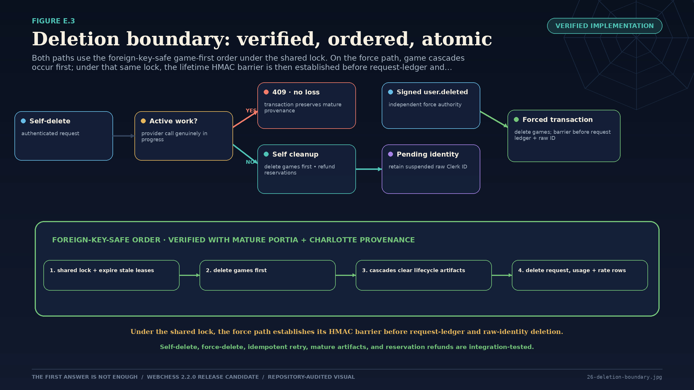

*Figure E.3 — The 2.2.0 candidate deletes games and their lifecycle artifacts before deleting remaining model requests. Self-service preserves the pending identity marker; signed forced cleanup commits the lifetime HMAC barrier before raw identity disappears.*

Self-service deletion refuses while provider work is genuinely `in_progress` under an unexpired lease. Otherwise, under the shared usage lock, it refunds outstanding global reservations, clears slots, removes user usage, user rate rows, replay intents, and application content, then leaves a suspended `ACCOUNT_DELETION_PENDING` `user_controls` row containing the raw Clerk identifier. That still-valid identity cannot return with reset controls.

Clerk's verified, signed `user.deleted` webhook is the intended forced authority. It inserts or preserves the lifetime HMAC barrier before removing the raw control record and remaining content, and it can win over active work. Late settlement sees the deletion barrier and cannot recreate the owner. Shared IP rate rows remain because they cannot safely be attributed back to one account. Historical global used usage remains; only outstanding reservations are refunded. The signed webhook's event identifier is not stored in a separate durable replay ledger, although repeated events are state-idempotent through the barrier.

The deletion secret cannot be rotated away while tombstones remain unless an external re-key source preserves the deleted raw identifiers—which would defeat the data-minimization design. Vendor backup aging remains governed by separately configured provider retention.

### E.10.2 COMMITTED RC repair and measured boundary

The 2.1/repository-main failure was ordering, not partial loss: deleting `model_requests` first could meet `ON DELETE RESTRICT` references from `portia_reviews` or `charlotte_results` and roll back the transaction before the later game cascade. Commit `7a3749c` fixes that interaction without weakening those provenance references:

1. under the shared usage lock, one transaction first deletes the owner's games;
2. game deletion cascades through lifecycle runs and removes Portia, Gate, Charlotte, Wilbur, lifecycle-event, and research artifacts;
3. the transaction then deletes remaining owner model-request rows and the rest of the account-scoped control data in its established accounting order; and
4. self-service leaves the suspended raw pending marker, while forced signed-webhook cleanup installs the HMAC deletion barrier and removes the raw marker.

**MEASURED:** disposable PostgreSQL 17 integration cases now seed mature Portia and Charlotte artifacts. Self-service deletion removes games, requests, lifecycle runs, Portia, Gate, and Charlotte rows and leaves the expected `ACCOUNT_DELETION_PENDING` control. With live provider work, self-service returns 409 without changing mature provenance; forced cleanup wins, removes raw account/content rows, leaves exactly one HMAC barrier, clears the slot, and prevents late settlement from recreating the owner. Repeated self-service and forced operations remain state-idempotent. These tests establish the repaired transactional interaction; they do not establish vendor-backup erasure or a live Clerk webhook.

Local boundaries are different. OpenClaw has no account API path. The signed loopback source-checkout interface intentionally omits deletion. Clerk-backed source-checkout use can enter the two-step flow, but a missing optional webhook can leave the raw pending marker. `local:down` stops the PostgreSQL container; it does not remove its persistent volume.

## E.11 Authentication, authorization, and privacy boundaries

### E.11.1 Hosted source target

The browser is untrusted. Routing middleware is a navigation convenience; every protected Application Programming Interface (API) route independently resolves the Clerk session, derives the owner, and scopes its repositories. Authentication pages resolve their origin and session state in request scope rather than caching one request's result for another, and malformed or ambiguous `Host` input fails closed. A malformed or foreign game UUID receives the same public not-found shape. Mutations require an exact same-origin `Origin`; when `Sec-Fetch-Site` is present it must be `same-origin`. Ordinary JSON bodies require `application/json`, are capped at 16 kibibytes, and pass strict schemas.

Configured Clerk mode uses an exact authorized-party origin and a nonce-bearing strict Content Security Policy (CSP): `strict-dynamic`, no configured inline-script allowance, `frame-ancestors 'none'`, and no camera, microphone, or geolocation permission. Preview and Production are intended to use separate Clerk instances, credential classes, origins, and webhook secrets. These are source requirements until a real disposable-user smoke verifies Google, verified email, passkey, export, self-deletion, and signed webhook behavior.

The hosted OpenAI key is intended to be a server-only WebChess Platform credential. Visitors neither supply a key nor choose the provider/model. Requests use fixed `gpt-5.6-sol`, bounded structured outputs, no automatic Software Development Kit retry, a provider idempotency key, a pseudonymous safety identifier, timeout, and `store: false`. `store: false` does not establish Zero Data Retention (ZDR); organization, project, abuse-monitoring, retention, and data-sharing settings still apply.

The database design separates a protected migration owner from a non-owner runtime role. The local all-in-one development role does not satisfy that intended hosted privilege contract, and no live Neon role was verified.

### E.11.2 Local OpenClaw

OpenClaw local identity is accepted only outside Vercel, in explicitly enabled mode, on loopback Host/URL pairs, with the exact runtime header, and only for division/game paths. The header value is deliberately fixed and not secret. Browser cross-origin requests are constrained, but any capable local process within the operating-system boundary may act as the installation principal. All browser profiles share that owner.

The launcher binds to `127.0.0.1`, clears Clerk, Vercel, generic database, and hosted OpenAI settings, disables Next.js telemetry, and uses only a dedicated loopback PostgreSQL URL. Model execution uses an argument array with `shell: false`, bounded output and time, `TERM`, then `KILL`. Provider credentials remain in OpenClaw and never enter the browser. The provider may be remote.

This is not a hardened multi-user Web server. The launcher starts Next.js development mode, whose offline CSP permits inline script and, during development, `unsafe-eval`. The runtime automatically migrates with the same local database credential used by the application. Default owner and HMAC material are deterministic hashes of the installation path, suitable only inside the declared same-machine boundary. Moving or reinstalling under a different path without preserving those values can change the apparent owner, orphan existing rows from the new session, and break continuity of deletion/rate identities.

### E.11.3 Loopback source-checkout authentication and launcher

The committed candidate permits a signed session only off Vercel, outside OpenClaw, when Clerk is absent, the dedicated local-session secret contains at least 32 bytes, and the request URL and Host are both loopback addresses with equal parsed ports. The cookie lasts seven days, is `HttpOnly` and `SameSite=Lax`, and is checked with timing-safe comparison. The owner is a 128-bit prefix of a purpose-separated SHA-256 digest of the secret. It identifies a machine installation, not a verified human or operating-system account. A user with local browser access can choose “Continue on this machine”; there is no password challenge.

Authentication is a strict two-mode choice. With neither Clerk key, the launcher selects the signed machine principal. With both a `pk_test_...` publishable key and an `sk_test_...` secret key, it selects Clerk development identity. A partial pair or live-key class fails closed; prefix validation does not prove that the two development keys belong to the same Clerk instance. Local identity cannot activate when any of `VERCEL`, `VERCEL_ENV`, `VERCEL_TARGET_ENV`, or `VERCEL_URL` is present, even as an empty marker.

`local:setup` and `local:dev` validate numeric ports and the exact generated environment; serialize setup with a lock; write environment state atomically; keep database credentials out of process arguments; pin PostgreSQL 17 to loopback; and verify the managed container, restart policy, credentials, persistent volume, volume mount, and ownership labels before reuse. An old volume can be adopted only by the explicit data-preserving procedure, and only when it is genuinely label-free; an unrelated or ambiguously owned container or volume is refused. The runtime opens the browser only after a bounded readiness probe; on startup failure or exit it terminates the owned Next.js process group, while the separately spawned browser helper has its own bound and termination path. Canonical automatic migration requires the one-purpose local-hosted activation contract and exact loopback database boundary. Bootstrap refuses unexpected relation names or a noncanonical migration ledger; it does not replace the fuller deployment-schema conformance check.

### E.11.4 What the controls do not prove

| Control | Important limit |
|---|---|
| Owner-scoped routes and queries | Does not survive compromise of Clerk, application server, or database credential |
| Strict schemas and output bounds | Does not detect every prompt injection, falsehood, bias, or harmful schema-valid recommendation |
| SHA-256 digest graph | Is not a signature, non-repudiation, truth, or tamper evidence against a writer who can recompute it |
| Purpose-separated HMAC | Is not anonymity or unlinkability; secret compromise enables correlation and guess testing |
| Same-origin checks and hosted CSP | Do not protect from malicious software already inside the trusted origin/device |
| `store: false` | Is not ZDR and does not purge provider abuse-monitoring or backup systems |
| Least-privilege hosted contract | Is not proof that a live role has those grants |
| Deletion barrier and foreign-key-safe order | Do not immediately purge vendor backups or prove that a live Clerk webhook is configured |
| Loopback listener | Is not person-level authentication or isolation from local processes/users |
| “No prompt logging” design | Is not an audit of a live logging pipeline or its administrator access and retention |

Questions, 64 facets, prompts, Answers, research synthesis, and Wilbur observations may contain personal, strategic, legal, medical, commercial, or third-party information. Application columns do not add field-level encryption; local protection depends on the host and PostgreSQL/Docker environment, while hosted protection would depend on provider transport and storage configuration. The privacy notice correctly warns against confidential, regulated, safety-critical, or third-party personal data.

Active-account content has no definite maximum retention period. Expired leases and rate rows are merely eligible for request-driven cleanup. Immutable game and provenance content can be exported or deleted, not edited in place as a general “correction” API. Model output cannot change ownership, quota, legal moves, Gate, or real-world observations without deterministic validation or authenticated user input. That authority boundary does not make the recommendation safe or true, and a Wilbur observation proves only that an owner recorded it—not that it causally established an outcome.

## E.12 Backup and disaster recovery

- **Point-in-Time Recovery (PITR)** means restoring a database to a selected moment using backups and transaction logs.
- **Recovery Point Objective (RPO)** is the maximum acceptable recent data loss, expressed as time.
- **Recovery Time Objective (RTO)** is the target time to restore service after an incident.

The audited repository establishes no automated backup schedule, database dump/restore command, export import path, PITR configuration proof, RPO, RTO, restore drill, backup encryption/access review, cross-region recovery, corruption runbook, local-volume backup, or HMAC-key escrow. No live hosted deployment was proven, so vendor defaults cannot become WebChess guarantees.

Local PostgreSQL persists across browser refresh and ordinary process restart. The loopback source-checkout Docker named volume survives stopping or recreating a container that reuses it. Neither fact protects against disk loss, file-system corruption, accidental volume deletion, ransomware, theft, or machine failure. OpenClaw provides no WebChess cloud backup or synchronization. Application rollback moves code back and intentionally does not reverse migration history; it cannot restore lost data.

Local identity recovery also requires preserving the database plus owner identity, general HMAC secret, deletion HMAC secret, dedicated local-session secret, and credentials. Losing the signed loopback session secret derives a new `local_...` owner, making prior rows inaccessible to that new machine session even if the database survives.

```text
browser refresh / duplicate request / interrupted Function / expired lease
        -> implemented application and lifecycle recovery

corrupt database / lost disk / deleted volume / regional loss
        -> no repository-proven backup or disaster-recovery guarantee
```

Any future hosted recovery claim should follow measured evidence of scheduled backups, retention, restoration access, a successful restore drill, and published RPO/RTO. Local documentation should give an explicit PostgreSQL logical-backup and restore procedure rather than suggesting that copying a live data directory is automatically safe.

## E.13 Infrastructure conclusions

The infrastructure can safely support these claims:

- the released Local OpenClaw surface and committed 2.2.0 candidate persist an owner-scoped game and lifecycle genealogy in PostgreSQL rather than relying on process memory;
- canonical replay, necessary revision fences, idempotency digests, quotas, fixed-window rates, expiring provider leases, and the durable Wilbur intent ledger provide strong application-level recovery and duplicate-intent controls;
- the migration runner creates one checksum ledger, while 13 forward migrations define 19 application tables; together the 20 physical tables are guarded by eight contract indexes, two exact Wilbur trigger/function pairs, 18 critical constraints, and five mutation-ledger defaults;
- Local OpenClaw and the loopback source-checkout runtime have concrete loopback database and identity boundaries, although OpenClaw's configured provider and source-checkout OpenAI calls may leave the machine;
- the hosted Clerk/Vercel/Neon/OpenAI architecture exists in source, but no live hosted operation was demonstrated;
- research is bounded and visible only on the wired OpenClaw Portia path, does not fetch pages, is accounted outside the model ledger, and does not have a deterministic required-research Gate hard stop;
- integrity hashes are mismatch detectors, not signatures or truth certificates;
- Wilbur writes are rate-admitted once, lifetime row/text bounded, and atomically recorded with their lifecycle evidence; account export format 4 includes recovery and sanitized ledger data; and the foreign-key-safe deletion order is regression-tested with Portia and Charlotte artifacts;
- the 2.2.0 candidate remains locally committed but untagged, unpushed, and undeployed; and
- no backup, PITR, RPO, or RTO guarantee is established.

The Web earns its metaphor by preserving differences: identity is not evidence; a discovered link is not a read source; a digest is not a signature; a user observation is not causality; transaction recovery is not backup; committed architecture is not deployment; and implementation is not validation. Deliberation before decision depends as much on those refusals as on the answer the system eventually permits.

---

# References

1. Arthur, P. (2019). Man, know thyself: The role of Ananse stories in Ghanaian pedagogy. *Journal of Mother-Tongue Biblical Hermeneutics and Theology, 1*(2), 8–24. [https://doi.org/10.32051/12301902](https://doi.org/10.32051/12301902)

2. Beaty, R., Deshpande, V., Lai, C. K. Y., Attuch, A., Shivagunde, N., Roy, S., Pujari, R., DiStefano, P. V., Muckatira, S., Stevenson, C. E., Gronas, M., & Rumshisky, A. (2026). AGC-Bench: Measuring artificial general creativity. *arXiv preprint arXiv:2607.01152*. [https://arxiv.org/abs/2607.01152](https://arxiv.org/abs/2607.01152)

3. Boonpromkul, P. (2022). Friendship, humility, and the complicated morality of E. B. White's *Charlotte's Web*. *MANUSYA: Journal of Humanities, 25*(1), 1–18. [https://doi.org/10.1163/26659077-25010019](https://doi.org/10.1163/26659077-25010019)

4. Campbell, D. T. (1960). Blind variation and selective retention in creative thought. *Psychological Review, 67*(6), 380–400. [https://doi.org/10.1037/h0040373](https://doi.org/10.1037/h0040373)

5. Camuffo, A., Gambardella, A., Messinese, D., Novelli, E., Paolucci, E., & Spina, C. (2024). A scientific approach to entrepreneurial decision-making: Large-scale replication and extension. *Strategic Management Journal, 45*(6), 1209–1237. [https://doi.org/10.1002/smj.3580](https://doi.org/10.1002/smj.3580)

6. Cross, F. R., & Jackson, R. R. (2019). Portia's capacity to decide whether a detour is necessary. *Journal of Experimental Biology, 222*(15), jeb203463. [https://doi.org/10.1242/jeb.203463](https://doi.org/10.1242/jeb.203463)

7. Dorst, K., & Cross, N. (2001). Creativity in the design process: Co-evolution of problem–solution. *Design Studies, 22*(5), 425–437. [https://doi.org/10.1016/S0142-694X(01)00009-6](https://doi.org/10.1016/S0142-694X%2801%2900009-6)

8. FIDE Rules Commission. (n.d.). *Guidelines II: Chess960 rules*. Retrieved August 1, 2026. [https://rcc.fide.com/guidelinesii/](https://rcc.fide.com/guidelinesii/)

9. Finke, R. A., Ward, T. B., & Smith, S. M. (1992). *Creative cognition: Theory, research, and applications*. MIT Press. [https://mitpress.mit.edu/9780262061506/creative-cognition/](https://mitpress.mit.edu/9780262061506/creative-cognition/)

10. Gentner, D. (1983). Structure-mapping: A theoretical framework for analogy. *Cognitive Science, 7*(2), 155–170. [https://doi.org/10.1207/s15516709cog0702_3](https://doi.org/10.1207/s15516709cog0702_3)

11. Gick, M. L., & Holyoak, K. J. (1983). Schema induction and analogical transfer. *Cognitive Psychology, 15*(1), 1–38. [https://doi.org/10.1016/0010-0285(83)90002-6](https://doi.org/10.1016/0010-0285%2883%2990002-6)

12. Gnoli, G. (1996; updated 2017). Dualism. *Encyclopaedia Iranica, VII*(6), 576–582. [https://www.iranicaonline.org/articles/dualism/](https://www.iranicaonline.org/articles/dualism/)

13. Hon, T.-K. (2023). Chinese philosophy of change (Yijing). In E. N. Zalta & U. Nodelman (Eds.), *The Stanford Encyclopedia of Philosophy*. [https://plato.stanford.edu/entries/chinese-change/](https://plato.stanford.edu/entries/chinese-change/)

14. Huang, J., Chen, X., Mishra, S., Zheng, H. S., Yu, A. W., Song, X., & Zhou, D. (2024). Large language models cannot self-correct reasoning yet. *International Conference on Learning Representations*. [https://proceedings.iclr.cc/paper_files/paper/2024/hash/8b4add8b0aa8749d80a34ca5d941c355-Abstract-Conference.html](https://proceedings.iclr.cc/paper_files/paper/2024/hash/8b4add8b0aa8749d80a34ca5d941c355-Abstract-Conference.html)

15. Hutchins, E. (1995). *Cognition in the wild*. MIT Press. [https://mitpress.mit.edu/9780262581462/cognition-in-the-wild/](https://mitpress.mit.edu/9780262581462/cognition-in-the-wild/)

16. Jackson, R. R. (1995). Cues for web invasion and aggressive mimicry signalling in *Portia* (Araneae, Salticidae). *Journal of Zoology, 236*(1), 131–149. [https://doi.org/10.1111/j.1469-7998.1995.tb01789.x](https://doi.org/10.1111/j.1469-7998.1995.tb01789.x)

17. Jackson, R. R., & Cross, F. R. (2013). A cognitive perspective on aggressive mimicry. *Journal of Zoology, 290*(3), 161–171. [https://doi.org/10.1111/jzo.12036](https://doi.org/10.1111/jzo.12036)

18. Jackson, R. R., & Nelson, X. J. (2011). Reliance on trial and error signal derivation by *Portia africana*, an araneophagic jumping spider from East Africa. *Journal of Ethology, 29*(2), 301–307. [https://doi.org/10.1007/s10164-010-0258-5](https://doi.org/10.1007/s10164-010-0258-5)

19. Jansson, D. G., & Smith, S. M. (1991). Design fixation. *Design Studies, 12*(1), 3–11. [https://doi.org/10.1016/0142-694X(91)90003-F](https://doi.org/10.1016/0142-694X%2891%2990003-F)

20. Ji, Z., Lee, N., Frieske, R., Yu, T., Su, D., Xu, Y., Ishii, E., Bang, Y. J., Madotto, A., & Fung, P. (2023). Survey of hallucination in natural language generation. *ACM Computing Surveys, 55*(12), Article 248, 1–38. [https://doi.org/10.1145/3571730](https://doi.org/10.1145/3571730)

21. Jung, C. G. (2010). *Synchronicity: An acausal connecting principle* (R. F. C. Hull, Trans.). Princeton University Press. (Original work published 1952.) [https://doi.org/10.2307/j.ctt7s94k](https://doi.org/10.2307/j.ctt7s94k)

22. Kirsh, D., & Maglio, P. (1994). On distinguishing epistemic from pragmatic action. *Cognitive Science, 18*(4), 513–549. [https://doi.org/10.1207/s15516709cog1804_1](https://doi.org/10.1207/s15516709cog1804_1)

23. Larkin, J. H., & Simon, H. A. (1987). Why a diagram is (sometimes) worth ten thousand words. *Cognitive Science, 11*(1), 65–100. [https://doi.org/10.1111/j.1551-6708.1987.tb00863.x](https://doi.org/10.1111/j.1551-6708.1987.tb00863.x)

24. Madaan, A., Tandon, N., Gupta, P., Hallinan, S., Gao, L., Wiegreffe, S., Alon, U., Dziri, N., Prabhumoye, S., Yang, Y., Gupta, S., Majumder, B. P., Hermann, K., Welleck, S., Yazdanbakhsh, A., & Clark, P. (2023). Self-Refine: Iterative refinement with self-feedback. *Advances in Neural Information Processing Systems, 36*. [https://doi.org/10.52202/075280-2019](https://doi.org/10.52202/075280-2019)

25. Malthouse, E., Liang, Y., Russell, S., & Hills, T. T. (2022). The influence of exposure to randomness on lateral thinking in divergent, convergent, and creative search. *Cognition, 218*, 104937. [https://doi.org/10.1016/j.cognition.2021.104937](https://doi.org/10.1016/j.cognition.2021.104937)

26. Marshall, E. Z. (2012). *Anansi's journey: A story of Jamaican cultural resistance*. University of the West Indies Press. [https://www.uwipress.com/9789766402617/anansis-journey/](https://www.uwipress.com/9789766402617/anansis-journey/)

27. Newell, A., Shaw, J. C., & Simon, H. A. (1958). Elements of a theory of human problem solving. *Psychological Review, 65*(3), 151–166. [https://doi.org/10.1037/h0048495](https://doi.org/10.1037/h0048495)

28. Nickerson, R. S. (1998). Confirmation bias: A ubiquitous phenomenon in many guises. *Review of General Psychology, 2*(2), 175–220. [https://doi.org/10.1037/1089-2680.2.2.175](https://doi.org/10.1037/1089-2680.2.2.175)

29. OpenAI. (2026). *GPT-5.6 Sol model documentation*. Retrieved August 1, 2026. [https://developers.openai.com/api/docs/models/gpt-5.6-sol](https://developers.openai.com/api/docs/models/gpt-5.6-sol)

30. Perez, E., Huang, S., Song, F., Cai, T., Ring, R., Aslanides, J., Glaese, A., McAleese, N., & Irving, G. (2022). Red teaming language models with language models. *arXiv preprint arXiv:2202.03286*. [https://arxiv.org/abs/2202.03286](https://arxiv.org/abs/2202.03286)

31. Ratelle, A. (2014). Ethics and edibility in *Charlotte's Web*. *The Lion and the Unicorn, 38*(3), 327–341. [https://doi.org/10.1353/uni.2014.0026](https://doi.org/10.1353/uni.2014.0026)

32. Reiter-Palmon, R., Mumford, M. D., O'Connor Boes, J., & Runco, M. A. (1997). Problem construction and creativity: The role of ability, cue consistency, and active processing. *Creativity Research Journal, 10*(1), 9–23. [https://doi.org/10.1207/s15326934crj1001_2](https://doi.org/10.1207/s15326934crj1001_2)

33. Rietzschel, E. F., Nijstad, B. A., & Stroebe, W. (2010). The selection of creative ideas after individual idea generation: Choosing between creativity and impact. *British Journal of Psychology, 101*(1), 47–68. [https://doi.org/10.1348/000712609X414204](https://doi.org/10.1348/000712609X414204)

34. Risko, E. F., & Gilbert, S. J. (2016). Cognitive offloading. *Trends in Cognitive Sciences, 20*(9), 676–688. [https://doi.org/10.1016/j.tics.2016.07.002](https://doi.org/10.1016/j.tics.2016.07.002)

35. Rushdy, A. H. A. (1991). “The miracle of the web”: Community, desire, and narrativity in *Charlotte's Web*. *The Lion and the Unicorn, 15*(2), 35–60.

36. Shinn, N., Cassano, F., Gopinath, A., Narasimhan, K., & Yao, S. (2023). Reflexion: Language agents with verbal reinforcement learning. *Advances in Neural Information Processing Systems, 36*. [https://doi.org/10.52202/075280-0377](https://doi.org/10.52202/075280-0377)

37. Thibodeau, P. H., & Boroditsky, L. (2011). Metaphors we think with: The role of metaphor in reasoning. *PLOS ONE, 6*(2), e16782. [https://doi.org/10.1371/journal.pone.0016782](https://doi.org/10.1371/journal.pone.0016782)

38. Thomas, T. H. (2016). The arc of the rope swing: Humour, poetry, and spirituality in *Charlotte's Web* by E. B. White. *International Journal of Children's Spirituality, 21*(3–4), 201–215. [https://doi.org/10.1080/1364436X.2016.1228618](https://doi.org/10.1080/1364436X.2016.1228618)

39. Thomke, S. H. (1998). Managing experimentation in the design of new products. *Management Science, 44*(6), 743–762. [https://doi.org/10.1287/mnsc.44.6.743](https://doi.org/10.1287/mnsc.44.6.743)

40. Turing, A. M. (1950). Computing machinery and intelligence. *Mind, 59*(236), 433–460. [https://doi.org/10.1093/mind/LIX.236.433](https://doi.org/10.1093/mind/LIX.236.433)

41. WebChess Project. (2026). *WebChess private repository*: released tag `v2.1.0` at `9980328581ba3e6fed6f2c4fc99b555fec4773bc`; immutable package-2.2.0 release-candidate commit `7a3749cf7f2c4e4c5ebfeb9b9aa870a11843f3a2`, audited August 15, 2026. Authorized repository access only; no public source URL, remote branch, tag, or deployed service is claimed for the candidate.

42. White, E. B. (1952). *Charlotte's Web*. Harper & Brothers.

43. Whitson, J. A., & Galinsky, A. D. (2008). Lacking control increases illusory pattern perception. *Science, 322*(5898), 115–117. [https://doi.org/10.1126/science.1159845](https://doi.org/10.1126/science.1159845)

44. Wilhelm, R. (Trans.). (1967). *The I Ching or Book of Changes* (C. F. Baynes, English trans.; C. G. Jung, foreword; 3rd ed.). Princeton University Press. (English translation originally published 1950.) [https://search.worldcat.org/title/222777](https://search.worldcat.org/title/222777)

45. World Wide Web Consortium. (2013). *PROV-DM: The PROV data model*. W3C Recommendation. [https://www.w3.org/TR/prov-dm/](https://www.w3.org/TR/prov-dm/)

46. Yao, S., Yu, D., Zhao, J., Shafran, I., Griffiths, T. L., Cao, Y., & Narasimhan, K. (2023). Tree of Thoughts: Deliberate problem solving with large language models. *Advances in Neural Information Processing Systems, 36*. [https://proceedings.neurips.cc/paper_files/paper/2023/hash/271db9922b8d1f4dd7aaef84ed5ac703-Abstract.html](https://proceedings.neurips.cc/paper_files/paper/2023/hash/271db9922b8d1f4dd7aaef84ed5ac703-Abstract.html)

47. Zhang, J., & Norman, D. A. (1994). Representations in distributed cognitive tasks. *Cognitive Science, 18*(1), 87–122. [https://doi.org/10.1207/s15516709cog1801_3](https://doi.org/10.1207/s15516709cog1801_3)
